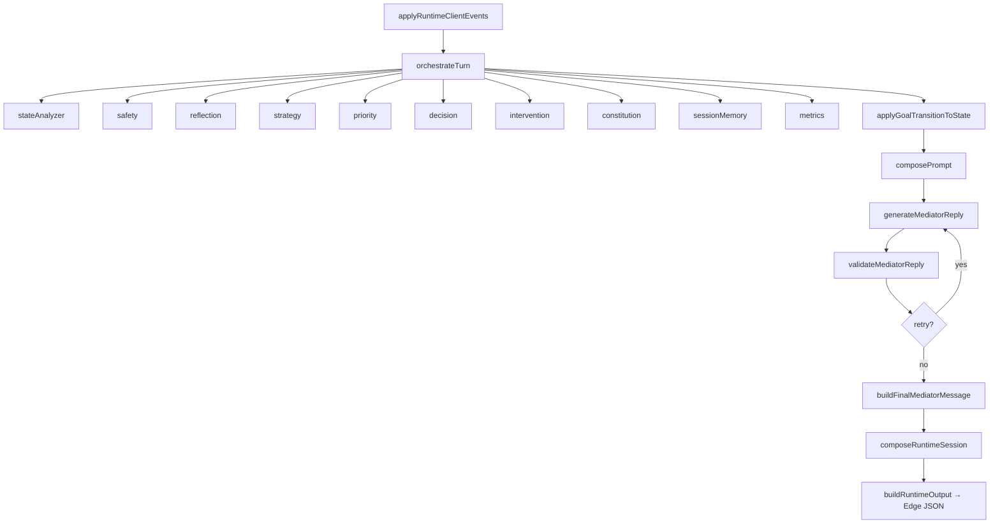

# Mediation Legacy Inventory — MOST Live Mediation Runtime

> **Audit type:** read-only dependency graph before legacy runtime removal  
> **Date:** 2026-07-15  
> **Scope:** Mediator AI Engine v2.3 + `liveMediation.ts` client orchestration + Supabase artifacts  
> **Constraint:** No code/migration/Supabase changes were made. Only this document was created.

---

## 1. Executive Summary

| Metric | Count | Notes |
|--------|------:|-------|
| **Files in mediation ecosystem** | **~617** | Core scope below; excludes `.pnpm-store` duplicates |
| `services/mediatorEngine/` | 453 | ~39 200 LOC incl. tests |
| `services/mediatorRuntimeClient/` | 93 | ~11 000 LOC incl. tests |
| `services/liveMediation*.ts` | 3 | 2 701 LOC |
| `types/mediator/` | 31 | 3 141 LOC |
| `app/mediation/` | 9 | 6 238 LOC |
| `legacyMigration/` | 4 | 307 LOC |
| `constants/i18n/liveMediation/` | 9 | 1 987 LOC |
| `supabase/functions/mediator-runtime/` | 7 | ~10 855 LOC (bundle ~10 700) |
| Related `services/mediation*.ts` | 21 | Pre/post-live CRUD, not engine core |
| **Edge Functions (total deployed)** | **10** | 8 mediation-adjacent |
| **Edge Function (core runtime)** | **1** | `mediator-runtime` |
| **PostgreSQL tables (mediation)** | **3** | `mediations`, `live_messages`, `agreement_archive` |
| **PostgreSQL RPC (mediation-named)** | **1** | `get_mediation_by_invite_code` |
| **PostgreSQL RPC (couple-adjacent)** | **2** | `connect_couple_by_invite_code`, `get_my_couple_connection` |
| **Triggers (mediation-specific)** | **0** | |
| **Views (mediation)** | **0** | |
| **Cron jobs (mediation)** | **0** | |
| **RLS policies (mediation tables)** | **10** | 4 mediations + 2 live_messages + 4 agreement_archive |
| **Realtime publications (mediation)** | **2** | `live_messages`, `mediations` |
| **Frontend runtime call sites** | **4** | `callMediatorRuntime` production paths |
| **Frontend files importing `liveMediation.ts`** | **7** | |
| **`supabase.functions.invoke` calls** | **0** | All edge calls use `fetch` via `callEdge` / `callMediatorRuntime` |
| **Engine test artifacts** | **118** | `mediatorEngine/__tests__/` |
| **Client test artifacts** | **38** | `mediatorRuntimeClient/__tests__/` |
| **Golden conversation fixtures** | **23** | `__tests__/goldenConversations/` |

### Critical architectural fact

Production runtime is **split across three layers**:

1. **Client orchestration:** `liveMediation.ts` (2 477 LOC) + `app/mediation/live.tsx`
2. **Runtime client bridge:** `mediatorRuntimeClient/*` (HTTP fetch, parse, persist, UI projection)
3. **Server engine:** `mediator-runtime` Edge Function → prebundled `mediatorRuntime.bundle.ts` (esbuild of entire `mediatorEngine`)

The client **never imports** `runMediatorEngineTurn` directly. Engine modules are bundled server-side.

---

## 2. Active Entrypoints

### 2.1 Primary client entrypoint

| Property | Value |
|----------|-------|
| **Path** | `services/liveMediation.ts` |
| **LOC** | 2 477 |
| **Direct importers** | `app/mediation/live.tsx`, `services/disputeClosure.ts`, `services/mediationDelete.ts`, `services/mediationSummary.ts`, `tests/runtimeComparison/*` (3 files) |
| **Status** | **ACTIVE** — central live chat orchestrator |

**Direct imports (22 paths):**

```
@/legacyMigration/historyFilters
@/services/supabase
@/constants/i18n
@/constants/i18n/liveMediation
@/services/liveMediationI18n
@/utils/i18nFormat
@/utils/textTruncate
@/services/mediatorRuntimeClient/mediatorRuntimeClient
@/services/mediatorRuntimeClient/liveMediationBridge
@/services/mediatorRuntimeClient/mediationRuntimeSessionPersistence
@/services/mediatorRuntimeClient/loadMediationRuntimeSession
@/services/mediatorRuntimeClient/buildLiveTranscriptWindow
@/services/mediatorRuntimeClient/resolveRuntimeClientEventsForTurn
@/services/mediatorRuntimeClient/deriveParticipantReplyStateFromMessages
@/services/mediatorRuntimeClient/openingBootstrapGuards
@/services/mediatorRuntimeClient/mapMediationContextToBootstrapState
@/types/mediator (RuntimeClientEvent)
@/services/liveMediation.types
(re-exports: openingBootstrapGuards, processBothParticipantReplies, liveMediation.types)
```

### 2.2 UI entrypoint

| Path | Role | Status |
|------|------|--------|
| `app/mediation/live.tsx` | Main live chat screen; turn gating, AI generation, runtime recovery | **ACTIVE** |
| `app/mediation/new.tsx` | Intake + paywall gate | **ACTIVE** |
| `app/mediation/analysis.tsx` | Pre-live AI analysis | **ACTIVE** |
| `app/mediation/invite.tsx` | Partner invite + start live | **ACTIVE** |
| `app/mediation/join.tsx` | Partner join-by-code | **ACTIVE** |
| `app/mediation/partner-perspective.tsx` | Partner perspective input | **ACTIVE** |
| `app/mediation/summary.tsx` | Post-mediation agreements | **ACTIVE** |
| `app/mediation/closure.tsx` | Re-exports dispute closure | **ACTIVE** |
| `app/mediation/_layout.tsx` | Stack navigator | **ACTIVE** |

### 2.3 Runtime client entrypoints

| Path | Role | Status |
|------|------|--------|
| `services/mediatorRuntimeClient/mediatorRuntimeClient.ts` | `callMediatorRuntime()` — HTTP POST to edge | **ACTIVE** |
| `services/mediatorRuntimeClient/processBothParticipantReplies.ts` | Atomic both-replies turn | **ACTIVE** |
| `services/mediatorRuntimeClient/liveMediationBridge.ts` | `routeLiveMediatorTurn`, trigger mapping | **ACTIVE** |
| `services/mediatorRuntimeClient/loadMediationRuntimeSession.ts` | SELECT runtime columns | **ACTIVE** |
| `services/mediatorRuntimeClient/mediationRuntimeSessionPersistence.ts` | UPDATE runtime columns | **ACTIVE** |
| `hooks/useRuntimeSession.ts` | Read-only runtime session mirror | **ACTIVE** |

### 2.4 Edge Function entrypoint

| Property | Value |
|----------|-------|
| **Function name** | `mediator-runtime` |
| **Deploy path** | `supabase/functions/mediator-runtime/` |
| **HTTP entry** | `index.ts` → `serve(handleMediatorRuntimeHttpRequest)` |
| **Bundle entry** | `services/mediatorEngine/edge/handleMediatorRuntimeHttp.ts` |
| **Build command** | `npm run build:mediator:edge` → `scripts/build-mediator-runtime-edge.mjs` |
| **Bundle output** | `supabase/functions/mediator-runtime/_generated/mediatorRuntime.bundle.ts` (~10 700 LOC) |
| **Turn handler** | `handleMediatorRuntimeTurn.ts` → `runMediatorEngineTurn.ts` |

**Edge call chain:**

```
index.ts
  → handleMediatorRuntimeHttpRequest (bundle)
    → parseMediatorRuntimeRequest
    → createEdgeLlmProvider (OPENAI_API_KEY)
    → runMediatorEngineTurn
      → applyRuntimeClientEvents
      → orchestrateTurn (10-module pipeline)
      → composePrompt → generateMediatorReply
      → validateMediatorReply → runReplyRetryLoop
      → buildFinalMediatorMessage → composeRuntimeSession
    → buildMediatorRuntimeEdgeSuccess
```

### 2.5 Engine internal entrypoint (server-only, bundled)

| Path | Role |
|------|------|
| `services/mediatorEngine/runtime/runMediatorEngineTurn.ts` | Full turn pipeline executor |
| `services/mediatorEngine/orchestrator/orchestrateTurn.ts` | 10-stage deterministic pipeline |

---

## 3. Execution Graph — One Mediation Turn

### Path A: Participant reply (half-turn)

```
live.tsx handleSend
  → sendUserMessage (liveMediation.ts)
    → supabase.from('live_messages').insert
    → invalidateLiveMessagesCache
  → computeLiveTurnState
    → deriveParticipantReplyStateFromMessages
  → buildParticipantReplyClientEvents
  → enqueueRuntimeClientEvents (if applicable)
  → [if bothAnswered && host leads] → Path B
```

### Path B: Atomic both-replies generation (standard question round)

```
live.tsx runGenerateNextQuestion
  → shouldHostLeadGeneration / canGenerateNextQuestion (guards)
  → fetchLiveMessages / dedupeLiveMessages
  → processBothParticipantReplies
    → loadMediationRuntimeState (SELECT mediation_state, session_memory, mediator_runtime_session)
    → buildBothRepliesTranscriptDelta
    → buildLiveTranscriptWindow
    → buildParticipantReplyClientEventsFromMessages
    → callMediatorRuntime (fetch POST /functions/v1/mediator-runtime)
      → [Edge] handleMediatorRuntimeTurn → runMediatorEngineTurn
    → buildMediationRuntimePersistencePatch → supabase UPDATE mediations
  → buildLocalAiMessages → insertAiMessages
  → fetchLiveSession
```

### Path C: Direct AI turn (opening, summaries, closure, proposals)

```
live.tsx applyAiTurn
  → processMediationTurn (liveMediation.ts)
    → loadMediationRuntimeState
    → buildBootstrapMediationStateFromContext (if opening bootstrap)
    → buildLiveRuntimeTurnInput
    → resolveRuntimeClientEventsForTurn
    → routeLiveMediatorTurn → callMediatorRuntime
    → persistMediationRuntimeState
    → normalizeEdgeResponse → adaptRuntimeToLiveResponse (inside parse)
  → insertAiMessages / buildLocalAiMessages
```

### Engine pipeline (inside every successful edge turn)



---

## 4. File Inventory Table

> **Legend:** ACTIVE = on production path. TEST_ONLY = tests/benchmarks. LEGACY = pre-v2.3 remnants. DEPRECATED = superseded but present.

### 4.1 Core orchestration

| File | Responsibility | Imported by | Active | Removal risk |
|------|---------------|-------------|--------|-------------|
| `services/liveMediation.ts` | Messages, sessions, turn state, AI insertion, pause/end | `live.tsx`, `disputeClosure`, `mediationDelete`, `mediationSummary` | **ACTIVE** | **CRITICAL** — root client orchestrator |
| `services/liveMediation.types.ts` | `LiveMediatorResponse`, `MediatorMode`, flow types | `liveMediation`, all `mediatorRuntimeClient/*`, tests | **ACTIVE** | **HIGH** — shared type contract |
| `services/liveMediationI18n.ts` | Localized opening/proposal strings | `liveMediation`, `live.tsx` | **ACTIVE** | MEDIUM |
| `app/mediation/live.tsx` | UI + turn gating + generation triggers | Expo router | **ACTIVE** | **CRITICAL** |
| `hooks/useRuntimeSession.ts` | Read-only `mediator_runtime_session` | `live.tsx` | **ACTIVE** | MEDIUM |

### 4.2 Runtime client bridge (`mediatorRuntimeClient/` — 55 prod files)

| File | Responsibility | Imported by | Active | Removal risk |
|------|---------------|-------------|--------|-------------|
| `mediatorRuntimeClient.ts` | HTTP fetch, retry, parse | `liveMediation`, `processBothParticipantReplies`, `live.tsx` (dynamic) | **ACTIVE** | **CRITICAL** |
| `liveMediationBridge.ts` | Trigger mapping, `routeLiveMediatorTurn` | `liveMediation`, `processBothParticipantReplies` | **ACTIVE** | **CRITICAL** |
| `processBothParticipantReplies.ts` | Atomic both-replies turn | `liveMediation` (re-export), `live.tsx` | **ACTIVE** | **CRITICAL** |
| `parseMediatorRuntimeResponse.ts` | Edge response safety + parse | `mediatorRuntimeClient` | **ACTIVE** | **HIGH** |
| `adaptRuntimeToLiveResponse.ts` | `RuntimeSession` → `LiveMediatorResponse` | `parseMediatorRuntimeResponse` | **ACTIVE** | **HIGH** |
| `buildMediatorRuntimeRequest.ts` | Request payload builder | `mediatorRuntimeClient`, `processBothParticipantReplies` | **ACTIVE** | HIGH |
| `mediationRuntimeSessionPersistence.ts` | DB read/write of runtime columns | `liveMediation`, `processBothParticipantReplies`, `loadMediationRuntimeSession` | **ACTIVE** | **CRITICAL** |
| `loadMediationRuntimeSession.ts` | SELECT runtime state | `liveMediation`, `useRuntimeSession`, `processBothParticipantReplies` | **ACTIVE** | **CRITICAL** |
| `resolveRuntimeSessionFlow.ts` | `RuntimeSession` → legacy `LiveSessionFlow` | `live.tsx` | **ACTIVE** | HIGH |
| `resolveRuntimeSessionInputState.ts` | Input visibility gating | `live.tsx` | **ACTIVE** | HIGH |
| `resolveRuntimeSessionWaitingDisplay.ts` | Host/partner waiting labels | `live.tsx` | **ACTIVE** | MEDIUM |
| `resolveRuntimeGenerationFlow.ts` | When to trigger generation | `live.tsx` | **ACTIVE** | HIGH |
| `resolveRuntimeActionExecution.ts` | Auto-advance guards | `resolveRuntimeSessionFlow` | **ACTIVE** | MEDIUM |
| `shouldBlockRuntimeMediatorGeneration.ts` | Block AI while awaiting replies | `live.tsx` | **ACTIVE** | HIGH |
| `recoverMediationRuntimeSession.ts` | Host-only session recovery | `live.tsx` | **ACTIVE** | MEDIUM |
| `recoverMediationRuntimeSessionCore.ts` | Recompose missing `mediator_runtime_session` | `recoverMediationRuntimeSession` | **ACTIVE** | MEDIUM |
| `syncParticipantRepliesFromLiveMessages.ts` | Partial reply sync (old path) | None in prod (grep) | **DEPRECATED** | LOW — candidate orphan |
| `supabaseBridge.ts` | Edge URL resolution | `mediatorRuntimeClient` (dynamic import) | **ACTIVE** | MEDIUM |
| `mediatorRuntimeConfig.ts` | `v2.3`, timeouts, retries | All runtime client | **ACTIVE** | HIGH |
| `*DevLog.ts` (12 files) | DEV-only tracing | Various | DEV_ONLY | LOW |

### 4.3 Engine modules (`mediatorEngine/` — bundled in edge)

| Module dir | Files | LOC | Entry function | Bundled | Removal risk |
|------------|------:|----:|----------------|---------|-------------|
| `stateAnalyzer/` | 10 | 672 | `analyzeState` | Yes | HIGH |
| `safety/` | 16 | 598 | `evaluateSafety` | Yes | HIGH |
| `reflection/` | 9 | 730 | `runReflection` | Yes | HIGH |
| `strategy/` | 13 | 669 | `selectStrategy` | Yes | HIGH |
| `priority/` | 18 | 870 | `resolvePriority` | Yes | HIGH |
| `decision/` | 18 | 837 | `makeDecision` | Yes | HIGH |
| `intervention/` | 12 | 421 | `generateIntervention` | Yes | HIGH |
| `constitution/` | 22 | 742 | `validateConstitution` | Yes | HIGH |
| `memory/` | 21 | 1064 | `updateSessionMemory` | Yes | HIGH |
| `metrics/` | 1 | 20 | `recordMetrics` | Yes | LOW |
| `responseValidator/` | 24 | 1531 | `validateMediatorReply` | Yes | HIGH |
| `runtime/` | 9 | 912 | `runMediatorEngineTurn` | Yes | **CRITICAL** |
| `runtimeSession/` | 3 | ~1100 | `composeRuntimeSession` | Yes | **CRITICAL** |
| `clientEvents/` | 4 | ~800 | `applyRuntimeClientEvents` | Yes | HIGH |
| `goalContinuity/` | 15 | ~1200 | `chooseGoalContinuityRecommendation` | Yes | HIGH |
| `promptComposer/` | 25+ | ~2500 | `composePrompt` | Yes | HIGH |
| `llm/` | 12+ | ~1500 | `generateMediatorReply` | Yes | HIGH |
| `edge/` | 12 | ~800 | `handleMediatorRuntimeHttp` | Yes | **CRITICAL** |
| `orchestrator/` | 4 | ~400 | `orchestrateTurn` | Yes | **CRITICAL** |
| `evaluation/` | 8 | ~600 | Benchmark runners | Test/bundle | MEDIUM |
| `corpus/` | 10+ | ~400 | Relationship language lexicon | Bundled | LOW |
| `_internal/` | 1 | 385 | Skeleton factories | Yes | MEDIUM |

### 4.4 Types (`types/mediator/` — 31 files)

| File cluster | Responsibility | Active | Removal risk |
|-------------|---------------|--------|-------------|
| `mediationState.ts`, `sessionMemory.ts` | Persisted state aggregates | **ACTIVE** (DB columns) | **CRITICAL** |
| `runtimeSession.ts` | UI flow contract | **ACTIVE** | **CRITICAL** |
| `therapeuticGoal.ts`, `goals.ts` | FSM nodes + transitions | **ACTIVE** | HIGH |
| `pipeline.ts`, `runtime.ts` | Turn request/response | **ACTIVE** | HIGH |
| `engineTypes.ts` | 181 union members (strategies, intents, interventions) | **ACTIVE** | HIGH |
| `responseValidator.ts`, `constitution.ts` | Validation types | **ACTIVE** | MEDIUM |
| Remaining 24 type files | Module I/O contracts | **ACTIVE** (engine) | MEDIUM–HIGH |

### 4.5 Legacy migration (pre-v2.3)

| File | Responsibility | Imported by | Active | Removal risk |
|------|---------------|-------------|--------|-------------|
| `legacyMigration/historyFilters.ts` | Filter old `conversation_state` messages | `liveMediation.ts`, `live.tsx` | **ACTIVE** (read path) | MEDIUM |
| `legacyMigration/conversationState.ts` | Old `ConversationPhase` parser | `legacyMigration/index`, `tests/runtimeComparison` | **LEGACY** | LOW |
| `legacyMigration/sessionFlow.ts` | Old flow inference | `legacyMigration/index`, `tests/runtimeComparison` | **LEGACY** | LOW |
| `legacyMigration/index.ts` | Re-exports | Tests only | **LEGACY** | LOW |

### 4.6 Pre/post-live services (not engine, but mediation flow)

| File | Responsibility | Active | Removal risk |
|------|---------------|--------|-------------|
| `mediationCreate.ts` | Create mediation row | **ACTIVE** | HIGH (shared create flow) |
| `mediationSubmit.ts` | Submit intake | **ACTIVE** | HIGH |
| `mediationInvite.ts` | Invite code generation | **ACTIVE** | HIGH |
| `mediationPartner.ts` | Partner join RPC | **ACTIVE** | HIGH |
| `mediationAnalysisRun.ts` | Pre-live `analyze-perspectives` | **ACTIVE** | HIGH |
| `mediationSummary.ts` | Post-live summary | **ACTIVE** | HIGH |
| `mediationDelete.ts` | Delete + cache invalidation | **ACTIVE** | MEDIUM |
| `mediationOcr.ts` | Screenshot OCR on new screen | **ACTIVE** | MEDIUM |
| `disputeClosure.ts` | Calls `endLiveMediation` | **ACTIVE** | MEDIUM |
| `aiMediator.ts` | Old dispute-phase mediator (NOT live v2.3) | **LEGACY** | See orphans |
| `soloMediationRecord.ts` | Solo flow record | Separate feature | Do not conflate |

### 4.7 Tests, fixtures, golden messages

| Location | Count | Purpose | Removal risk |
|----------|------:|---------|-------------|
| `services/mediatorEngine/__tests__/` | 118 files | Unit, integration, golden, evaluation, production e2e | Remove with engine |
| `services/mediatorRuntimeClient/__tests__/client/` | 30 test files | Client flow, RLS, E2E | Remove with client |
| `services/mediatorEngine/__tests__/goldenConversations/` | 23 fixtures | Golden trace benchmarks | TEST_ONLY |
| `services/mediatorEngine/__tests__/endingConversations/` | 4 fixtures | Ending quality benchmarks | TEST_ONLY |
| `tests/runtimeComparison/` | 4 files | Legacy vs runtime comparison tooling | TEST_ONLY |

### 4.8 Build, CI, scripts

| File | Role |
|------|------|
| `package.json` | 20+ `test:mediator:*` scripts, `build:mediator:edge`, `smoke:mediator-runtime` |
| `scripts/build-mediator-runtime-edge.mjs` | esbuild bundle for Deno deploy |
| `scripts/smoke-mediator-runtime.mjs` | Post-deploy smoke test |
| `scripts/setup-supabase.sh` | Deploy instructions for `mediator-runtime` |
| `tsconfig.mediator-client.json` | Typecheck profile for runtime client |
| `tsconfig.edge.json` | Edge typecheck (excludes bundle) |
| `tsconfig.node.json` | Includes mediator engine + client tests |
| `docs/runtime-live-manual-test-checklist.md` | Manual QA checklist |

**CI/CD:** No `.yml`/`.yaml` workflow files reference mediation (grep returned 0). Tests run via `package.json` scripts only.

---

## 5. Supabase / PostgreSQL Objects

### 5.1 Tables

| Table | Migration | Columns (final) | Realtime | RLS |
|-------|-----------|-----------------|----------|-----|
| `public.mediations` | `002` + 12 alters | ~40 (intake, partner, live session, runtime v2.3 JSONB) | Yes (`018`) | 4 policies |
| `public.live_messages` | `004` | 11 | Yes (`018`) | 2 policies |
| `public.agreement_archive` | `012` | 11 (FK → mediations) | No | 4 policies |

### 5.2 Runtime columns on `mediations` (v2.3 persistence)

| Column | Type | Migration | Written by |
|--------|------|-----------|------------|
| `mediation_state` | JSONB | `022` | `mediationRuntimeSessionPersistence`, `persistRecoveredRuntimeSession` |
| `session_memory` | JSONB | `022` | Same |
| `mediator_engine_version` | TEXT | `022` | Always `'v2.3'` via `MEDIATOR_RUNTIME_ENGINE_VERSION` |
| `mediator_runtime_metadata` | JSONB | `022` | Turn metadata |
| `mediator_last_goal` | TEXT | `022` | Denormalized |
| `mediator_last_strategy` | TEXT | `022` | Denormalized |
| `mediator_last_safety_level` | TEXT | `022` | Denormalized |
| `mediator_runtime_session` | JSONB | `023` | Full `RuntimeSession` contract |

### 5.3 Legacy live columns (still read/written by `liveMediation.ts`)

| Column | Used for |
|--------|----------|
| `live_phase`, `live_progress`, `live_paused` | Legacy UI state |
| `current_question`, `current_question_index` | Question counter |
| `partner_typing` | Typing indicator |
| `live_summary` | Summary storage |
| `status` | `live`, `pending_agreements`, `resolved`, etc. |

### 5.4 CHECK constraints (pseudo-enums)

| Constraint | Values |
|-----------|--------|
| `mediations.status` | `pending`, `analyzing`, `completed`, `failed`, `cancelled`, `inviting`, `live`, `pending_agreements`, `resolved` |
| `live_messages.message_type` | `message`, `question`, `hint`, `system`, `summary` |
| `agreement_archive.archive_status` | `active`, `needs_refresh` |
| `mediations_partner_not_host_check` | Partner ≠ host (`029`) |

### 5.5 RPC functions

| RPC | SQL file | Client caller | Mediation? |
|-----|----------|---------------|-----------|
| `get_mediation_by_invite_code(text)` | `016_mediation_partner.sql` | `mediationPartner.ts:105` | **Yes** |
| `connect_couple_by_invite_code` | `013_couple_connect_rpc.sql` | `CoupleContext.tsx:103` | Adjacent |
| `get_my_couple_connection` | `015_couple_read_policies.sql` | `CoupleContext.tsx:157` | Adjacent |

### 5.6 Triggers, views, cron, webhooks

| Type | Mediation count |
|------|----------------|
| Triggers | 0 |
| Views | 0 |
| pg_cron jobs | 0 |
| SQL webhooks | 0 |

### 5.7 Realtime

Migration `018_live_messages_realtime.sql`:
- `ALTER PUBLICATION supabase_realtime ADD TABLE live_messages, mediations`
- `REPLICA IDENTITY FULL` on both

### 5.8 Edge Functions

| Function | Path | Mediation role | Client invocation |
|----------|------|---------------|-------------------|
| **`mediator-runtime`** | `supabase/functions/mediator-runtime/` | **Core live engine** | `callMediatorRuntime` (4 paths) |
| `analyze-perspectives` | `analyze-perspectives/` | Pre-live analysis | `mediationAnalysisRun.ts` |
| `check-limits` | `check-limits/` | Paywall `create_live_mediation` | `checkLimits.ts`, `new.tsx`, `invite.tsx` |
| `ocr-analyze` | `ocr-analyze/` | Screenshot on new mediation | `mediationOcr.ts` |
| `screenshot-interpret` | `screenshot-interpret/` | Screenshot structuring | `screenshotInterpret.ts` |
| `connect-couple` | `connect-couple/` | Couple linking | `CoupleContext.tsx` |
| `dispute-closure` | `dispute-closure/` | Closure date ideas | **No active caller** (URL defined only) |
| `solo-coach` | `solo-coach/` | Separate solo feature | `soloCoach.ts` |
| `relationship-reminder` | `relationship-reminder/` | Reminders | `relationshipReminder.ts` |
| `revenuecat-webhook` | `revenuecat-webhook/` | Billing (gates limits) | Webhook only |

**Dead edge URL:** `EDGE.realtimeCoach` in `services/supabase.ts:86` — function folder does not exist. Called from `aiMediator.ts` (legacy dispute flow).

### 5.9 Environment variables

| Variable | Where read | Purpose |
|----------|-----------|---------|
| `OPENAI_API_KEY` | Edge `handleMediatorRuntimeHttp.ts` | LLM provider |
| `OPENAI_MODEL` | Edge env | Model selection |
| `OPENAI_TIMEOUT_MS` | Edge env | Request timeout |
| `SUPABASE_URL` | Client `supabase.ts` (hardcoded) | API base |
| `SUPABASE_ANON_KEY` | Client `supabase.ts` (hardcoded) | Auth |
| Test env via `__tests__/production/loadEnv.ts` | Production e2e tests | OpenAI probe |

---

## 6. Frontend Reference Table

### 6.1 Runtime HTTP calls (`callMediatorRuntime`)

| # | File | Function / context | Trigger |
|---|------|-----------------|---------|
| 1 | `liveMediation.ts` | `processMediationTurn` → `routeLiveMediatorTurn` | `host_generate`, `session_start`, summaries, closure |
| 2 | `processBothParticipantReplies.ts` | `defaultCallRuntime` | `host_generate` (both replied) |
| 3 | `live.tsx` | Dynamic import `callMediatorRuntime` | Recovery / bootstrap retry paths (2 sites) |

**Invocation mechanism:** `fetch(POST)` to `/functions/v1/mediator-runtime` — NOT `supabase.functions.invoke`.

### 6.2 DB reads/writes — runtime columns

| Operation | File | Columns |
|-----------|------|---------|
| SELECT | `loadMediationRuntimeSession.ts` | `mediation_state`, `session_memory`, `mediator_runtime_session`, `mediator_runtime_metadata` |
| UPDATE | `mediationRuntimeSessionPersistence.ts` | All 8 runtime columns |
| UPDATE | `liveMediation.ts` (`persistMediationRuntimeState`) | Via persistence patch |
| UPDATE | `processBothParticipantReplies.ts` | Via persistence patch |
| UPDATE | `persistRecoveredRuntimeSession.ts` | `session_memory`, `mediator_runtime_session`, `mediator_engine_version` |
| UPDATE | `syncParticipantRepliesFromLiveMessages.ts` | Partial (deprecated) |

### 6.3 DB reads/writes — `live_messages`

| File | Operations |
|------|-----------|
| `liveMediation.ts` | INSERT (user + AI messages), SELECT (fetch, dedupe, subscribe) |
| `live.tsx` | Realtime subscription via `subscribeLiveMessages` |

### 6.4 DB reads/writes — `mediations` (52 call sites, 21 files)

Top consumers: `liveMediation.ts` (9), `mediationPartner.ts` (5), `mediationInvite.ts` (4), `mediationCreate.ts`, `mediationSubmit.ts`, `mediationAnalysisRun.ts`, `mediationSummary.ts`, `mediationDelete.ts`.

### 6.5 Response format assumptions

| Layer | Contract | Enforced by |
|-------|----------|-------------|
| Edge success | `MediatorRuntimeEdgeSuccess` (`ok: true`, `engineVersion: 'v2.3'`, `finalMediatorMessage`, `runtimeSession`, state/memory) | `parseMediatorRuntimeResponse.ts`, `isMediatorRuntimeResponseSafe()` |
| Legacy UI | `LiveMediatorResponse` (`aiQuestion`, `publicMessage`, `privateHint`, `summaryType`, `questionTarget`) | `adaptRuntimeToLiveResponse.ts` |
| Post-process | `processMediationTurn` rejects empty; forces `questionTarget='oboje'` for `generate_question` | `liveMediation.ts:2231+` |

### 6.6 Host/Partner turn control

| Mechanism | File | Rule |
|-----------|------|------|
| Host-only AI | `shouldHostLeadGeneration` | Only host device calls AI |
| Both-replies gate | `participantReplyFlowControl.ts` | Must have host+partner reply before generation |
| Input blocking | `resolveRuntimeSessionInputState.ts` | Hides input on decision panels, safety, finished |
| Generation blocking | `shouldBlockRuntimeMediatorGeneration.ts` | Blocks while `pending.awaiting` ≠ `nothing` |
| Atomic turn | `processBothParticipantReplies.ts` | Single runtime call per question round |

### 6.7 Paywall

| File | Action | Gate |
|------|--------|------|
| `app/mediation/new.tsx` | `ensureFeatureAllowed('create_live_mediation')` | Before create |
| `app/mediation/invite.tsx` | Same | Before start live |
| `app/mediation/live.tsx` | `incrementFeatureUsage` | Metering only (post-open) |
| `utils/paywallReason.ts` | Maps to `live_limit` | Display |
| `supabase/functions/check-limits/` | Server-side counter | `create_live_mediation` action |

### 6.8 Dynamic imports (mediation-related)

| File | Dynamic import target |
|------|----------------------|
| `mediatorRuntimeClient.ts` | `@/services/mediatorRuntimeClient/supabaseBridge` |
| `processBothParticipantReplies.ts` | `loadMediationRuntimeSession`, `supabase`, `mediatorRuntimeClient`, `errors` |
| `live.tsx` | `callMediatorRuntime` (2 recovery paths) |

### 6.9 String-based edge/RPC references

| String | Location | Type |
|--------|----------|------|
| `/functions/v1/mediator-runtime` | `mediatorRuntimeConfig.ts`, `supabase.ts` EDGE | URL path |
| `'v2.3'` | `mediatorRuntimeConfig.ts`, request builder | Engine version |
| `'get_mediation_by_invite_code'` | `mediationPartner.ts:105` | RPC |
| `'create_live_mediation'` | `checkLimits.types.ts`, paywall, `new.tsx`, `invite.tsx` | Limit action |
| `/functions/v1/realtimecoach` | `supabase.ts:86` EDGE | **Dead URL** |
| `/functions/v1/dispute-closure` | `supabase.ts:90` EDGE | Deployed, unused |

---

## 7. Potentially Orphaned Files

> Marked **POTENTIALLY_ORPHANED** — NOT safe to delete without verification.

| File / cluster | Why orphaned | Importers | Risk if deleted |
|----------------|-------------|-----------|----------------|
| `legacyMigration/conversationState.ts` | Pre-v2.3 `ConversationPhase`; not on live path | `legacyMigration/index`, `tests/runtimeComparison` | LOW — breaks comparison tests |
| `legacyMigration/sessionFlow.ts` | Old flow inference | Same | LOW |
| `legacyMigration/index.ts` | Barrel for legacy exports | Tests only | LOW |
| `syncParticipantRepliesFromLiveMessages.ts` | Comment: superseded by `processBothParticipantReplies` | No prod importers found | LOW |
| `services/aiMediator.ts` | Old dispute-phase mediator; calls dead `realtimecoach` edge | Dispute screens (not live v2.3) | MEDIUM — separate feature |
| `EDGE.realtimeCoach` in `supabase.ts` | Function folder missing | `aiMediator.ts` | LOW for live; breaks dispute |
| `supabase/functions/dispute-closure/` | Deployed but zero client callers | None | LOW for live |
| `clientEvents/index.ts` | Barrel export | 0 importers | LOW |
| `services/mediatorEngine/evaluation/` | Benchmark runners only | Tests, `__tests__/evaluation/*` | TEST_ONLY |
| `services/mediatorEngine/__tests__/goldenConversations/` (23 files) | Golden trace fixtures | Tests only | TEST_ONLY |
| `tests/runtimeComparison/` (4 files) | Dev comparison tooling | Manual scripts | TEST_ONLY |
| `services/mediatorEngine/corpus/relationshipLanguage/` | Lexicon for priority signals | Bundled in edge (1 importer chain) | Bundled — verify before removal |
| `supabase/functions/mediator-runtime/{cors,errors,request,response}.ts` | Stubs re-exporting engine edge modules | Not used at deploy (bundle used) | Deploy artifact only |
| `soloMediationRecord.ts` | Solo flow, not live couple mediation | Solo screens | Do not conflate with live |

**Note on engine orphan detection:** Static import graph from `liveMediation.ts` reaches only ~72 files (client-side). The remaining ~280 engine source files are reachable **only through the esbuild bundle**, not TypeScript import graph from client. They are **ACTIVE on server** despite appearing orphaned from client tracing.

---

## 8. Shared Elements — Do NOT Remove Without Further Analysis

| Element | Shared with | Why protected |
|---------|------------|---------------|
| `services/supabase.ts` | Entire app | Auth, all tables, all edge URLs, `Mediation` type with runtime columns |
| `services/checkLimits.ts` + `check-limits` edge | OCR, solo, multiple features | `create_live_mediation` is one action among many |
| `CoupleContext.tsx` + couple RPCs | Partner linking across app | RLS policies `027`, `028` couple-scoped |
| `analyze-perspectives` edge | Solo analysis, dispute analysis, mediation analysis | Pre-live only but shared infra |
| `agreement_archive` table | Post-mediation summary screen | Survives engine removal if summary kept |
| `revenuecat-webhook` + `usage_counters` | Premium gating globally | Indirectly limits live mediation |
| `@/constants/i18n` | All locales app-wide | `liveMediation` is one bundle |
| `@/utils/edgeFunctionError.ts` | All edge callers | Shared error parsing |
| `components/feature/ChatScreenshotFlow.tsx` | New mediation + potentially others | OCR intake |
| `components/feature/PartnerMediationBanner.tsx` | Home screen | Partner invite routing |
| `app/(tabs)/index.tsx` | Home → mediation/new route | Entry point |
| `types/mediator/*` | Edge bundle + client persistence | New system may reuse subset |
| `live_messages` table + realtime | Core chat persistence | Required regardless of engine |
| `mediations` table (intake columns) | Full mediation lifecycle | Pre-live + post-live depend on it |

---

## 9. Proposed Disconnection Order (no changes executed)

### Phase 0 — Preconditions
1. Inventory verified (this document).
2. New runtime contract defined (replacement for `RuntimeSession`, `LiveMediatorResponse`, edge payload).
3. Migration path for existing `mediation_state` / `session_memory` / `mediator_runtime_session` JSONB rows.

### Phase 1 — Stop the bleeding (lowest user impact)
1. Freeze `mediator-runtime` edge deploys.
2. Add feature flag to bypass `callMediatorRuntime` (not implemented — plan only).
3. Document active sessions with `mediator_engine_version = 'v2.3'`.

### Phase 2 — Client bridge removal
1. Remove `processBothParticipantReplies` call chain from `live.tsx`.
2. Remove `processMediationTurn` / `routeLiveMediatorTurn` from `liveMediation.ts`.
3. Remove `mediatorRuntimeClient/*` resolvers (`resolveRuntimeSession*`, `resolveRuntimeGeneration*`).
4. Remove `useRuntimeSession` hook.
5. Remove `LiveRuntimeDevDiagnostics` component.

### Phase 3 — Client orchestrator simplification
1. Gut `liveMediation.ts` runtime calls; retain message CRUD, realtime, session management.
2. Remove `adaptRuntimeToLiveResponse` dependency on `LiveMediatorResponse` shape.
3. Remove runtime column writes (`buildMediationRuntimePersistencePatch`).

### Phase 4 — Edge + engine removal
1. Undeploy `mediator-runtime` edge function.
2. Delete `services/mediatorEngine/` (453 files).
3. Delete `supabase/functions/mediator-runtime/`.
4. Remove `build:mediator:edge`, `smoke:mediator-runtime`, all `test:mediator:*` scripts.

### Phase 5 — Types + legacy cleanup
1. Audit which `types/mediator/*` types new system needs.
2. Remove `legacyMigration/` if history filter no longer needed.
3. Remove `tests/runtimeComparison/`.

### Phase 6 — Database (requires separate migration plan)
1. Decide fate of JSONB columns: drop vs archive vs migrate.
2. Evaluate denormalized columns (`mediator_last_*`) removal.
3. Keep `live_messages`, `mediations` core, `agreement_archive` unless full feature removal.

### Phase 7 — Ancillary cleanup
1. Remove dead `EDGE.realtimeCoach` or entire `aiMediator.ts` if dispute flow also retired.
2. Remove `dispute-closure` edge if confirmed unused.
3. Update `docs/runtime-live-manual-test-checklist.md`.

---

## 10. Uncertainties and Unclassified Items

| Item | Issue | Recommendation |
|------|-------|----------------|
| `mediatorRuntime.bundle.ts` exact module list | 10 700 LOC monolith; static analysis cannot enumerate included modules without parsing bundle | Run `build:mediator:edge` with metafile or grep bundle exports before deletion |
| `aiMediator.ts` vs live v2.3 | Separate code path for old dispute phases; shares `analyze-perspectives` edge | Classify as dispute-legacy, not live-legacy |
| `live_phase` / `current_question_index` columns | Still written by `liveMediation.ts` alongside v2.3 runtime columns | Dual-write period — verify which UI still reads legacy columns |
| `GOAL_FLOW_ORDER` vs `TherapeuticGoal` | 9 vs 10 goals (`EMOTION_ACKNOWLEDGMENT` missing from flow order) | Data migration risk for in-flight sessions |
| `syncParticipantRepliesFromLiveMessages.ts` | Marked deprecated in audit; no prod importer found via grep | Confirm no dynamic import before marking safe |
| `dispute-closure` edge function | Deployed, URL in `EDGE`, zero callers | May be planned feature; confirm with product |
| `realtimecoach` edge URL | Referenced in `supabase.ts` + `aiMediator.ts`, no function folder | Dead code or never-deployed function |
| In-flight sessions at removal time | JSONB rows with `mediator_engine_version='v2.3'` | Need backward-compat read or forced session end |
| `evaluation/` + golden conversations | 23+ fixtures, benchmark CLI | High value for regression if new engine reuses patterns |
| CI/CD integration | No GitHub Actions reference mediation tests | Tests may not run in CI — verify manually |
| `supabase/.env` and `functions/.env` | Present in repo | May contain keys; not audited (out of scope) |
| Bundle vs source drift | Deploy uses prebuilt bundle; source may differ if `build:mediator:edge` not run | Always rebuild before final inventory snapshot |
| `tests/runtimeComparison/` | Manual dev tooling comparing legacy vs runtime decision panels | Purpose: migration validation; safe to remove post-migration |

---

## Appendix A: `liveMediation.ts` Direct Import Transitive Tree (summary)

```
liveMediation.ts
├── mediatorRuntimeClient/
│   ├── mediatorRuntimeClient.ts → supabaseBridge (dynamic), parse, retry, buildRequest
│   ├── liveMediationBridge.ts → buildMediatorRuntimeRequest, errors
│   ├── processBothParticipantReplies.ts → [full atomic turn chain]
│   ├── loadMediationRuntimeSession.ts → supabase, persistence, diagnostics
│   ├── mediationRuntimeSessionPersistence.ts → edge/types, runtimeSessionShape
│   ├── buildLiveTranscriptWindow.ts → types/mediator, promptComposer/transcript
│   ├── resolveRuntimeClientEventsForTurn.ts → deriveParticipantReplyState, buildClientEvents
│   ├── deriveParticipantReplyStateFromMessages.ts (leaf)
│   ├── openingBootstrapGuards.ts (leaf)
│   └── mapMediationContextToBootstrapState.ts → createInitialMediationState (engine!)
├── legacyMigration/historyFilters.ts (leaf)
├── services/supabase.ts → @supabase/supabase-js, types/mediator (types only)
├── constants/i18n/liveMediation/ → 6 locale files
└── liveMediation.types.ts (leaf)
```

**Key transitive reach into engine (client-side only):**
- `mapMediationContextToBootstrapState.ts` → `stateAnalyzer/factory/createInitialMediationState.ts`

All other engine modules are reached **only via edge bundle**, not client imports.

---

## Appendix B: Engine Pipeline Module Map

| Step | Module path | Key exports |
|------|------------|-------------|
| 1 | `stateAnalyzer/analyzeState.ts` | `analyzeState`, `updateMediationState` |
| 2 | `safety/evaluateSafety.ts` | `evaluateSafety` |
| 3 | `reflection/runReflection.ts` | `runReflection` |
| 4 | `strategy/selectStrategy.ts` | `selectStrategy`, `chooseGoalTransition` |
| 5 | `priority/resolvePriority.ts` | `resolvePriority` |
| 6 | `decision/makeDecision.ts` | `makeDecision`, `chooseGoalTransition`, `chooseIntent` |
| 7 | `intervention/generateIntervention.ts` | `generateIntervention` |
| 8 | `constitution/validateConstitution.ts` | `validateConstitution` + 12 rules |
| 9 | `memory/updateSessionMemory.ts` | `updateSessionMemory` |
| 10 | `metrics/recordMetrics.ts` | `recordMetrics` |
| Post | `orchestrator/applyGoalTransitionToState.ts` | Goal FSM mutation |
| LLM | `promptComposer/composePrompt.ts` | Prompt assembly |
| LLM | `llm/generateMediatorReply.ts` | Provider call |
| Val | `responseValidator/validateMediatorReply.ts` | 11 rules + retry |
| Val | `runtime/retry/runReplyRetryLoop.ts` | Retry + targeted rewrite |
| UI | `runtimeSession/composeRuntimeSession.ts` | `RuntimeSession` projection |
| Events | `clientEvents/applyRuntimeClientEvents.ts` | Client event application |

---

## Appendix C: Mediation SQL Migrations (14 files)

| # | File | Objects |
|---|------|---------|
| 1 | `002_mediations_schema.sql` | CREATE `mediations`, indexes, RLS ×3 |
| 2 | `003_mediation_invite.sql` | invite columns, status CHECK |
| 3 | `004_live_messages.sql` | CREATE `live_messages`, mediations live cols, RLS |
| 4 | `005_mediation_summary.sql` | status CHECK expansion |
| 5 | `006_fix_mediations_columns.sql` | column backfill |
| 6 | `008_current_question_index.sql` | `current_question_index` |
| 7 | `009_mediation_delete_policy.sql` | DELETE RLS |
| 8 | `012_agreement_archive.sql` | CREATE `agreement_archive`, RLS ×4 |
| 9 | `016_mediation_partner.sql` | partner cols, RPC `get_mediation_by_invite_code` |
| 10 | `018_live_messages_realtime.sql` | realtime publication |
| 11 | `022_mediation_runtime_state.sql` | 7 runtime JSONB/TEXT columns |
| 12 | `023_mediator_runtime_session.sql` | `mediator_runtime_session` JSONB |
| 13 | `026_mediations_submit_fix.sql` | submit column fixes |
| 14 | `027–029` | couple RLS, participant integrity CHECK |

---

*End of inventory. No existing files were modified.*
