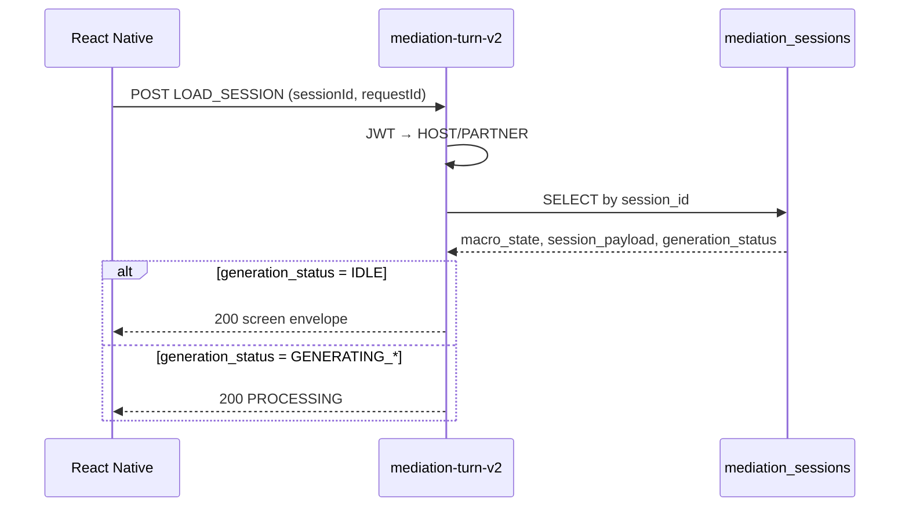
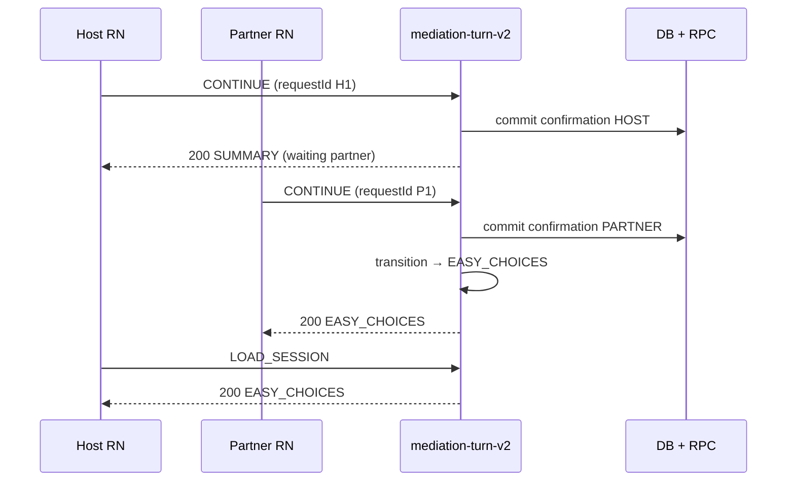
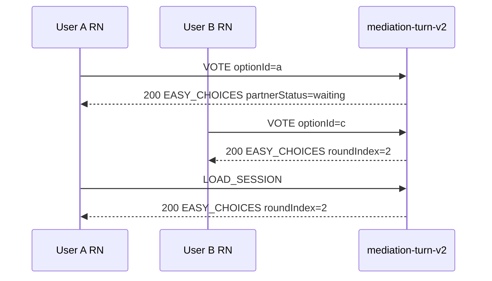
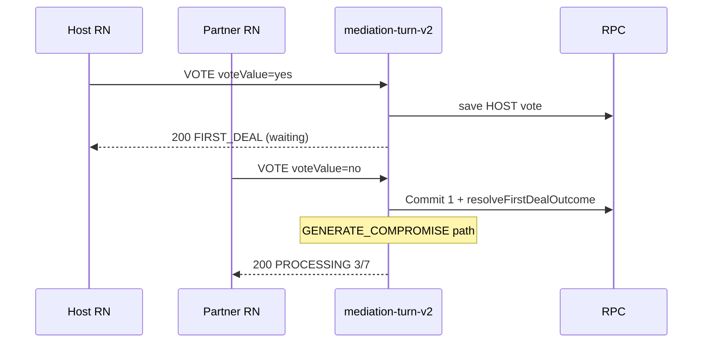
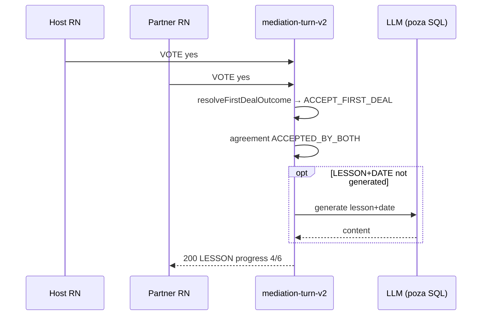
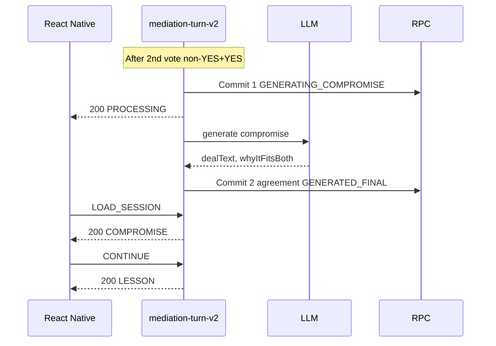
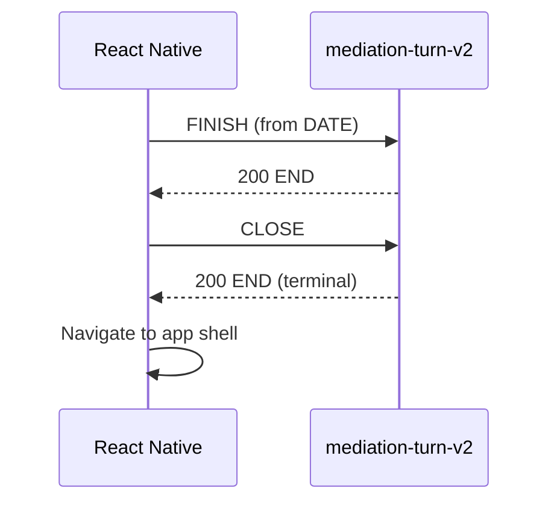

# Mediation V2 — API Contract

> **Typ:** kontrakt HTTP API (dokumentacja; bez implementacji)  
> **Data:** 2026-07-15 (rev. 1)  
> **Edge Function:** `mediation-turn-v2`  
> **Endpoint:** `POST /functions/v1/mediation-turn-v2`  
> **Źródła prawdy:** [mediation-v2-product-contract.md](./mediation-v2-product-contract.md) (rev. 3), [mediation-v2-architecture-alignment.md](./mediation-v2-architecture-alignment.md) (rev. 3)  
> **Reguła konfliktu:** Product Contract wygrywa.

---

## 1. Overview

### 1.1 Jedna funkcja, jeden endpoint

Mediacja V2 ma **jeden** runtime HTTP:

| Aspekt | Wartość |
|--------|---------|
| **Funkcja** | `mediation-turn-v2` |
| **Metoda** | `POST` |
| **URL** | `/functions/v1/mediation-turn-v2` |
| **Auth** | `Authorization: Bearer <JWT>` (Supabase) |
| **Content-Type** | `application/json` |

React Native **nie zawiera logiki biznesowej**. Wysyła akcję (`action`). Backend zwraca **gotowy ekran** (`screen + title + subtitle + content + actions + progress`).

### 1.2 Odpowiedzialności funkcji

Backend (`mediation-turn-v2`) odpowiada za:

| Obszar | Zakres |
|--------|--------|
| Auth | JWT → `auth.uid()` → mapowanie HOST/PARTNER |
| Load session | Odczyt `mediation_sessions` po `sessionId` |
| Idempotencja | `requestId` + `session_version` |
| Paywall | Integracja z limitami (reguła biznesowa TBD — Product Contract §20) |
| Walidacja | Akcja vs bieżący `macro_state`, schema payload |
| Przejścia | Deterministyczne `macro_state` (7 ekranów) |
| Decyzja gałęzi | `resolveFirstDealOutcome` — **bez LLM** |
| Persystencja | Atomowe RPC (`commit_mediation_action`) |
| LLM | Max **4** wywołania/sesję, **poza** transakcją SQL |
| Envelope | Jeden format odpowiedzi dla wszystkich ekranów |
| Exclusion history | Per `couple_id + conflict_category + content_type` |

### 1.3 Czego funkcja NIE robi

| Zakaz | Uzasadnienie |
|-------|--------------|
| Otwarty chat / dowolny tekst użytkownika | Product Contract §2, §10.4 |
| Druga runda głosowania | Product Contract §2 |
| Stany `DECISION`, `EASY_DEAL` | Product Contract §2 |
| LLM w transakcji SQL | Product Contract §5, §7 |
| LLM wybiera następny ekran | Product Contract §17 |
| Orchestrator legacy (`mediatorEngine`) | Architecture Alignment |
| Osobne formaty response per ekran | Product Contract §18 |
| Wywołania przez `mediator-runtime`, `live-mediator` | Architecture Alignment |

### 1.4 Model interakcji

```
RN (renderer)  ──POST { sessionId, requestId, action }──►  mediation-turn-v2
RN (renderer)  ◄── { ok, screen, content, actions, ... }──  mediation-turn-v2
```

RN renderuje to, co zwróci backend. RN **nie liczy** gałęzi flow, progresu całej sesji ani roli użytkownika.

---

## 2. Request Envelope

### 2.1 Pełny JSON

```json
{
  "sessionId": "550e8400-e29b-41d4-a716-446655440000",
  "requestId": "6ba7b810-9dad-11d1-80b4-00c04fd430c8",
  "action": {
    "type": "LOAD_SESSION",
    "optionId": null,
    "voteValue": null
  }
}
```

> **Uwaga strukturalna:** Product Contract §10.4 definiuje pola akcji użytkownika (`CONTINUE`, `VOTE`, `FINISH`, `CLOSE`). Ten dokument API dodaje **`LOAD_SESSION`** i **`RETRY`** wyłącznie jako akcje **transportowe** (odczyt / ponowienie generacji) — **bez** nowych ekranów, stanów `macro_state` ani wywołań LLM poza budżetem Product Contract §12.

### 2.2 Pola requestu

| Pole | Typ | Wymagane | Opis |
|------|-----|----------|------|
| `sessionId` | `uuid` | **tak** | PK sesji = `public.mediation_sessions.session_id` |
| `requestId` | `uuid` | **tak** | Idempotencja żądania; **nowy UUID** przy każdej intencji użytkownika lub retry |
| `action` | `object` | **tak** | Intencja klienta; patrz §3 |
| `action.type` | `ActionType` | **tak** | Typ akcji |
| `action.optionId` | `string \| null` | warunkowe | Wymagane dla `VOTE` na `EASY_CHOICES` |
| `action.voteValue` | `Vote \| null` | warunkowe | Wymagane dla `VOTE` na `FIRST_DEAL` |

**Pola zabronione w requestcie** (Product Contract §10.1a, §10.4):

- `role`, `talker`, `HOST`, `PARTNER`
- `couple_id`, `mediation_id`
- `screen`, `macro_state` (jako źródło prawdy)
- `message`, `userMessage`, dowolny wolny tekst
- `session_version` od klienta (optimistic lock jest po stronie RPC)

### 2.3 Walidacja identyfikatorów

| Reguła | Wartość |
|--------|---------|
| Format UUID | RFC 4122, regex: `^[0-9a-f]{8}-[0-9a-f]{4}-[1-8][0-9a-f]{3}-[89ab][0-9a-f]{3}-[0-9a-f]{12}$` (case-insensitive) |
| `sessionId` | Musi istnieć w DB; użytkownik musi być HOST lub PARTNER sesji |
| `requestId` | Musi być unikalny w scope `(sessionId, requestId)` dla nowej mutacji |

### 2.4 Walidacja `optionId`

| Reguła | Wartość |
|--------|---------|
| Typ | `string` |
| Max długość | **64** znaków |
| Dozwolone znaki | `[a-zA-Z0-9_-]` |
| Wymagane | Gdy `action.type = VOTE` i `screen = EASY_CHOICES` |
| Musi | Odpowiadać `id` jednej z opcji bieżącej rundy w `session_payload` |

### 2.5 Idempotencja (request)

- Ten sam `(sessionId, requestId)` **zawsze** zwraca **identyczną** odpowiedź HTTP (status + body).
- Backend zapisuje wynik pierwszego przetworzenia; repliki nie mutują stanu.
- Szczegóły: §13.

---

## 3. Action Types

### 3.1 Enum `ActionType`

| Wartość | Mutacja stanu | Opis |
|---------|---------------|------|
| `LOAD_SESSION` | **nie** | Odczyt bieżącego ekranu; wejście na live, odświeżenie, polling |
| `CONTINUE` | **tak** | Potwierdzenie ekranu (`SUMMARY`, `COMPROMISE`, `LESSON`) |
| `VOTE` | **tak** | Wybór kafelka (`EASY_CHOICES`) lub głos (`FIRST_DEAL`) |
| `FINISH` | **tak** | Zakończenie z ekranu `DATE` |
| `CLOSE` | **tak** | Zamknięcie z ekranu `END` |
| `RETRY` | **tak** | Ponowienie ostatniej nieudanej generacji LLM (`generation_status = FAILED`) |

> **Mapowanie nazw potocznych:**  
> `SELECT_OPTION` = `VOTE` + `optionId` (EASY_CHOICES)  
> `SUBMIT_VOTE` = `VOTE` + `voteValue` (FIRST_DEAL)

### 3.2 Tabela akcji

| `action.type` | Ekrany | Payload wymagany | Kiedy używana |
|---------------|--------|------------------|---------------|
| `LOAD_SESSION` | wszystkie | brak | Mount ekranu live; odświeżenie; polling `PROCESSING` |
| `CONTINUE` | `SUMMARY`, `COMPROMISE`, `LESSON` | brak | Użytkownik klika „Dalej" |
| `VOTE` | `EASY_CHOICES` | `optionId` | Wybór kafelka w rundzie |
| `VOTE` | `FIRST_DEAL` | `voteValue` | Głos YES / NO / STUBBORN |
| `FINISH` | `DATE` | brak | Użytkownik klika „Zakończ" |
| `CLOSE` | `END` | brak | Użytkownik klika „Wróć" |
| `RETRY` | dowolny z `generation_status = FAILED` | brak | Ponowienie generacji po błędzie LLM |

### 3.3 Semantyka per ekran

| `screen` | Dozwolone `action.type` | Niedozwolone |
|----------|-------------------------|--------------|
| `SUMMARY` | `LOAD_SESSION`, `CONTINUE` | `VOTE`, `FINISH`, `CLOSE` |
| `EASY_CHOICES` | `LOAD_SESSION`, `VOTE` | `CONTINUE`, `FINISH`, `CLOSE` |
| `FIRST_DEAL` | `LOAD_SESSION`, `VOTE` | `CONTINUE`, `FINISH`, `CLOSE` |
| `COMPROMISE` | `LOAD_SESSION`, `CONTINUE` | `VOTE`, `FINISH`, `CLOSE` |
| `LESSON` | `LOAD_SESSION`, `CONTINUE` | `VOTE`, `FINISH`, `CLOSE` |
| `DATE` | `LOAD_SESSION`, `FINISH` | `VOTE`, `CONTINUE`, `CLOSE` |
| `END` | `LOAD_SESSION`, `CLOSE` | `VOTE`, `CONTINUE`, `FINISH` |

Gdy `generation_status ∈ { GENERATING_COMPROMISE, GENERATING_CONTENT }`, mutujące akcje (poza idempotentnym replay) zwracają envelope **`PROCESSING`** (§10.6 Product Contract) — HTTP **200**.

---

## 4. Payload per Action

Wszystkie pola payload są **wewnątrz obiektu `action`**. Brak osobnego top-level `payload`.

### 4.1 `LOAD_SESSION`

```json
{
  "sessionId": "550e8400-e29b-41d4-a716-446655440000",
  "requestId": "11111111-1111-4111-8111-111111111111",
  "action": {
    "type": "LOAD_SESSION",
    "optionId": null,
    "voteValue": null
  }
}
```

### 4.2 `CONTINUE`

```json
{
  "sessionId": "550e8400-e29b-41d4-a716-446655440000",
  "requestId": "22222222-2222-4222-8222-222222222222",
  "action": {
    "type": "CONTINUE",
    "optionId": null,
    "voteValue": null
  }
}
```

### 4.3 `VOTE` — EASY_CHOICES (`SELECT_OPTION`)

```json
{
  "sessionId": "550e8400-e29b-41d4-a716-446655440000",
  "requestId": "33333333-3333-4333-8333-333333333333",
  "action": {
    "type": "VOTE",
    "optionId": "b",
    "voteValue": null
  }
}
```

### 4.4 `VOTE` — FIRST_DEAL (`SUBMIT_VOTE`)

```json
{
  "sessionId": "550e8400-e29b-41d4-a716-446655440000",
  "requestId": "44444444-4444-4444-8444-444444444444",
  "action": {
    "type": "VOTE",
    "optionId": null,
    "voteValue": "yes"
  }
}
```

Dozwolone `voteValue`: `"yes"` | `"no"` | `"stubborn"`.

### 4.5 `FINISH`

```json
{
  "sessionId": "550e8400-e29b-41d4-a716-446655440000",
  "requestId": "55555555-5555-4555-8555-555555555555",
  "action": {
    "type": "FINISH",
    "optionId": null,
    "voteValue": null
  }
}
```

### 4.6 `CLOSE`

```json
{
  "sessionId": "550e8400-e29b-41d4-a716-446655440000",
  "requestId": "66666666-6666-4666-8666-666666666666",
  "action": {
    "type": "CLOSE",
    "optionId": null,
    "voteValue": null
  }
}
```

### 4.7 `RETRY`

```json
{
  "sessionId": "550e8400-e29b-41d4-a716-446655440000",
  "requestId": "77777777-7777-4777-8777-777777777777",
  "action": {
    "type": "RETRY",
    "optionId": null,
    "voteValue": null
  }
}
```

- Dozwolone **tylko** gdy `generation_status = FAILED`.
- Wymaga **nowego** `requestId`.
- Liczy się w budżecie LLM (Product Contract §12).

---

## 5. Response Envelope

### 5.1 Sukces — pełny ekran (HTTP 200)

```json
{
  "ok": true,
  "sessionId": "550e8400-e29b-41d4-a716-446655440000",
  "screen": "SUMMARY",
  "title": "O czym dziś rozmawiamy",
  "subtitle": "Krótkie podsumowanie sporu",
  "content": {
    "summary": "..."
  },
  "actions": [
    {
      "id": "continue",
      "type": "CONTINUE",
      "label": "Dalej",
      "voteValue": null,
      "disabled": false,
      "loading": false,
      "visible": true
    }
  ],
  "progress": {
    "current": 1,
    "total": 6
  },
  "generationStatus": "IDLE",
  "sessionVersion": 3,
  "correlationId": "aaaaaaaa-aaaa-4aaa-8aaa-aaaaaaaaaaaa"
}
```

### 5.2 Pola odpowiedzi sukcesu

| Pole | Typ | Zawsze | Opis |
|------|-----|--------|------|
| `ok` | `boolean` | tak | `true` dla sukcesu |
| `sessionId` | `uuid` | tak | Echo PK sesji |
| `screen` | `Screen` | tak* | Bieżący ekran produktowy (*patrz PROCESSING) |
| `title` | `string` | tak* | Nagłówek ekranu |
| `subtitle` | `string \| null` | tak* | Podtytuł lub `null` |
| `content` | `object` | tak* | Payload specyficzny dla `screen` — §8 |
| `actions` | `Action[]` | tak* | Dostępne akcje UI — §7 |
| `progress` | `{ current, total }` | tak | Dynamiczny progress — §9 |
| `generationStatus` | `GenerationStatus` | tak | Stan techniczny generacji — §10 |
| `sessionVersion` | `integer` | tak | Wartość `mediation_sessions.session_version` po obsłudze |
| `correlationId` | `uuid` | tak | Id logów / support |

\* Przy odpowiedzi `PROCESSING` (§5.3) pola ekranu mogą być pominięte — klient pokazuje stan oczekiwania.

### 5.3 Sukces — PROCESSING (HTTP 200)

Gdy `generation_status ∈ { GENERATING_COMPROMISE, GENERATING_CONTENT }`:

```json
{
  "ok": true,
  "processing": true,
  "sessionId": "550e8400-e29b-41d4-a716-446655440000",
  "generationStatus": "GENERATING_COMPROMISE",
  "message": "PROCESSING",
  "progress": {
    "current": 3,
    "total": 7
  },
  "sessionVersion": 8,
  "correlationId": "bbbbbbbb-bbbb-4bbb-8bbb-bbbbbbbbbbbb"
}
```

- **Bez mutacji stanu** przy równoległych żądaniach.
- **Bez ponownego wywołania LLM**.
- Klient polluje przez `LOAD_SESSION` z nowym `requestId`.

### 5.4 Błąd (HTTP 4xx/5xx)

Patrz §12.

---

## 6. Screen Contract

Dla każdego ekranu: **7 stanów** Product Contract §2. RN renderuje `title`, `subtitle`, `content`, `actions`, `progress`. RN **nie liczy** następnego ekranu, gałęzi COMPROMISE, roli partnera ani `progress.total`.

### 6.1 `SUMMARY`

| Aspekt | Wartość |
|--------|---------|
| **Cel** | Potwierdzenie wspólnego zrozumienia sporu |
| **`content`** | `{ "summary": "string" }` |
| **`actions`** | `[{ type: "CONTINUE", label: "Dalej" }]` |
| **RN renderuje** | Tytuł, podtytuł, tekst summary, przycisk Dalej |
| **RN NIE liczy** | Kiedy partner potwierdził; backend ustawia `partnerStatus` implicit przez stan sesji |
| **Przejście** | Oboje `CONTINUE` → `EASY_CHOICES` |

### 6.2 `EASY_CHOICES`

| Aspekt | Wartość |
|--------|---------|
| **Cel** | 5 rund kafelkowych (3–4 opcje/runda) |
| **`content`** | `{ roundIndex, totalRounds: 5, question, options[], partnerStatus }` |
| **`actions`** | 3–4 × `{ type: "VOTE", id: optionId, label, voteValue: null }` |
| **`partnerStatus`** | `"waiting"` \| `"answered"` \| `"both_done"` |
| **RN renderuje** | Numer rundy, pytanie, kafelki, status partnera |
| **RN NIE liczy** | Numer następnej rundy po obu odpowiedziach; edycja po zamknięciu rundy |
| **Przejście** | Runda 5 oboje → `FIRST_DEAL` |

### 6.3 `FIRST_DEAL`

| Aspekt | Wartość |
|--------|---------|
| **Cel** | Jedna propozycja + **jedyne** głosowanie sesji |
| **`content`** | `{ "dealText": "string" }` |
| **`actions`** | 3 × `{ type: "VOTE", voteValue: "yes"\|"no"\|"stubborn" }` |
| **RN renderuje** | Tekst dealu, trzy kafelki głosowania |
| **RN NIE liczy** | `resolveFirstDealOutcome`; czy będzie COMPROMISE |
| **Przejście** | Po 2. głosie: YES+YES → `LESSON`; inaczej → generacja → `COMPROMISE` |

### 6.4 `COMPROMISE` (warunkowy)

| Aspekt | Wartość |
|--------|---------|
| **Cel** | Finalne rozwiązanie gdy brak YES+YES |
| **`content`** | `{ "dealText", "whyItFitsBoth" }` |
| **`actions`** | **Tylko** `[{ type: "CONTINUE", label: "Dalej" }]` — **brak VOTE** |
| **RN renderuje** | Tekst kompromisu, wyjaśnienie, Dalej |
| **RN NIE liczy** | Akceptacji — `agreement.acceptance = GENERATED_FINAL` już zapisane |
| **Przejście** | `CONTINUE` → `LESSON` |

### 6.5 `LESSON`

| Aspekt | Wartość |
|--------|---------|
| **Cel** | Refleksja po sporze |
| **`content`** | `{ "observation", "lesson" }` |
| **`actions`** | `[{ type: "CONTINUE", label: "Dalej" }]` |
| **RN renderuje** | Obserwacja + lekcja |
| **RN NIE liczy** | Kolejności względem DATE (generowane razem preferowane) |
| **Przejście** | `CONTINUE` → `DATE` |

### 6.6 `DATE`

| Aspekt | Wartość |
|--------|---------|
| **Cel** | Pomysł na randkę |
| **`content`** | `{ "dateIdea", "scenario": ["string"] }` |
| **`actions`** | `[{ type: "FINISH", label: "Zakończ" }]` |
| **RN renderuje** | Pomysł, lista kroków scenariusza |
| **RN NIE liczy** | Zakończenia sesji poza akcją użytkownika |
| **Przejście** | `FINISH` → `END` |

### 6.7 `END`

| Aspekt | Wartość |
|--------|---------|
| **Cel** | Zamknięcie sesji |
| **`content`** | `{ "closingMessage": "string" }` |
| **`actions`** | `[{ type: "CLOSE", label: "Wróć" }]` |
| **RN renderuje** | Podziękowanie, nawigacja do app shell |
| **RN NIE liczy** | `agreement` — już w `session_payload` |
| **Stan terminalny** | `macro_state = END`; brak dalszych przejść |

---

## 7. Actions[]

### 7.1 Kontrakt elementu `Action`

```json
{
  "id": "string",
  "type": "CONTINUE | VOTE | FINISH | CLOSE",
  "label": "string",
  "voteValue": "yes | no | stubborn | null",
  "disabled": false,
  "loading": false,
  "icon": "string | null",
  "visible": true
}
```

| Pole | Typ | Wymagane | Opis |
|------|-----|----------|------|
| `id` | `string` | tak | Stabilny identyfikator UI; dla VOTE na EASY_CHOICES = `optionId` |
| `type` | `ActionType` (response subset) | tak | `CONTINUE`, `VOTE`, `FINISH`, `CLOSE` — **bez** `LOAD_SESSION`/`RETRY` w response |
| `label` | `string` | tak | Tekst kafelka / przycisku (i18n po stronie backendu lub stałe) |
| `voteValue` | `Vote \| null` | tak | Ustawione dla FIRST_DEAL; `null` dla EASY_CHOICES i CONTINUE |
| `disabled` | `boolean` | nie (default `false`) | Kafelek nieaktywny (np. już zagłosowano, czekamy na partnera) |
| `loading` | `boolean` | nie (default `false`) | Wskazówka UI podczas wysyłania requestu |
| `icon` | `string \| null` | nie | Opcjonalny identyfikator ikony po stronie RN |
| `visible` | `boolean` | nie (default `true`) | `false` ukrywa akcję bez usuwania z kontraktu |

### 7.2 Zasady

- Backend **zawsze** zwraca komplet akcji dla bieżącego użytkownika i stanu sync.
- RN **nie dodaje** własnych akcji poza listą.
- Na `COMPROMISE` lista **musi** zawierać wyłącznie `CONTINUE`.
- Na `FIRST_DEAL` lista **musi** zawierać dokładnie 3× `VOTE` z `voteValue`.

---

## 8. Content object

Pole `content` jest obiektem JSON; kształt zależy od `screen`. Wszystkie ekrany muszą być odtwarzalne z `mediation_sessions` + `session_payload`.

### 8.1 Mapowanie `screen` → `content`

| `screen` | Pola `content` | Źródło w `session_payload` |
|----------|----------------|------------------------------|
| `SUMMARY` | `summary: string` | `summary` |
| `EASY_CHOICES` | `roundIndex`, `totalRounds`, `question`, `options[]`, `partnerStatus` | `easyChoices` |
| `FIRST_DEAL` | `dealText: string` | `firstDeal.dealText` |
| `COMPROMISE` | `dealText`, `whyItFitsBoth` | `compromise` |
| `LESSON` | `observation`, `lesson` | `lesson` |
| `DATE` | `dateIdea`, `scenario[]` | `date` |
| `END` | `closingMessage: string` | template / statyczny |

### 8.2 Typy zagnieżdżone

**`Option` (EASY_CHOICES):**

```json
{ "id": "a", "label": "string" }
```

**`agreement` (w payload sesji, nie zawsze w `content` ekranu):**

```json
{
  "source": "FIRST_DEAL | COMPROMISE",
  "text": "string",
  "acceptance": "ACCEPTED_BY_BOTH | GENERATED_FINAL",
  "createdAt": "2026-07-15T12:00:00.000Z"
}
```

RN może odczytać `agreement` z osobnego pola response **tylko jeśli** backend je eksponuje w przyszłości; Product Contract §10.2 nie wymaga `agreement` w envelope ekranu — wystarczy `session_payload` po stronie serwera.

---

## 9. Progress

### 9.1 Dynamiczne `total`

| Ścieżka | `progress.total` | Ekrany |
|---------|------------------|--------|
| YES + YES | **6** | SUMMARY → EASY_CHOICES → FIRST_DEAL → LESSON → DATE → END |
| Inna kombinacja głosów | **7** | … → COMPROMISE → LESSON → DATE → END |

`progress.total` ustawiane **per sesja** po wyniku `resolveFirstDealOutcome`.

### 9.2 Tabela `current` / `total`

**Bez COMPROMISE (6 ekranów):**

| `screen` | `progress` |
|----------|------------|
| `SUMMARY` | 1 / 6 |
| `EASY_CHOICES` | 2 / 6 |
| `FIRST_DEAL` | 3 / 6 |
| `LESSON` | 4 / 6 |
| `DATE` | 5 / 6 |
| `END` | 6 / 6 |

**Z COMPROMISE (7 ekranów):**

| `screen` | `progress` |
|----------|------------|
| `SUMMARY` | 1 / 7 |
| `EASY_CHOICES` | 2 / 7 |
| `FIRST_DEAL` | 3 / 7 |
| `COMPROMISE` | 4 / 7 |
| `LESSON` | 5 / 7 |
| `DATE` | 6 / 7 |
| `END` | 7 / 7 |

### 9.3 Reguły

- Po FIRST_DEAL → LESSON (YES+YES): **`4/6`**, bez skoku (np. zabronione `3/7 → 5/7`).
- Podczas `PROCESSING` po 2. głosie (ścieżka COMPROMISE): zwykle **`3/7`** do wyświetlenia COMPROMISE.
- Envelope **zawsze** zawiera oba pola: `progress.current` i `progress.total`.
- RN **nie przelicza** progress lokalnie.

---

## 10. Generation Status

### 10.1 Enum `GenerationStatus` (pole DB + response)

| Wartość | Semantyka |
|---------|-----------|
| `IDLE` | Brak trwającej generacji; normalna obsługa akcji |
| `GENERATING_CONTENT` | Trwa LLM (np. SUMMARY+EASY_CHOICES, FIRST_DEAL, LESSON+DATE) |
| `GENERATING_COMPROMISE` | Trwa LLM COMPROMISE po 2. głosie (ścieżka non-YES+YES) |
| `FAILED` | Ostatnia generacja LLM nie powiodła się; dozwolony `RETRY` |

### 10.2 `PROCESSING` (nie jest wartością enum)

`PROCESSING` to **`message`** w odpowiedzi HTTP gdy `generation_status ∈ { GENERATING_COMPROMISE, GENERATING_CONTENT }`:

- HTTP **200**, `ok: true`, `processing: true`
- Brak mutacji przy równoległych requestach
- Klient polluje aż `generationStatus` wróci do `IDLE` lub `FAILED`

### 10.3 Przebieg COMPROMISE

```
Commit 1 (RPC) → generation_status = GENERATING_COMPROMISE
       ↓
LLM × 1 (poza SQL)
       ↓
Commit 2 (RPC) → macro_state = COMPROMISE, generation_status = IDLE
```

---

## 11. HTTP Status Codes

| HTTP | Kiedy | Response body |
|------|-------|---------------|
| **200** | Sukces: pełny envelope ekranu lub `PROCESSING` | §5.1 lub §5.3 |
| **400** | Niepoprawny JSON, brak pól, zły UUID, zły format `action` | §12 `INVALID_REQUEST` |
| **401** | Brak JWT, wygasły token, niepoprawny token | §12 `NOT_AUTHORIZED` |
| **403** | Użytkownik nie jest HOST/PARTNER sesji; paywall | §12 `NOT_AUTHORIZED` lub `PAYWALL` |
| **404** | `sessionId` nie istnieje | §12 `NOT_FOUND` |
| **409** | Konflikt `session_version` / równoległa mutacja | §12 `CONFLICT` |
| **422** | Akcja niedozwolona dla ekranu; brak payload; zły `optionId`/`voteValue` | §12 `ILLEGAL_ACTION` |
| **429** | Rate limit (Edge / Supabase) | §12 `RATE_LIMITED` |
| **500** | Błąd wewnętrzny, RPC failure | §12 `INTERNAL` |
| **501** | Funkcja niezaimplementowana (stan skeleton) | §12 `NOT_IMPLEMENTED` |

**OPTIONS** → `200` (CORS preflight), bez body JSON.

---

## 12. Error Contract

### 12.1 Jednolity JSON błędu

```json
{
  "ok": false,
  "error": "INVALID_REQUEST",
  "message": "Human-readable description",
  "correlationId": "cccccccc-cccc-4ccc-8ccc-cccccccccccc"
}
```

### 12.2 Enum `ErrorCode`

| `error` | HTTP | Opis |
|---------|------|------|
| `INVALID_REQUEST` | 400 | Schema / typ / UUID / długość |
| `NOT_AUTHORIZED` | 401, 403 | Auth lub brak dostępu do sesji |
| `NOT_FOUND` | 404 | Nieznany `sessionId` |
| `CONFLICT` | 409 | Optimistic lock / równoległa mutacja |
| `ILLEGAL_ACTION` | 422 | Akcja vs ekran; brak `optionId`/`voteValue` |
| `PAYWALL` | 403 | Limit subskrypcji (reguła TBD — §20 Product Contract) |
| `RATE_LIMITED` | 429 | Throttling |
| `NOT_IMPLEMENTED` | 501 | Skeleton / nieobsługiwany ekran |
| `INTERNAL` | 500 | Błąd serwera |

Product Contract §10.5 definiuje podzbiór: `INVALID_REQUEST | NOT_AUTHORIZED | PAYWALL | NOT_IMPLEMENTED | INTERNAL`. Ten dokument API rozszerza o kody transportowe (`NOT_FOUND`, `CONFLICT`, `ILLEGAL_ACTION`, `RATE_LIMITED`) **bez** zmiany flow produktowego.

---

## 13. Idempotency

### 13.1 `requestId`

| Reguła | Opis |
|--------|------|
| Scope | Unikalność w `(sessionId, requestId)` |
| Nowa intencja | **Nowy** UUID v4 |
| Replay sieci | Ten sam `requestId` → ta sama odpowiedź, **bez** podwójnej mutacji |
| Storage | Backend zapisuje hash requestu + response + `session_version` |

### 13.2 `session_version`

- Inkrementowany przy każdym atomowym commicie.
- RPC weryfikuje wersję oczekiwaną — konflikt → HTTP **409**.
- Response zawsze zwraca aktualny `sessionVersion`.

### 13.3 Retry sieciowy

1. Klient wysyła request z `requestId = R1`.
2. Timeout / brak odpowiedzi.
3. Klient **ponawia z tym samym `R1`** → backend zwraca cached response.
4. Klient **nie generuje `R2`** dla tej samej intencji użytkownika.

### 13.4 Retry generacji LLM

- Po `generation_status = FAILED`: **nowy** `requestId` + `action.type = RETRY`.
- Nie wlicza się jako osobna runda produktowa; obowiązuje limit 4 LLM/sesję.

---

## 14. Concurrency

### 14.1 Drugi partner

- HOST i PARTNER wysyłają **niezależne** requesty z własnymi `requestId`.
- Backend mapuje `auth.uid()` → rola; **klient nie przesyła roli**.
- EASY_CHOICES: odpowiedzi osobno; `partnerStatus` w `content` odzwierciedla sync.
- SUMMARY / LESSON: oboje muszą `CONTINUE` — backend śledzi `confirmations` w payload.

### 14.2 Race conditions

| Scenariusz | Zachowanie |
|------------|------------|
| Dwa głosy FIRST_DEAL równolegle | Drugi commit atomowy; po 2. głosie `resolveFirstDealOutcome` |
| CONTINUE oboje w tej samej ms | Idempotencja + RPC serializuje |
| Request podczas `GENERATING_*` | HTTP 200 `PROCESSING`, brak mutacji |
| Ten sam `requestId` równolegle | Jedna mutacja; reszta cached response |

### 14.3 Polling

- Gdy `processing: true`, klient wysyła `LOAD_SESSION` co **1–2 s** (backoff opcjonalny).
- Po `generationStatus = IDLE`, następny response zawiera pełny ekran (`COMPROMISE` lub `LESSON`).

---

## 15. Validation Rules

| Reguła | Szczegóły |
|--------|-----------|
| UUID | `sessionId`, `requestId`, `correlationId` — format RFC 4122 |
| Brak wolnego tekstu | Odrzucenie dowolnego pola `message` / chat |
| `action.type` | Musi być członkiem `ActionType` |
| `optionId` | Wymagany iff `VOTE` + `EASY_CHOICES`; max 64 znaków |
| `voteValue` | Wymagany iff `VOTE` + `FIRST_DEAL`; enum `yes\|no\|stubborn` |
| Screen mismatch | `CONTINUE` na `FIRST_DEAL` → **422** `ILLEGAL_ACTION` |
| `RETRY` | Tylko gdy `generation_status = FAILED` |
| `LOAD_SESSION` | Zawsze dozwolony dla uczestnika sesji |
| Paywall | TBD — Product Contract §20 |
| LLM output | JSON schema validation; **bez** retry stylistycznego |

---

## 16. Deterministic Rules

| # | Zasada |
|---|--------|
| 1 | Backend jest **jedynym** źródłem prawdy o `macro_state` |
| 2 | RN renderuje envelope; **nie** gałęzi flow |
| 3 | Klient **nie przesyła** roli, ekranu, `couple_id` |
| 4 | LLM generuje **wyłącznie** treść widoczną (`content` fields) |
| 5 | LLM **nigdy** nie wybiera następnego `screen` |
| 6 | `resolveFirstDealOutcome`: tylko `YES+YES` → ACCEPT; reszta → COMPROMISE |
| 7 | Jedna odpowiedź API = **jeden kompletny ekran** (lub `PROCESSING`) |
| 8 | Mutacje **tylko** przez atomowe RPC |
| 9 | LLM **poza** transakcją SQL |
| 10 | Max **4** wywołania LLM / sesję |
| 11 | Każda zakończona sesja = dokładnie **jedno** `agreement` |
| 12 | `agreement.acceptance`: `ACCEPTED_BY_BOTH` vs `GENERATED_FINAL` |

---

## 17. Sequence Diagrams (Mermaid)

### 17.1 LOAD_SESSION



### 17.2 SUMMARY (oboje CONTINUE)



### 17.3 EASY_CHOICES (runda 1)



### 17.4 FIRST_DEAL (głosowanie)



### 17.5 YES + YES → LESSON



### 17.6 COMPROMISE



### 17.7 END



---

## 18. Examples

Poniżej pełne przykłady request/response. Wszystkie UUID są przykładowe.

### 18.1 SUMMARY

**Request (`CONTINUE` — host potwierdza):**

```json
{
  "sessionId": "550e8400-e29b-41d4-a716-446655440000",
  "requestId": "a1000001-0001-4001-8001-000000000001",
  "action": { "type": "CONTINUE", "optionId": null, "voteValue": null }
}
```

**Response (partner jeszcze nie potwierdził — nadal SUMMARY):**

```json
{
  "ok": true,
  "sessionId": "550e8400-e29b-41d4-a716-446655440000",
  "screen": "SUMMARY",
  "title": "O czym dziś rozmawiamy",
  "subtitle": "Spór o obowiązki domowe",
  "content": {
    "summary": "Oboje czujecie, że podział obowiązków jest niesprawiedliwy. Host czuje, że robi więcej, partner czuje, że jego wysiłek jest niedoceniany."
  },
  "actions": [
    {
      "id": "continue",
      "type": "CONTINUE",
      "label": "Dalej",
      "voteValue": null,
      "disabled": true,
      "loading": false,
      "visible": true
    }
  ],
  "progress": { "current": 1, "total": 6 },
  "generationStatus": "IDLE",
  "sessionVersion": 2,
  "correlationId": "c1000001-0001-4001-8001-000000000001"
}
```

### 18.2 EASY_CHOICES

**Request (`VOTE` — wybór kafelka):**

```json
{
  "sessionId": "550e8400-e29b-41d4-a716-446655440000",
  "requestId": "a2000002-0002-4002-8002-000000000002",
  "action": { "type": "VOTE", "optionId": "b", "voteValue": null }
}
```

**Response:**

```json
{
  "ok": true,
  "sessionId": "550e8400-e29b-41d4-a716-446655440000",
  "screen": "EASY_CHOICES",
  "title": "Runda 2 z 5",
  "subtitle": null,
  "content": {
    "roundIndex": 2,
    "totalRounds": 5,
    "question": "Kiedy ostatnio poculiście się razem bez telefonów?",
    "options": [
      { "id": "a", "label": "Wczoraj — ale to był przypadek" },
      { "id": "b", "label": "Tydzień temu, przy kawie" },
      { "id": "c", "label": "Nie pamiętam, ale brzmi znajomo" },
      { "id": "d", "label": "Telefon to mój partner życiowy" }
    ],
    "partnerStatus": "waiting"
  },
  "actions": [
    { "id": "a", "type": "VOTE", "label": "Wczoraj — ale to był przypadek", "voteValue": null, "disabled": false, "visible": true },
    { "id": "b", "type": "VOTE", "label": "Tydzień temu, przy kawie", "voteValue": null, "disabled": false, "visible": true },
    { "id": "c", "type": "VOTE", "label": "Nie pamiętam, ale brzmi znajomo", "voteValue": null, "disabled": false, "visible": true },
    { "id": "d", "type": "VOTE", "label": "Telefon to mój partner życiowy", "voteValue": null, "disabled": false, "visible": true }
  ],
  "progress": { "current": 2, "total": 6 },
  "generationStatus": "IDLE",
  "sessionVersion": 5,
  "correlationId": "c2000002-0002-4002-8002-000000000002"
}
```

### 18.3 FIRST_DEAL

**Request (`VOTE` — głos YES):**

```json
{
  "sessionId": "550e8400-e29b-41d4-a716-446655440000",
  "requestId": "a3000003-0003-4003-8003-000000000003",
  "action": { "type": "VOTE", "optionId": null, "voteValue": "yes" }
}
```

**Response (czeka na partnera):**

```json
{
  "ok": true,
  "sessionId": "550e8400-e29b-41d4-a716-446655440000",
  "screen": "FIRST_DEAL",
  "title": "Propozycja porozumienia",
  "subtitle": null,
  "content": {
    "dealText": "Przez najbliższy tydzień każde z was przejmuje jedną strefę domu — kuchnię lub łazienkę — i utrzymuje ją na bieżąco. W piątek wieczorem robicie 15-minutowy check-in przy herbacie."
  },
  "actions": [
    { "id": "vote-yes", "type": "VOTE", "label": "Tak", "voteValue": "yes", "disabled": true, "visible": true },
    { "id": "vote-no", "type": "VOTE", "label": "Nie", "voteValue": "no", "disabled": true, "visible": true },
    { "id": "vote-stubborn", "type": "VOTE", "label": "Nie chcę, jestem uparty/a", "voteValue": "stubborn", "disabled": true, "visible": true }
  ],
  "progress": { "current": 3, "total": 7 },
  "generationStatus": "IDLE",
  "sessionVersion": 12,
  "correlationId": "c3000003-0003-4003-8003-000000000003"
}
```

### 18.4 COMPROMISE

**Request (`LOAD_SESSION` po zakończeniu generacji):**

```json
{
  "sessionId": "550e8400-e29b-41d4-a716-446655440000",
  "requestId": "a4000004-0004-4004-8004-000000000004",
  "action": { "type": "LOAD_SESSION", "optionId": null, "voteValue": null }
}
```

**Response:**

```json
{
  "ok": true,
  "sessionId": "550e8400-e29b-41d4-a716-446655440000",
  "screen": "COMPROMISE",
  "title": "Kompromis na dziś",
  "subtitle": "To finalne ustalenie sesji",
  "content": {
    "dealText": "Dziś wieczorem każde z was robi jeden konkretny krok: host zmywa i wyciera blat, partner odkłada rzeczy z podłogi w salonie. Jutro rano 5-minutowa wymiana bez ocen.",
    "whyItFitsBoth": "Host dostaje natychmiastową ulgę w kuchni, partner — mniejszy, jasno ograniczony krok zamiast poczucia niesprawiedliwego podziału."
  },
  "actions": [
    { "id": "continue", "type": "CONTINUE", "label": "Dalej", "voteValue": null, "disabled": false, "visible": true }
  ],
  "progress": { "current": 4, "total": 7 },
  "generationStatus": "IDLE",
  "sessionVersion": 15,
  "correlationId": "c4000004-0004-4004-8004-000000000004"
}
```

### 18.5 LESSON

**Request (`CONTINUE`):**

```json
{
  "sessionId": "550e8400-e29b-41d4-a716-446655440000",
  "requestId": "a5000005-0005-4005-8005-000000000005",
  "action": { "type": "CONTINUE", "optionId": null, "voteValue": null }
}
```

**Response:**

```json
{
  "ok": true,
  "sessionId": "550e8400-e29b-41d4-a716-446655440000",
  "screen": "LESSON",
  "title": "Lekcja na przyszłość",
  "subtitle": null,
  "content": {
    "observation": "Konflikt wybuchał, gdy obowiązki były domyślne, a nie ustalone. Brak krótkiego check-inu pozwalał na narastanie irytacji.",
    "lesson": "Ustalcie jeden cotygodniowy 10-minutowy moment na podział zadań — bez telefonów, bez rozliczania."
  },
  "actions": [
    { "id": "continue", "type": "CONTINUE", "label": "Dalej", "voteValue": null, "disabled": false, "visible": true }
  ],
  "progress": { "current": 5, "total": 7 },
  "generationStatus": "IDLE",
  "sessionVersion": 16,
  "correlationId": "c5000005-0005-4005-8005-000000000005"
}
```

### 18.6 DATE

**Request (`FINISH`):**

```json
{
  "sessionId": "550e8400-e29b-41d4-a716-446655440000",
  "requestId": "a6000006-0006-4006-8006-000000000006",
  "action": { "type": "FINISH", "optionId": null, "voteValue": null }
}
```

**Response (następny ekran END — przykład odpowiedzi po FINISH):**

```json
{
  "ok": true,
  "sessionId": "550e8400-e29b-41d4-a716-446655440000",
  "screen": "DATE",
  "title": "Pomysł na randkę",
  "subtitle": "Coś prostego na ten tydzień",
  "content": {
    "dateIdea": "Wieczór herbaty i planszówki",
    "scenario": [
      "Zablokujcie 45 minut w kalendarzu",
      "Przygotujcie herbatę — każde swoją ulubioną",
      "Wyłączcie telefony do szuflady",
      "Jedna szybka gra — bez rozgrywek na cały wieczór",
      "Na koniec jedno zdanie: co dziś doceniam w partnerze"
    ]
  },
  "actions": [
    { "id": "finish", "type": "FINISH", "label": "Zakończ", "voteValue": null, "disabled": false, "visible": true }
  ],
  "progress": { "current": 6, "total": 7 },
  "generationStatus": "IDLE",
  "sessionVersion": 17,
  "correlationId": "c6000006-0006-4006-8006-000000000006"
}
```

> **Uwaga:** Powyższy response DATE ilustruje ekran **przed** kliknięciem FINISH. Po `FINISH` backend zwraca `screen: "END"`.

### 18.7 END

**Response (po FINISH z DATE):**

```json
{
  "ok": true,
  "sessionId": "550e8400-e29b-41d4-a716-446655440000",
  "screen": "END",
  "title": "Dziękujemy",
  "subtitle": null,
  "content": {
    "closingMessage": "Sesja mediacji zakończona. Wasze ustalenie zostało zapisane."
  },
  "actions": [
    { "id": "close", "type": "CLOSE", "label": "Wróć", "voteValue": null, "disabled": false, "visible": true }
  ],
  "progress": { "current": 7, "total": 7 },
  "generationStatus": "IDLE",
  "sessionVersion": 18,
  "correlationId": "c7000007-0007-4007-8007-000000000007"
}
```

---

## 19. Appendix

### 19.1 Enum `Screen`

```
SUMMARY
EASY_CHOICES
FIRST_DEAL
COMPROMISE
LESSON
DATE
END
```

**Usunięte (nie używać):** `DECISION`, `EASY_DEAL`, `START_CHAT`, `GATHER_INFO`, `PROPOSE_DEAL`.

### 19.2 Enum `ActionType` (request)

```
LOAD_SESSION
CONTINUE
VOTE
FINISH
CLOSE
RETRY
```

**Response `actions[].type` (subset):**

```
CONTINUE
VOTE
FINISH
CLOSE
```

### 19.3 Enum `Vote`

```
yes
no
stubborn
```

### 19.4 Enum `GenerationStatus`

```
IDLE
GENERATING_CONTENT
GENERATING_COMPROMISE
FAILED
```

**Nie jest enum:** `PROCESSING` — flaga/message odpowiedzi HTTP (§10.2).

### 19.5 Enum `AgreementSource`

```
FIRST_DEAL
COMPROMISE
```

### 19.6 Enum `AgreementAcceptance`

```
ACCEPTED_BY_BOTH
GENERATED_FINAL
```

### 19.7 Enum `PartnerStatus` (EASY_CHOICES content)

```
waiting
answered
both_done
```

### 19.8 Enum `ErrorCode`

```
INVALID_REQUEST
NOT_AUTHORIZED
NOT_FOUND
CONFLICT
ILLEGAL_ACTION
PAYWALL
RATE_LIMITED
NOT_IMPLEMENTED
INTERNAL
```

---

*Dokument zamknięty (rev. 1). Implementacja kodu, migracji i deploymentu poza zakresem tego artefaktu.*
