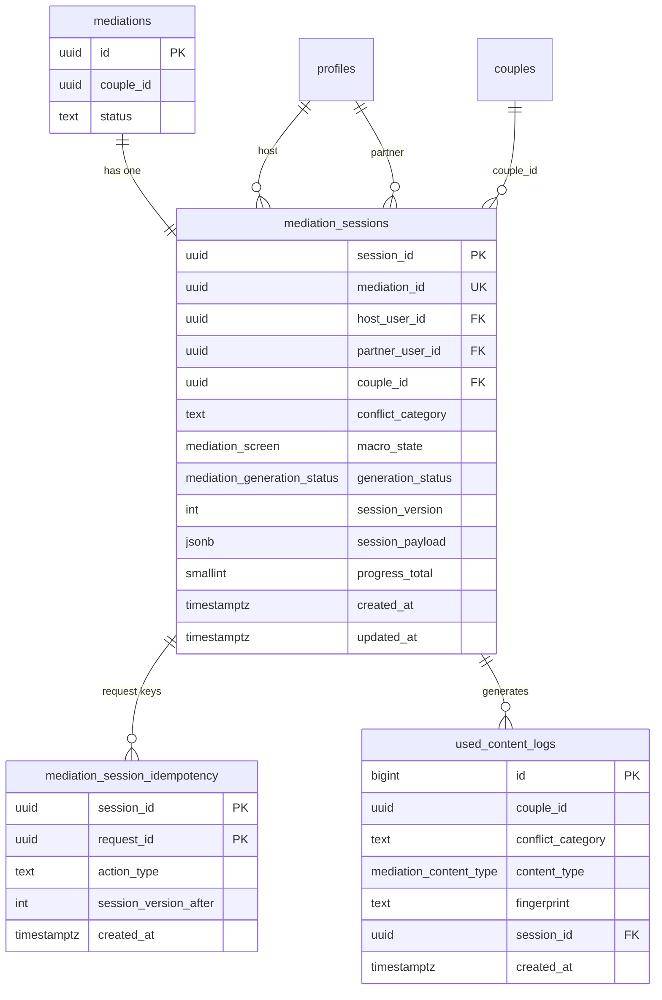

# Mediation V2 — Database Contract

> **Typ:** projekt docelowego modelu PostgreSQL (dokumentacja; bez SQL, bez migracji)  
> **Data:** 2026-07-15 (rev. 1)  
> **Docelowa migracja:** `033` (planowana; poza zakresem tego artefaktu)  
> **Źródła prawdy:** [mediation-v2-product-contract.md](./mediation-v2-product-contract.md) (rev. 3), [mediation-v2-api-contract.md](./mediation-v2-api-contract.md) (rev. 1), [mediation-v2-architecture-alignment.md](./mediation-v2-architecture-alignment.md) (rev. 3)  
> **Reguła konfliktu:** Product Contract > API Contract > Architecture Alignment

---

## 1. Overview

### 1.1 Opis modelu danych

Mediacja V2 persystuje **jedną sesję kafelkową** jako wiersz w `public.mediation_sessions` oraz **historię unikalności treści** w `public.used_content_logs`. Stan produktowy (7 ekranów, głosy, agreement, treści LLM) żyje w **`session_payload` (JSONB)**. Kolumny wiersza sesji (`macro_state`, `generation_status`, `session_version`) są indeksem operacyjnym dla Edge Function i RPC.

Mutacje **wyłącznie** przez `service_role` RPC (`SECURITY DEFINER`). Uczestnicy (`authenticated`) mają **SELECT** własnej sesji — bez bezpośredniego INSERT/UPDATE/DELETE.

### 1.2 Założenia

| # | Założenie |
|---|-----------|
| 1 | **Jedna sesja V2 = jeden wiersz** `mediation_sessions` (1:1 z `mediations.id` przez `mediation_id`) |
| 2 | **`session_id`** = PK i **`sessionId`** w API (Product Contract §9, API Contract §2) |
| 3 | **`couple_id` + `conflict_category`** zapisane w wierszu sesji przy utworzeniu (Product Contract §9.1 — **opcja A**) |
| 4 | **Brak chatu** — zero tabel/wierszy na dowolny tekst użytkownika |
| 5 | **Max 6 wywołań LLM / sesję** — `session_payload.metadata.llmCallCount` = liczba **rozpoczętych** Claude calls; +1 wyłącznie przy claim outcome `CLAIMED` (w tym reclaim) |
| 6 | **LLM poza transakcją SQL** — RPC Commit 1 / Commit 2 (Product Contract §5, §7) |
| 7 | **Idempotencja** — `(session_id, request_id)` w osobnej tabeli |
| 8 | **`mediations`** (intake) pozostaje tabelą SHARED; legacy JSONB runtime zostanie usunięte po cutover (Architecture Alignment §6) |

### 1.3 Dlaczego `chat_history` znika

| Aspekt | Legacy (031) | V2 docelowy |
|--------|--------------|-------------|
| Model interakcji | Append-only pary `user_message` / `mediator_message` | Kafelki + jedno głosowanie FIRST_DEAL |
| Źródło prawdy UI | Rekonstrukcja z tablicy wiadomości | `macro_state` + `session_payload` |
| RPC | `commit_mediation_turn` | Atomowe `commit_mediation_*` |
| Product Contract | **Usunięte** §9 | `session_payload` zastępuje `chat_history` |

`chat_history` implikuje otwarty chat i turę czatu — **zabronione** w V2 (Product Contract §2, §18).

### 1.4 Dlaczego `session_payload` jest jedynym źródłem prawdy treści

- Każdy ekran musi być **odtwarzalny** z `mediation_sessions` + `session_payload` (Architecture Alignment — V2 Principles §12).
- Envelope API (`content`) jest **projekcją** payloadu + `macro_state`, nie osobnym store.
- Pola `summary`, `easyChoices`, `firstDeal`, `compromise`, `agreement`, `lesson`, `date` są **wersjonowane razem** w jednym commicie JSONB.
- Unika split-brain między kolumnami JSONB a wieloma tabelami satelitarnymi.

Kolumny wiersza (`macro_state`, `generation_status`, `session_version`) są **metadanymi operacyjnymi**; treść ekranu zawsze pochodzi z payloadu.

---

## 2. Tabela `mediation_sessions`

Jedna tabela sesji runtime V2.

### 2.1 Kolumny

| Kolumna | Typ | Nullable | Default | Opis | Kiedy zmieniana | Przez kogo |
|---------|-----|----------|---------|------|-----------------|------------|
| `session_id` | `uuid` | NOT NULL | `gen_random_uuid()` | PK sesji; = API `sessionId` | Nigdy po INSERT | `create_mediation_session` RPC |
| `mediation_id` | `uuid` | NOT NULL | — | FK → `public.mediations(id)`; 1 sesja / mediację | Nigdy | `create_mediation_session` RPC |
| `host_user_id` | `uuid` | NOT NULL | — | FK → `profiles(id)`; twórca sesji | Nigdy | `create_mediation_session` RPC |
| `partner_user_id` | `uuid` | NULL | NULL | FK → `profiles(id)`; NULL do czasu join partnera | Raz (join partnera) | `create_mediation_session` / `link_partner` RPC |
| `couple_id` | `uuid` | NOT NULL | — | Para; źródło exclusion history | Nigdy po INSERT | `create_mediation_session` RPC |
| `conflict_category` | `text` | NOT NULL | — | Kategoria sporu (np. `money`, `chores`) | Nigdy po INSERT | `create_mediation_session` RPC |
| `macro_state` | `mediation_screen` | NOT NULL | `'SUMMARY'` | Bieżący ekran produktowy (7 stanów) | Każde przejście ekranu | RPC commit_* |
| `generation_status` | `mediation_generation_status` | NOT NULL | `'IDLE'` | Stan techniczny generacji LLM | Commit 1/2 generacji; retry | RPC commit_generation |
| `session_version` | `integer` | NOT NULL | `0` | Licznik mutacji; optimistic lock | Każdy atomowy commit | Wszystkie RPC mutujące |
| `session_payload` | `jsonb` | NOT NULL | szablon §3 | Pełny stan treści sesji | Każdy commit zmieniający treść/stan | RPC commit_* |
| `progress_total` | `smallint` | NULL | NULL | `6` lub `7`; NULL do 2. głosu FIRST_DEAL | Po `resolveFirstDealOutcome` | RPC commit_vote |
| `prompt_version` | `text` | NOT NULL | `'most-v2'` | Audyt wersji promptu | Przy generacji LLM | Edge → RPC commit_generation |
| `model_version` | `text` | NOT NULL | — | Audyt modelu LLM | Przy generacji LLM | Edge → RPC commit_generation |
| `created_at` | `timestamptz` | NOT NULL | `now()` | Utworzenie sesji | INSERT | `create_mediation_session` |
| `updated_at` | `timestamptz` | NOT NULL | `now()` | Ostatnia mutacja | Każdy UPDATE | Trigger `set_mediation_session_updated_at` |

**Usunięte względem 031 (nie przenosić):** `chat_history`, `message_count`, `current_talker`, `current_macro_state`, `last_request_id` (zastąpione tabelą idempotencji).

### 2.2 Relacje

| Relacja | Reguła |
|---------|--------|
| `mediation_id` | UNIQUE — jedna sesja V2 na mediację |
| `host_user_id` ≠ `partner_user_id` | CHECK gdy partner ustawiony |
| `couple_id` | FK → `couples(id)` lub logiczny identyfikator pary (zgodnie z istniejącym modelem `mediations`) |

---

## 3. `session_payload`

Obiekt JSONB w kolumnie `mediation_sessions.session_payload`. **Jedyny store treści sesji.**

### 3.1 Szablon początkowy

```json
{
  "summary": null,
  "easyChoices": {
    "rounds": [],
    "answers": { "HOST": {}, "PARTNER": {} },
    "currentRound": 0
  },
  "firstDeal": null,
  "firstDealVotes": { "HOST": null, "PARTNER": null },
  "compromise": null,
  "agreement": null,
  "lesson": null,
  "date": null,
  "confirmations": {
    "SUMMARY": { "HOST": false, "PARTNER": false },
    "LESSON": { "HOST": false, "PARTNER": false },
    "COMPROMISE": { "HOST": false, "PARTNER": false }
  },
  "metadata": {
    "llmCallCount": 0,
    "lastFailedAt": null
  }
}
```

### 3.2 Pola — field-by-field

| Pole | Typ JSON | Nullable | Opis | Kiedy ustawiane |
|------|----------|----------|------|-----------------|
| `summary` | `string` | tak (`null` → wygenerowane) | Tekst podsumowania sporu (SUMMARY) | Po LLM SUMMARY+EASY_CHOICES |
| `easyChoices` | `object` | nie | Stan 5 rund kafelkowych | Patrz §3.3 |
| `firstDeal` | `object \| null` | tak | Propozycja FIRST_DEAL | Po LLM FIRST_DEAL |
| `firstDealVotes` | `object` | nie | Głosy HOST/PARTNER | Po każdym VOTE FIRST_DEAL |
| `compromise` | `object \| null` | tak | Treść COMPROMISE | Po LLM COMPROMISE (Commit 2) |
| `agreement` | `object \| null` | tak | Finalne ustalenie sesji | Po YES+YES lub po Commit 2 COMPROMISE |
| `lesson` | `object \| null` | tak | Lekcja (observation + lesson) | Po LLM LESSON+DATE |
| `date` | `object \| null` | tak | Pomysł na randkę | Po LLM LESSON+DATE |
| `confirmations` | `object` | nie | Kto potwierdził CONTINUE na sync ekranach | Po commit_action CONTINUE |
| `metadata` | `object` | nie | Liczniki techniczne | Edge + RPC |

**Nie implementować w payload:** `compromiseVotes`, `easyDeal`, `chat_history`, dowolny klucz `messages[]`.

### 3.3 `easyChoices`

| Podpole | Typ | Opis |
|---------|-----|------|
| `rounds` | `array` | 5 elementów po generacji LLM; każdy: `{ roundIndex, question, options[{ id, label }] }` |
| `answers.HOST` | `object` | Mapa `"roundIndex" → "optionId"` (string keys `"1"`…`"5"`) |
| `answers.PARTNER` | `object` | j.w. |
| `currentRound` | `integer` | `0` przed startem; `1`–`5` bieżąca runda; po rundzie 5 oboje → przejście FIRST_DEAL |

**Reguły:** jedna odpowiedź na osobę na rundę; edycja do odpowiedzi drugiej osoby (Product Contract §13).

### 3.4 `firstDeal`

| Podpole | Typ | Opis |
|---------|-----|------|
| `dealText` | `string` | Tekst propozycji wyświetlany na FIRST_DEAL |

### 3.5 `compromise`

| Podpole | Typ | Opis |
|---------|-----|------|
| `dealText` | `string` | Finalne rozwiązanie sesji |
| `whyItFitsBoth` | `string` | Krótkie wyjaśnienie |

### 3.6 `lesson`

| Podpole | Typ | Opis |
|---------|-----|------|
| `observation` | `string` | 2–4 zdania obserwacji |
| `lesson` | `string` | 1 zdanie lekcji |

### 3.7 `date`

| Podpole | Typ | Opis |
|---------|-----|------|
| `dateIdea` | `string` | Tytuł pomysłu |
| `scenario` | `string[]` | 3–5 kroków |

### 3.8 `confirmations`

Mapa ekranów wymagających sync obojga uczestników:

| Klucz | Wartość | Ekrany |
|-------|---------|--------|
| `SUMMARY` | `{ HOST: boolean, PARTNER: boolean }` | Oboje CONTINUE → EASY_CHOICES |
| `COMPROMISE` | `{ HOST: boolean, PARTNER: boolean }` | Oboje CONTINUE → LESSON |
| `LESSON` | `{ HOST: boolean, PARTNER: boolean }` | Oboje CONTINUE → DATE |

`FIRST_DEAL` używa `firstDealVotes`, nie `confirmations`.

### 3.9 `metadata`

| Podpole | Typ | Opis |
|---------|-----|------|
| `llmCallCount` | `integer` | Liczba **rozpoczętych** wywołań Claude (max **6**). +1 wyłącznie przy claim `CLAIMED` (w tym reclaim). Nie cofany przy fail sieci/parsera. |
| `lastFailedAt` | `string (ISO) \| null` | Timestamp ostatniego `generation_status = FAILED` |

**Nie duplikować w payload:** `lastGenerationKind` — autorytatywne jest `mediation_sessions.last_generation_kind` (kolumna).

**Uwaga:** `screen` **nie** jest duplikowany w payload — autorytatywne jest `macro_state` / `current_screen` w wierszu. `progress.current` **nie** jest persystowane — liczone przy projekcji envelope z `macro_state` + `progress_total` (Product Contract §11, API Contract §9).

---

## 4. `agreement`

Pole `session_payload.agreement`. **Dokładnie jedno** na zakończoną sesję.

### 4.1 Struktura

```json
{
  "source": "FIRST_DEAL",
  "acceptance": "ACCEPTED_BY_BOTH",
  "text": "string",
  "createdAt": "2026-07-15T12:00:00.000Z"
}
```

### 4.2 Pola

| Pole | Typ | Enum / wartości | Opis |
|------|-----|-----------------|------|
| `source` | `string` | `FIRST_DEAL` \| `COMPROMISE` | Skąd pochodzi tekst ustalenia |
| `acceptance` | `string` | `ACCEPTED_BY_BOTH` \| `GENERATED_FINAL` | YES+YES vs wygenerowany COMPROMISE |
| `text` | `string` | — | Treść ustalenia (= `firstDeal.dealText` lub `compromise.dealText`) |
| `createdAt` | `string` (ISO 8601) | — | Moment zapisu agreement w sesji |

### 4.3 Reguły zapisu

| Wynik głosowania | `source` | `acceptance` | `text` |
|------------------|----------|--------------|--------|
| YES + YES | `FIRST_DEAL` | `ACCEPTED_BY_BOTH` | `firstDeal.dealText` |
| Każda inna kombinacja | `COMPROMISE` | `GENERATED_FINAL` | `compromise.dealText` |

Zapis **przed** wyświetleniem COMPROMISE (Commit 2) lub przy ACCEPT_FIRST_DEAL (Product Contract §7, §8).

---

## 5. `firstDealVotes`

Pole `session_payload.firstDealVotes`.

### 5.1 Struktura

```json
{
  "HOST": "yes",
  "PARTNER": null
}
```

### 5.2 Semantyka

| Klucz | Typ wartości | Dozwolone |
|-------|--------------|-----------|
| `HOST` | `mediation_vote \| null` | `yes`, `no`, `stubborn`, `null` (nie głosował) |
| `PARTNER` | `mediation_vote \| null` | j.w. |

### 5.3 Status głosowania (logika aplikacyjna — nie osobne pole DB)

| Stan | Warunek |
|------|---------|
| **Otwarte** | Co najmniej jeden głos `null` |
| **Zamknięte** | Oba głosy ≠ `null` → uruchom `resolveFirstDealOutcome` |
| **Po zamknięciu** | Brak mutacji głosów; ewentualna zmiana tylko przez błąd / rollback całej sesji (poza scope) |

Backend **nie interpretuje psychologicznie** — tylko zapis enum + deterministyczna funkcja (Product Contract §5, §6).

---

## 6. `used_content_logs`

Tabela satelitarna: **exclusion history** (Product Contract §14–§15). Nazwa docelowa: `public.used_content_logs`.

### 6.1 Model

| Kolumna | Typ | Nullable | Opis |
|---------|-----|----------|------|
| `id` | `bigserial` | NOT NULL | PK |
| `couple_id` | `uuid` | NOT NULL | Para |
| `conflict_category` | `text` | NOT NULL | Kategoria sporu |
| `content_type` | `mediation_content_type` | NOT NULL | Typ treści |
| `fingerprint` | `text` | NOT NULL | Znormalizowany descriptor (trim, lower, skrót) |
| `session_id` | `uuid` | NOT NULL | FK → sesja źródłowa (audyt) |
| `created_at` | `timestamptz` | NOT NULL | `now()` |

### 6.2 Klucz logiczny

`(couple_id, conflict_category, content_type, fingerprint)` — UNIQUE (zapobiega duplikatom w kubełku).

### 6.3 Limit 50 wpisów

| Reguła | Wartość |
|--------|---------|
| Scope kubełka | `(couple_id, conflict_category, content_type)` |
| Max wpisów | **50** najnowszych |
| Strategia overflow | Po INSERT, jeśli count > 50 → **DELETE** najstarsze (`created_at ASC`) w tym kubełku |
| Kto zapisuje | Wyłącznie RPC po **udanym** commicie treści widocznej dla pary |
| Kto czyta | Edge Function (`service_role`); **nie** bezpośrednio przez klienta |

### 6.4 `content_type` wartości

`summary`, `easy_choices`, `deal`, `lesson`, `date` — mapowanie z Product Contract §14 (`summaries` → `summary`, `deals` → `deal`, itd.).

---

## 7. `generation_status`

Kolumna `mediation_sessions.generation_status`. **Nie** jest ekranem (`macro_state`).

### 7.1 Enum `mediation_generation_status`

| Wartość | Semantyka | Dozwolone RPC mutujące | Edge behavior |
|---------|-----------|------------------------|---------------|
| `IDLE` | Brak trwającej generacji | Wszystkie (zgodnie z ekranem) | Normalny envelope ekranu |
| `GENERATING_CONTENT` | LLM: SUMMARY+EASY, FIRST_DEAL, LESSON+DATE | Tylko idempotent replay; **brak** nowych commitów treści | API `PROCESSING` |
| `GENERATING_COMPROMISE` | LLM COMPROMISE po 2. głosie | j.w. | API `PROCESSING` |
| `FAILED` | Ostatnia generacja LLM nie powiodła się | `RETRY` → Commit 1 ponownie | API error + retry |

### 7.2 Przejścia

```
IDLE → GENERATING_*     (Commit 1 — start generacji)
GENERATING_* → IDLE     (Commit 2 — sukces)
GENERATING_* → FAILED   (błąd LLM po Commit 1)
FAILED → GENERATING_*   (retry z nowym requestId)
```

---

## 8. `session_version`

Kolumna `mediation_sessions.session_version`.

### 8.1 Reguła inkrementacji

| Zdarzenie | Δ `session_version` |
|-----------|---------------------|
| Każdy **udany** atomowy commit RPC (action, vote, generation, finish) | **+1** |
| Idempotentny replay `(session_id, request_id)` | **0** (brak UPDATE) |
| `LOAD_SESSION` / SELECT | **0** |

Zastępuje legacy `message_count` z 031 (Product Contract §9).

### 8.2 Optimistic locking

| Parametr RPC | Rola |
|--------------|------|
| `p_expected_session_version` | Wartość oczekiwana przez Edge Function |
| W RPC | `WHERE session_version = p_expected_session_version` |
| Konflikt | Raise `SESSION_VERSION_CONFLICT` → API HTTP **409** |

Edge Function odczytuje wersję przy load; przekazuje przy commit. Response API zwraca `sessionVersion` (API Contract §5).

---

## 9. Nowe ENUM-y

Wszystkie w schemacie `public`. Legacy `mediation_macro_state` (031) **zostanie usunięty** po migracji 033.

| Enum | Wartości | Użycie |
|------|----------|--------|
| `mediation_screen` | `SUMMARY`, `EASY_CHOICES`, `FIRST_DEAL`, `COMPROMISE`, `LESSON`, `DATE`, `END` | `macro_state` |
| `mediation_generation_status` | `IDLE`, `GENERATING_CONTENT`, `GENERATING_COMPROMISE`, `FAILED` | `generation_status` |
| `mediation_vote` | `yes`, `no`, `stubborn` | `firstDealVotes`, RPC |
| `mediation_agreement_source` | `FIRST_DEAL`, `COMPROMISE` | `agreement.source` (walidacja JSONB) |
| `mediation_agreement_acceptance` | `ACCEPTED_BY_BOTH`, `GENERATED_FINAL` | `agreement.acceptance` |
| `mediation_content_type` | `summary`, `easy_choices`, `deal`, `lesson`, `date` | `used_content_logs` |
| `mediation_talker` | `HOST`, `PARTNER` | **Zachowany** z 031 — klucze w `easyChoices.answers`, `confirmations` |

**Usunięte enumy (legacy):** `mediation_macro_state` (`START_CHAT`, `GATHER_INFO`, `PROPOSE_DEAL`, `PAYWALL`).

**Uwaga PAYWALL:** decyzja produktowa TBD (Product Contract §20). Paywall **nie** jest wartością `mediation_screen`. Blokada przez logikę Edge + ewentualnie flaga aplikacyjna — **poza** enum ekranu do decyzji produktowej.

---

## 10. Constraints

### 10.1 `mediation_sessions`

| Typ | Definicja logiczna |
|-----|-------------------|
| PK | `session_id` |
| UNIQUE | `mediation_id` |
| FK | `mediation_id` → `mediations(id)` ON DELETE CASCADE |
| FK | `host_user_id`, `partner_user_id` → `profiles(id)` |
| FK | `couple_id` → tabela pary (zgodnie z istniejącym modelem) |
| NOT NULL | `couple_id`, `conflict_category`, `session_payload`, `session_version`, `macro_state`, `generation_status` |
| CHECK | `session_version >= 0` |
| CHECK | `progress_total IS NULL OR progress_total IN (6, 7)` |
| CHECK | `partner_user_id IS NULL OR partner_user_id <> host_user_id` |
| CHECK | `jsonb_typeof(session_payload) = 'object'` |
| CHECK | `conflict_category <> ''` (non-empty trim) |

### 10.2 `session_payload` (walidacja w RPC, nie CHECK DB v1)

| Reguła | Opis |
|--------|------|
| `easyChoices.currentRound` | `0`–`5` |
| `firstDealVotes.*` | `null` lub enum `mediation_vote` |
| `agreement` | Zgodność `source` + `acceptance` (§4.3) |
| `metadata.llmCallCount` | `0`–`6` |

### 10.3 `used_content_logs`

| Typ | Definicja |
|-----|-----------|
| UNIQUE | `(couple_id, conflict_category, content_type, fingerprint)` |
| FK | `session_id` → `mediation_sessions(session_id)` |
| NOT NULL | wszystkie kolumny biznesowe |

### 10.4 `mediation_session_idempotency`

| Typ | Definicja |
|-----|-----------|
| PK | `(session_id, request_id)` |
| FK | `session_id` → `mediation_sessions(session_id)` ON DELETE CASCADE |
| NOT NULL | `action_type`, `session_version_after`, `created_at` |

---

## 11. Indeksy

### 11.1 `mediation_sessions`

| Indeks | Kolumny | Dlaczego |
|--------|---------|----------|
| `mediation_sessions_pkey` | `session_id` | PK; lookup API |
| `mediation_sessions_mediation_id_unique` | `mediation_id` UNIQUE | 1:1 mediacja ↔ sesja |
| `mediation_sessions_host_user_id_idx` | `host_user_id` | Lista sesji hosta |
| `mediation_sessions_partner_user_id_idx` | `partner_user_id` | Lista sesji partnera |
| `mediation_sessions_couple_id_idx` | `couple_id` | Raporty / audyt pary |
| `mediation_sessions_updated_at_desc_idx` | `updated_at DESC` | Ostatnio aktywne sesje |
| `mediation_sessions_generation_status_idx` | `generation_status` WHERE `<> 'IDLE'` | Monitoring zawieszonych generacji |

### 11.2 `used_content_logs`

| Indeks | Kolumny | Dlaczego |
|--------|---------|----------|
| `used_content_logs_bucket_idx` | `(couple_id, conflict_category, content_type, created_at DESC)` | Pobranie 50 ostatnich + purge |
| `used_content_logs_session_id_idx` | `session_id` | Audyt per sesja |

### 11.3 `mediation_session_idempotency`

| Indeks | Kolumny | Dlaczego |
|--------|---------|----------|
| `mediation_session_idempotency_pkey` | `(session_id, request_id)` | Idempotencja API |

---

## 12. RLS

### 12.1 `mediation_sessions`

| Rola | SELECT | INSERT | UPDATE | DELETE |
|------|--------|--------|--------|--------|
| `anon` | — | — | — | — |
| `authenticated` | ✅ własna sesja (host lub partner) | — | — | — |
| `service_role` | ✅ | ✅ (via RPC) | ✅ (via RPC) | ✅ (admin) |

**Policy SELECT (authenticated):**

```
auth.uid() = host_user_id OR auth.uid() = partner_user_id
```

Bezpośredni INSERT/UPDATE/DELETE **zablokowany** dla `authenticated` — mutacje wyłącznie przez `SECURITY DEFINER` RPC wołane z Edge Function.

### 12.2 `used_content_logs`

| Rola | Dostęp |
|------|--------|
| `anon` | brak |
| `authenticated` | brak (Edge czyta jako service_role) |
| `service_role` | pełny |

### 12.3 `mediation_session_idempotency`

| Rola | Dostęp |
|------|--------|
| `authenticated` | brak |
| `service_role` | pełny (RPC) |

### 12.4 RPC

| Rola | EXECUTE |
|------|---------|
| `anon` | REVOKE ALL |
| `authenticated` | REVOKE ALL |
| `service_role` | GRANT |

---

## 13. RPC

Interfejsy **bez implementacji SQL**. Wszystkie mutujące: **jedna transakcja** unless noted.

### 13.1 `create_mediation_session`

| Aspekt | Wartość |
|--------|---------|
| **Input** | `p_mediation_id`, `p_host_user_id`, `p_couple_id`, `p_conflict_category`, `p_partner_user_id?`, `p_prompt_version?`, `p_model_version` |
| **Output** | Wiersz `mediation_sessions` (macro_state=`SUMMARY`, payload=szablon §3.1) |
| **Transakcja** | Pojedyncza INSERT |
| **Kto woła** | Edge (pre-live → live transition) |

### 13.2 `load_mediation_session`

| Aspekt | Wartość |
|--------|---------|
| **Input** | `p_session_id uuid` |
| **Output** | Wiersz `mediation_sessions` (FOR SHARE lub zwykły SELECT) |
| **Transakcja** | Read-only |
| **Kto woła** | Edge (`LOAD_SESSION`) |

### 13.3 `commit_mediation_action`

| Aspekt | Wartość |
|--------|---------|
| **Input** | `p_session_id`, `p_request_id`, `p_expected_session_version`, `p_talker mediation_talker`, `p_screen mediation_screen`, `p_confirmation_key text` (`SUMMARY`\|`LESSON`\|`COMPROMISE`) |
| **Output** | Zaktualizowany wiersz + `session_version` |
| **Transakcja** | Atomowa: idempotencja → lock → potwierdzenie → ewentualne przejście `macro_state` → increment version |
| **Semantyka** | API `CONTINUE` (Product Contract §10.3) |

### 13.4 `commit_mediation_vote`

| Aspekt | Wartość |
|--------|---------|
| **Input** | `p_session_id`, `p_request_id`, `p_expected_session_version`, `p_talker`, `p_screen` (`EASY_CHOICES`\|`FIRST_DEAL`), `p_option_id?`, `p_vote? mediation_vote` |
| **Output** | Wiersz; opcjonalnie `outcome enum` (`NONE`\|`ROUND_ADVANCED`\|`VOTES_COMPLETE`\|`ACCEPT_FIRST_DEAL`\|`GENERATE_COMPROMISE`) |
| **Transakcja** | Atomowa |
| **Semantyka** | API `VOTE`; po 2. głosie FIRST_DEAL uruchamia `resolveFirstDealOutcome` **w RPC bez LLM** |

**Commit 1 (ścieżka COMPROMISE)** — wołany wewnętrznie lub jako część tego RPC:

- zapis głosów, `generation_status = GENERATING_COMPROMISE`, `session_version++`, ustawienie `progress_total = 7`

**Commit 1 (ścieżka YES+YES)**:

- zapis agreement, `macro_state = LESSON` (lub `GENERATING_CONTENT`), `progress_total = 6`, `session_version++`

### 13.5 `commit_mediation_generation`

| Aspekt | Wartość |
|--------|---------|
| **Input** | `p_session_id`, `p_request_id`, `p_expected_session_version`, `p_phase` (`START`\|`COMPLETE`), `p_generation_kind`, `p_payload_patch jsonb`, `p_next_macro_state?`, `p_prompt_version?`, `p_model_version?`, `p_fingerprints jsonb?` |
| **Output** | Wiersz |
| **Transakcja** | Atomowa per faza |
| **START** | Ustaw `generation_status` → `GENERATING_*` |
| **COMPLETE** | Merge patch do `session_payload`, `generation_status = IDLE`, opcjonalnie `macro_state`, INSERT `used_content_logs` + purge 50. **Uwaga Runtime V2:** `llmCallCount` inkrementuje `claim_mediation_generation` przy `CLAIMED`, nie COMPLETE. |

**LLM wykonywany przez Edge między START a COMPLETE** — poza transakcją.

### 13.6 `finish_mediation_session`

| Aspekt | Wartość |
|--------|---------|
| **Input** | `p_session_id`, `p_request_id`, `p_expected_session_version`, `p_action` (`FINISH`\|`CLOSE`) |
| **Output** | Wiersz (`macro_state = END` po FINISH; terminal po CLOSE) |
| **Transakcja** | Atomowa |
| **Semantyka** | API `FINISH` (DATE→END), `CLOSE` (END terminal) |

### 13.7 `record_idempotency` (wewnętrzny / współdzielony)

| Aspekt | Wartość |
|--------|---------|
| **Input** | `p_session_id`, `p_request_id`, `p_action_type`, `p_session_version_after` |
| **Output** | `boolean` (czy replay) |
| **Transakcja** | W ramach każdego commit RPC |

### 13.8 `append_used_content_log`

| Aspekt | Wartość |
|--------|---------|
| **Input** | `p_couple_id`, `p_conflict_category`, `p_content_type`, `p_fingerprint`, `p_session_id` |
| **Output** | void; purge >50 w kubełku |
| **Transakcja** | Atomowa z `commit_mediation_generation` COMPLETE |

**Łącznie projektowanych RPC (publiczne dla Edge):** **8** (`create`, `load`, `commit_action`, `commit_vote`, `commit_generation`, `finish`, + pomocnicze `record_idempotency`, `append_used_content_log`).

Mapowanie nazw użytkownika → projekt:

| Nazwa robocza | RPC docelowe |
|---------------|--------------|
| `load_session` | `load_mediation_session` |
| `commit_action` | `commit_mediation_action` |
| `commit_vote` | `commit_mediation_vote` |
| `commit_generation` | `commit_mediation_generation` |
| `finish_session` | `finish_mediation_session` |

Product Contract §16 używa nazwy **`commit_mediation_action`** jako rodzica atomowych operacji — powyższy podział jest **logiczny**, implementacja może być jedną funkcją z `p_operation` enum; kontrakt DB dopuszcza obie formy o ile semantyka się zgadza.

---

## 14. Atomic operations

### 14.1 Muszą być atomowe (pojedyncza transakcja RPC)

| Operacja | Co obejmuje |
|----------|-------------|
| Potwierdzenie CONTINUE + przejście ekranu | `confirmations` + `macro_state` + idempotencja + `session_version++` |
| Głos EASY_CHOICES | zapis odpowiedzi + ewentualna zmiana `currentRound` + ewentualnie `macro_state=FIRST_DEAL` |
| Drugi głos FIRST_DEAL | oba głosy + `resolveFirstDealOutcome` + agreement **lub** Commit 1 COMPROMISE + `progress_total` |
| Commit 1 generacji | `generation_status = GENERATING_*` + `session_version++` |
| Commit 2 generacji | patch payload + agreement (COMPROMISE) + `macro_state` + `generation_status=IDLE` + logs + `session_version++` |
| FINISH / CLOSE | `macro_state=END` + idempotencja |
| Idempotency record | INSERT idempotency key |
| Purge used_content_logs | DELETE starych + INSERT nowy w jednym kubełku |

### 14.2 NIE atomowe z LLM (świadomy podział)

| Operacja | Gdzie |
|----------|-------|
| Wywołanie LLM | Edge Function **między** Commit 1 a Commit 2 |
| Budowanie envelope API | Edge Function (read + projekcja) |
| Paywall check | Edge Function (przed RPC) |
| Retry sieci HTTP | Klient (ten sam `requestId`) |

### 14.3 Zabronione

- LLM wewnątrz transakcji RPC
- UPDATE `session_payload` bez increment `session_version`
- Zapis `used_content_logs` przed udanym commitem treści dla pary

---

## 15. Idempotency

### 15.1 Tabela `mediation_session_idempotency`

| Kolumna | Typ | Opis |
|---------|-----|------|
| `session_id` | `uuid` | FK sesji |
| `request_id` | `uuid` | API `requestId` |
| `action_type` | `text` | np. `VOTE`, `CONTINUE` |
| `session_version_after` | `integer` | Wersja po commicie |
| `created_at` | `timestamptz` | Audyt |

### 15.2 Reguły

| Reguła | Opis |
|--------|------|
| Unikalność | `(session_id, request_id)` |
| Replay | Jeśli istnieje → RPC zwraca bieżący wiersz **bez** mutacji |
| Nowa intencja | **Nowy** `request_id` (API Contract §13) |
| Retry generacji | Nowy `request_id` + `RETRY` gdy `FAILED` |
| Spójność z API | `sessionVersion` w response = `session_version_after` |

### 15.3 `session_version` vs `requestId`

| Mechanizm | Chroni przed |
|-----------|--------------|
| `requestId` | Duplikat tej samej akcji (retry sieci) |
| `session_version` | Równoległe **różne** akcje (race partnerów) |

---

## 16. Lifecycle

### 16.1 Timeline wiersza sesji

| Faza | `macro_state` | `generation_status` | `session_payload` (kluczowe) |
|------|---------------|---------------------|------------------------------|
| Utworzenie | `SUMMARY` | `IDLE` | szablon pusty |
| Po LLM start | `SUMMARY` | `IDLE`* | `summary`, `easyChoices.rounds[5]` |
| Oboje SUMMARY CONTINUE | `EASY_CHOICES` | `IDLE` | `confirmations.SUMMARY` |
| 5 rund VOTE | `EASY_CHOICES` | `IDLE` | `answers`, `currentRound` |
| Po rundzie 5 | `FIRST_DEAL` | `GENERATING_CONTENT`→`IDLE` | `firstDeal` |
| 1. głos FIRST_DEAL | `FIRST_DEAL` | `IDLE` | jeden głos |
| 2. głos YES+YES | `LESSON`† | `GENERATING_CONTENT`→`IDLE` | `agreement`, `progress_total=6` |
| 2. głos inny | `FIRST_DEAL`‡ | `GENERATING_COMPROMISE` | głosy zamknięte |
| Po LLM COMPROMISE | `COMPROMISE` | `IDLE` | `compromise`, `agreement` |
| CONTINUE COMPROMISE | `LESSON` | `IDLE` | confirmations |
| Po LLM LESSON+DATE | `LESSON` / `DATE` | `IDLE` | `lesson`, `date` |
| FINISH | `END` | `IDLE` | — |
| CLOSE | `END` | `IDLE` | sesja terminalna |

\* *Generacja SUMMARY+EASY może ustawić `GENERATING_CONTENT` między Commit 1/2.*  
† *Jeśli LESSON+DATE wymaga LLM — najpierw `GENERATING_CONTENT`.*  
‡ *Ekran może pozostać FIRST_DEAL do PROCESSING; po Commit 2 → COMPROMISE.*

### 16.2 `session_version` — przykładowa progresja

Każdy wiersz = +1: utworzenie sesji nie inkrementuje (version=0); pierwszy commit → 1; itd.

---

## 17. ER Diagram



---

## 18. Migration Strategy

Plan przejścia **031 → 033** (opis; bez SQL).

### 18.1 Fazy

| Faza | Działanie |
|------|-----------|
| **A. Przygotowanie** | Backup; freeze nowych feature na 031 RPC; feature flag V2 |
| **B. Nowe obiekty** | Utworzenie enumów V2, tabeli `used_content_logs`, `mediation_session_idempotency`; **nie** drop 031 |
| **C. Rozszerzenie / nowa kolumna** | Dodanie `session_payload`, `session_version`, `generation_status`, `couple_id`, `conflict_category`, `progress_total`; migracja danych jeśli istniejące sesje 031 (prawdopodobnie truncate dev) |
| **D. Zamiana enum ekranu** | `current_macro_state` → `macro_state` typu `mediation_screen`; mapowanie tylko dla sesji testowych — produkcja V2 startuje od `SUMMARY` |
| **E. RPC** | Deploy nowych RPC; Edge `mediation-turn-v2` przełącza na nowe funkcje |
| **F. Cutover callerów** | RN → tylko V2 API; zero `commit_mediation_turn` |
| **G. Cleanup (034+)** | DROP `chat_history`, `message_count`, `current_talker`, `commit_mediation_turn`, enum `mediation_macro_state` |

### 18.2 Mapowanie 031 → docelowy

| 031 | Docelowy (033) |
|-----|----------------|
| `chat_history` | **DROP** — treść w `session_payload` |
| `message_count` | **`session_version`** |
| `current_macro_state` | **`macro_state`** (`mediation_screen`) |
| `current_talker` | **DROP** — rola z JWT w Edge |
| `last_request_id` | **`mediation_session_idempotency`** |
| `commit_mediation_turn` | **`commit_mediation_*`** |
| brak | `session_payload`, `generation_status`, `couple_id`, `conflict_category`, `used_content_logs` |

### 18.3 Sesje in-flight (legacy)

- Sesje aktywne na `mediator-runtime` **nie migrują** payloadu chat → tile.
- V2 = **nowe sesje** po cutover; legacy kończy się naturalnie lub kill switch.

---

## 19. Legacy Removal Checklist

Po cutover V2 i zerowych callerach legacy:

| # | Element | Typ |
|---|---------|-----|
| 1 | `mediation_sessions.chat_history` | kolumna |
| 2 | `mediation_sessions.message_count` | kolumna |
| 3 | `mediation_sessions.current_talker` | kolumna |
| 4 | `mediation_sessions.current_macro_state` | kolumna |
| 5 | `mediation_sessions.last_request_id` | kolumna |
| 6 | `public.mediation_macro_state` | enum |
| 7 | `public.commit_mediation_turn(...)` | RPC |
| 8 | `mediations.mediation_state` | kolumna JSONB |
| 9 | `mediations.session_memory` | kolumna JSONB |
| 10 | `mediations.mediator_runtime_session` | kolumna JSONB |
| 11 | `mediations.mediator_runtime_metadata` | kolumna JSONB |
| 12 | `mediations.mediator_engine_version` | kolumna |
| 13 | `mediations.mediator_last_*` | kolumny debug |
| 14 | `public.live_messages` | tabela (po decyzji Open Decision §11 #4) |
| 15 | RLS / publication `live_messages` | policies |
| 16 | `supabase/functions/mediator-runtime` | Edge deploy |
| 17 | `supabase/functions/live-mediator` | Edge deploy (po logach) |

---

## 20. Appendix

### 20.1 Tabela legacy → replacement

| Legacy | Replacement | Status po 033 |
|--------|-------------|---------------|
| `chat_history` | `session_payload` | Zastąpione |
| `message_count` | `session_version` | Zastąpione |
| `commit_mediation_turn` | `commit_mediation_action` / `_vote` / `_generation` / `finish_mediation_session` | Zastąpione |
| `mediation_macro_state` | `mediation_screen` | Zastąpione |
| `current_talker` | JWT → `mediation_talker` w RPC | Zastąpione |
| `last_request_id` | `mediation_session_idempotency` | Zastąpione |
| Exclusion (brak w 031) | `used_content_logs` | **Nowe** |
| `agreement` (brak w 031) | `session_payload.agreement` | **Nowe** |
| `generation_status` (brak w 031) | kolumna + enum | **Nowe** |
| `couple_id` / `conflict_category` w sesji | kolumny NOT NULL | **Nowe** |
| `live_messages` | brak w V2 | Do usunięcia po decyzji |
| `mediator-runtime` Edge | `mediation-turn-v2` | Cutover |

### 20.2 Enumy — pełna lista docelowa

```
mediation_screen
mediation_generation_status
mediation_vote
mediation_agreement_source
mediation_agreement_acceptance
mediation_content_type
mediation_talker (zachowany)
```

### 20.3 Tabele — pełna lista docelowa

```
mediation_sessions          (zmodyfikowana)
mediation_session_idempotency (nowa)
used_content_logs           (nowa)
```

---

*Dokument zamknięty (rev. 1). Implementacja migracji 033, kodu i deploymentu poza zakresem tego artefaktu.*
