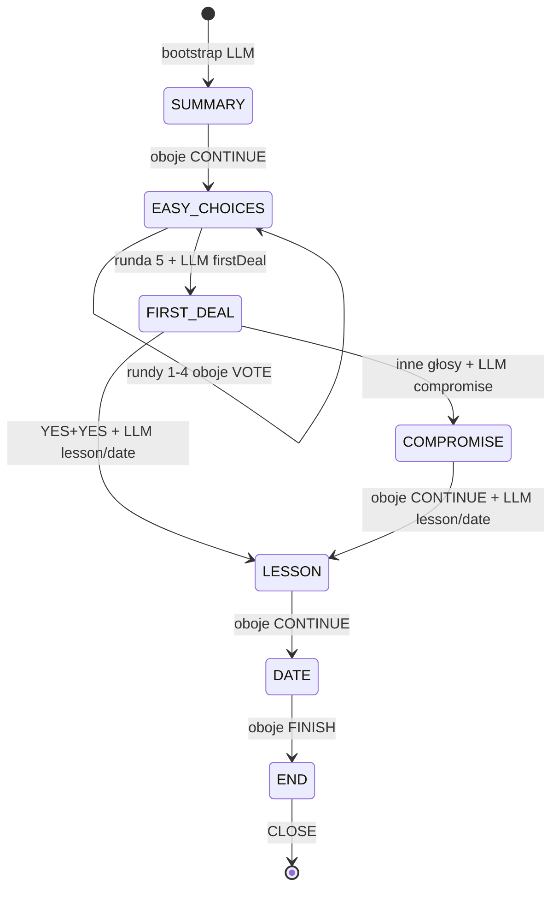
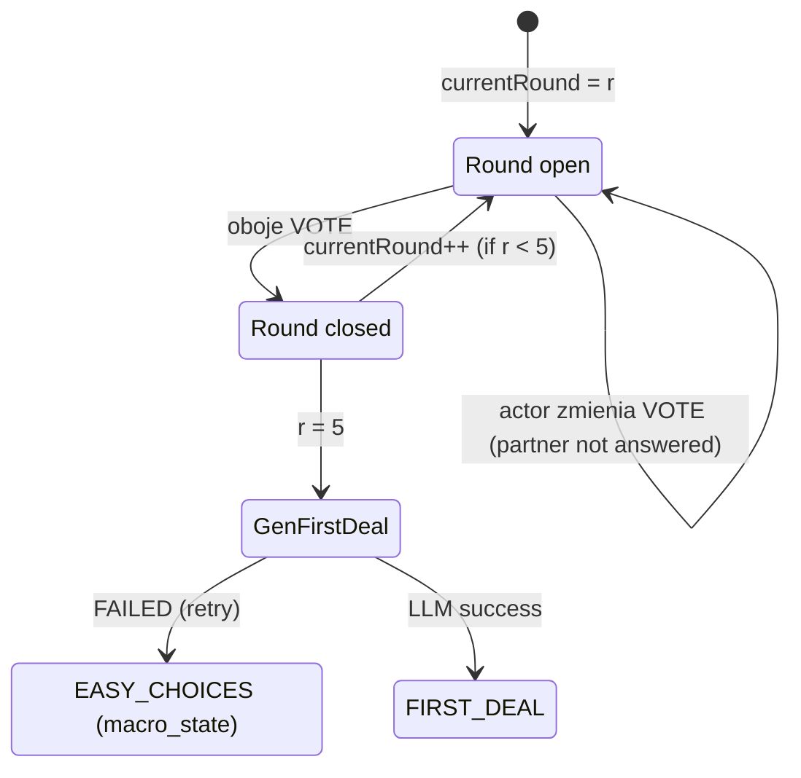
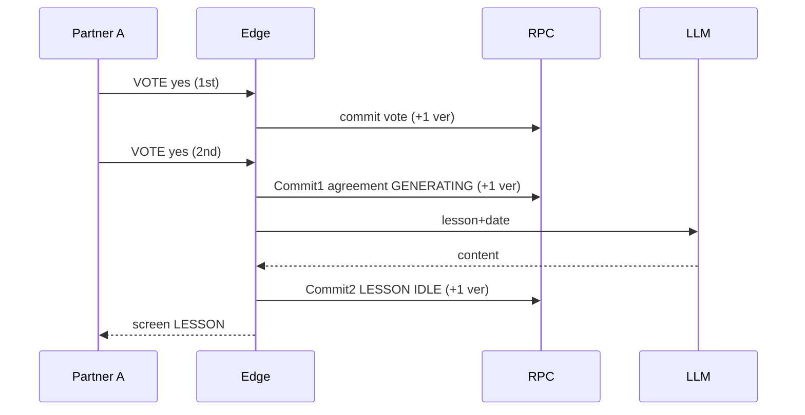
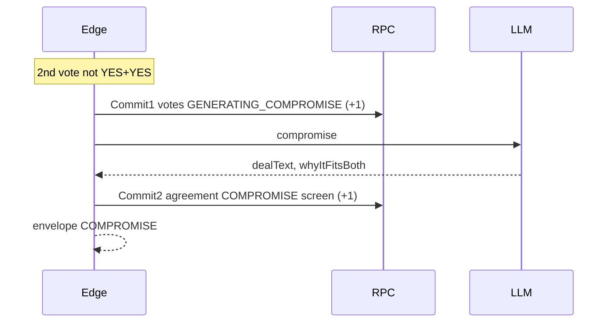
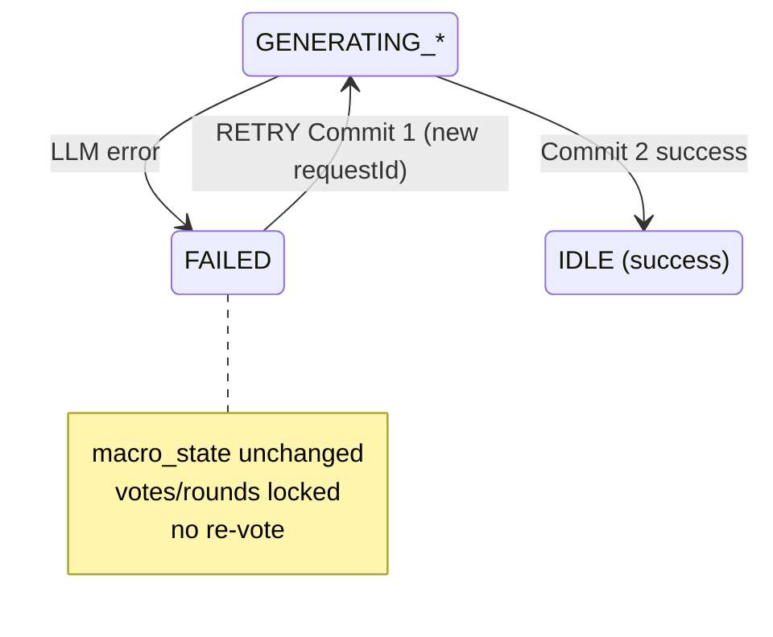
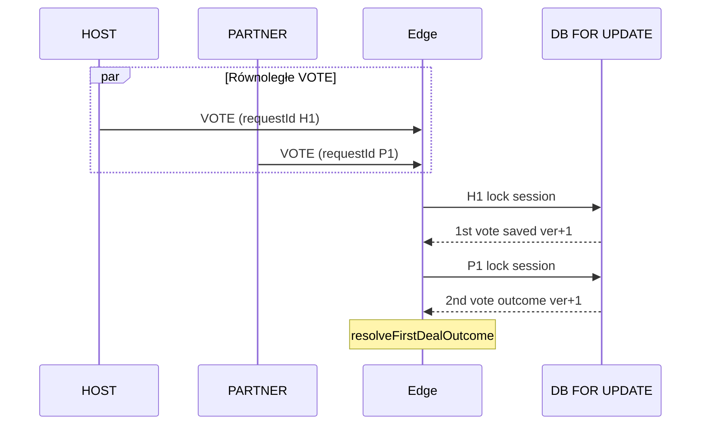

# Mediation V2 — State Machine

> **Typ:** formalna maszyna stanów (dokumentacja; bez kodu, bez migracji)  
> **Data:** 2026-07-15 (rev. 2 — rozłączna transition matrix)  
> **Źródła prawdy:** [mediation-v2-product-contract.md](./mediation-v2-product-contract.md) (rev. 3) → [mediation-v2-api-contract.md](./mediation-v2-api-contract.md) (rev. 1) → [mediation-v2-database-contract.md](./mediation-v2-database-contract.md) (rev. 1) → [mediation-v2-architecture-alignment.md](./mediation-v2-architecture-alignment.md) (rev. 3)

---

## 1. Zakres

Maszyna stanów opisuje **deterministyczny** runtime mediacji V2 realizowany wyłącznie przez Edge Function `mediation-turn-v2`.

### 1.1 Ekrany produktowe (`macro_state` / API `screen`)

Dokładnie **7** ekranów:

| # | Ekran | Warunkowy |
|---|-------|-----------|
| 1 | `SUMMARY` | nie |
| 2 | `EASY_CHOICES` | nie |
| 3 | `FIRST_DEAL` | nie |
| 4 | `COMPROMISE` | **tak** — tylko gdy `resolveFirstDealOutcome ≠ YES+YES` |
| 5 | `LESSON` | nie |
| 6 | `DATE` | nie |
| 7 | `END` | nie |

### 1.2 Poza zakresem (zabronione)

| Element | Status |
|---------|--------|
| `DECISION` jako stan / ekran | **Nie implementować** |
| `EASY_DEAL` | **Nie implementować** |
| `PAYWALL` jako ekran produktowy | **Nie implementować** (decyzja biznesowa TBD — Product Contract §20) |
| Otwarty chat / dowolny tekst użytkownika | **Nie implementować** |
| Podstany psychologiczne / analizatory | **Nie implementować** |
| Osobny `macro_state` per runda EASY_CHOICES | **Nie implementować** — paginacja przez `currentRound` w payload |

### 1.3 Bootstrap sesji (przed pierwszym ekranem)

Przed pierwszym `LOAD_SESSION` użytkownika:

1. `create_mediation_session` → `macro_state = SUMMARY`, `generation_status = GENERATING_CONTENT`, `session_version = 0`.
2. Commit 1 (start) → `session_version = 1`.
3. LLM × 1 (poza SQL): SUMMARY + EASY_CHOICES (5 rund).
4. Commit 2 (wynik) → zapis `summary`, `easyChoices.rounds`, `generation_status = IDLE`, `session_version = 2`.
5. Dopiero teraz ekran SUMMARY jest **w pełni gotowy** do wyświetlenia.

Ten bootstrap **nie jest** akcją klienta; klient zaczyna od `LOAD_SESSION`.

---

## 2. Stany techniczne

### 2.1 `generation_status` (osobno od ekranu)

| Wartość | Znaczenie |
|---------|-----------|
| `IDLE` | Brak trwającej generacji LLM; normalna obsługa akcji |
| `GENERATING_CONTENT` | Trwa LLM: SUMMARY+EASY (bootstrap), FIRST_DEAL, LESSON+DATE |
| `GENERATING_COMPROMISE` | Trwa LLM COMPROMISE po 2. głosie (ścieżka non-YES+YES) |
| `FAILED` | Ostatnia generacja LLM nie powiodła się |

### 2.2 Semantyka

| Reguła | Opis |
|--------|------|
| **Nie jest ekranem** | `generation_status` ≠ API `screen` |
| **Nie steruje produktem** | Nie wybiera gałęzi flow; gałąź decyduje `resolveFirstDealOutcome` |
| **Opis techniczny** | Informuje Edge, czy trwa LLM / czy można mutować |
| **PROCESSING** | Gdy `GENERATING_CONTENT` lub `GENERATING_COMPROMISE` → API zwraca HTTP 200 + `processing: true` (API Contract §5.3) |
| **FAILED + RETRY** | Klient może wysłać `RETRY` z **nowym** `requestId` |

### 2.3 Macierz overlay (ekran × generation_status)

| `generation_status` | Zachowanie akcji mutujących (nowy requestId) | `LOAD_SESSION` |
|---------------------|-----------------------------------------------|----------------|
| `IDLE` | Dozwolone zgodnie z tabelą przejść | Envelope ekranu |
| `GENERATING_*` | **Odrzucone** → odpowiedź `PROCESSING` (bez mutacji) | `PROCESSING` |
| `FAILED` | Dozwolone: `LOAD_SESSION`, `RETRY`; inne → `INVALID_TRANSITION` lub envelope bieżącego ekranu | Envelope + `generationStatus: FAILED` |

---

## 3. Akcje

### 3.1 Dozwolone akcje klienta

| Akcja | Mutacja | Opis |
|-------|---------|------|
| `LOAD_SESSION` | **nie** | Odczyt bieżącego stanu / polling |
| `CONTINUE` | **tak** | Sync ekrany: SUMMARY, COMPROMISE, LESSON |
| `VOTE` | **tak** | Kafelek (EASY_CHOICES) lub głos (FIRST_DEAL) |
| `FINISH` | **tak** | DATE → END |
| `CLOSE` | opcjonalnie audit | END terminal |
| `RETRY` | **tak** | Ponowienie ostatniej nieudanej generacji |

### 3.2 Doprecyzowanie `VOTE`

| Ekran | Payload | Semantyka |
|-------|---------|-----------|
| `EASY_CHOICES` | `optionId` (wymagane), `voteValue = null` | Wybór kafelka bieżącej rundy |
| `FIRST_DEAL` | `voteValue ∈ {yes, no, stubborn}`, `optionId = null` | Głos YES / NO / STUBBORN |

### 3.3 `RETRY`

- Dozwolony **wyłącznie** gdy `generation_status = FAILED`.
- Wymaga **nowego** `requestId`.
- Ponawia **tylko** ostatni nieudany `metadata.lastGenerationKind` — **bez** ponownego zapisu głosów, rund, confirmation ani głosowania.
- **Sekwencja RETRY:**
  1. Atomowy commit: `FAILED` → właściwy `GENERATING_*` (+1 `session_version`).
  2. LLM × 1 **poza** transakcją.
  3. Atomowy commit sukcesu **lub** błędu (+1 `session_version` każdy).
- **Równoległe RETRY:** tylko pierwszy commit może przejść `FAILED → GENERATING_*`; drugi dostaje `PROCESSING` (jeśli już generuje) albo `SESSION_VERSION_CONFLICT`.

### 3.4 Czego klient NIE wysyła

- roli (HOST/PARTNER),
- aktualnego `screen` / `macro_state`,
- następnego stanu,
- `couple_id`, `mediation_id`,
- dowolnego wolnego tekstu.

Backend mapuje `auth.uid()` → `mediation_talker` (HOST | PARTNER).

---

## 4. Transition matrix

Legenda kolumn:

- **Actor:** HOST | PARTNER | ANY (autoryzowany uczestnik); `—` = commit systemowy (Edge po LLM)
- **Response:** `SCREEN` = pełny envelope; `PROCESSING` = §5.3 API Contract
- **Δver:** increment `session_version` w **tym** commicie (+0 tylko replay idempotentny)
- **LLM:** `0` = brak wywołania w commicie; `1` = zewnętrzny krok modelu **poza** SQL (osobny wiersz lub opis między commitami)

### 4.0 Zasada rozłączności przejść

**Twarda reguła implementacyjna:**

Dla jednego requestu (`sessionId`, `requestId`), bieżącego stanu (`macro_state`, `generation_status`, payload) i aktora (`HOST` | `PARTNER`) **dokładnie jeden** wiersz transition matrix może spełnić warunki `preconditions`.

- Preconditions wszystkich wierszy w tej samej grupie (ten sam `current_screen` + `action`) muszą być **wzajemnie rozłączne**.
- Implementacja: **pierwsze pasujące** PRECONDITION w ustalonej kolejności priorytetu **albo** if/else z warunkami negującymi poprzednie gałęzie.
- **Jedna akcja klienta = jeden atomowy commit RPC** (wyjątek: replay idempotentny → 0 commitów).
- Drugi kompletujący participant **nie może** pasować do wiersza „zwykłego zapisu” — tylko do wiersza **Case B** (zapis + przejście / start generacji w jednej mutacji).

### 4.1 Odczyt i overlay

| ID | current_screen | action | actor | preconditions | mutation | LLM | next_screen | gen_before | gen_after | Δver | response | invalid error |
|----|----------------|--------|-------|---------------|----------|-----|-------------|------------|-----------|------|----------|---------------|
| T01 | *any* | LOAD_SESSION | ANY | uczestnik sesji; `generation_status = IDLE` | brak | 0 | =current | IDLE | IDLE | 0 | SCREEN | NOT_AUTHORIZED, SESSION_NOT_FOUND |
| T02 | *any* | LOAD_SESSION | ANY | uczestnik; `generation_status ∈ {GENERATING_CONTENT, GENERATING_COMPROMISE}` | brak | 0 | =current | GENERATING_* | GENERATING_* | 0 | PROCESSING | — |
| T03 | *any* | LOAD_SESSION | ANY | uczestnik; `generation_status = FAILED` | brak | 0 | =current | FAILED | FAILED | 0 | SCREEN (+FAILED) | — |
| T04 | *any* | CONTINUE/VOTE/FINISH/CLOSE | ANY | `generation_status ∈ {GENERATING_*}` | brak | 0 | =current | GENERATING_* | GENERATING_* | 0 | PROCESSING | — |
| T05 | *any* | mutacja (≠RETRY) | ANY | `generation_status = FAILED` | brak | 0 | =current | FAILED | FAILED | 0 | INVALID_TRANSITION | INVALID_TRANSITION |

### 4.2 SUMMARY

Wzorzec **Case A / Case B** — rozłączne preconditions względem `confirmations.SUMMARY.{partner}`.

| ID | current_screen | action | actor | preconditions | mutation (1 commit) | LLM | next_screen | gen_before → after | Δver | response | invalid error |
|----|----------------|--------|-------|---------------|----------------------|-----|-------------|-------------------|------|----------|---------------|
| T10 | SUMMARY | CONTINUE | ANY | **Case A:** `{actor}` nie potwierdził **oraz** `{partner}` nie potwierdził | zapis `confirmations.SUMMARY.{actor}=true` | 0 | SUMMARY | IDLE→IDLE | +1 | SCREEN | — |
| T11 | SUMMARY | CONTINUE | ANY | **Case B:** `{actor}` nie potwierdził **oraz** `{partner}` już potwierdził | atomowo: confirmation `{actor}=true`, `macro_state=EASY_CHOICES`, `currentRound=1` | 0 | EASY_CHOICES | IDLE→IDLE | +1 | SCREEN | — |
| T12 | SUMMARY | CONTINUE | ANY | `{actor}` już potwierdził; **nowy** `requestId` | brak | 0 | SUMMARY | IDLE→IDLE | 0 | SCREEN / DUPLICATE | DUPLICATE_ACTION |
| T13 | SUMMARY | *any* | ANY | ten sam `(sessionId, requestId)` co wcześniej | brak (replay) | 0 | =cached | =cached | 0 | cached | — |
| T14 | SUMMARY | VOTE/FINISH/CLOSE/RETRY | ANY | — | — | — | — | — | — | — | INVALID_TRANSITION |

### 4.3 EASY_CHOICES — rundy 1–4

| ID | current_screen | action | actor | preconditions | mutation (1 commit) | LLM | next_screen | gen_before → after | Δver | response | invalid error |
|----|----------------|--------|-------|---------------|----------------------|-----|-------------|-------------------|------|----------|---------------|
| T20 | EASY_CHOICES | VOTE | ANY | `currentRound∈{1..4}`; **Case A:** `{partner}` **nie** odpowiedział w rundzie `r` | zapis/zmiana `answers.{actor}[r]` | 0 | EASY_CHOICES | IDLE→IDLE | +1 | SCREEN | — |
| T21 | EASY_CHOICES | VOTE | ANY | `currentRound∈{1..4}`; **Case B:** `{partner}` **już** odpowiedział w rundzie `r`; `{actor}` jeszcze nie domyka rundy | atomowo: zapis odpowiedzi `{actor}`, zamknięcie rundy, `currentRound=r+1` | 0 | EASY_CHOICES | IDLE→IDLE | +1 | SCREEN | — |
| T22 | EASY_CHOICES | VOTE | ANY | runda `r` już zamknięta (oboje odpowiedzieli) | brak | 0 | EASY_CHOICES | IDLE→IDLE | 0 | INVALID_TRANSITION | INVALID_TRANSITION |
| T23 | EASY_CHOICES | VOTE | ANY | `optionId` spoza bieżącej rundy | brak | 0 | — | — | — | INVALID_REQUEST | INVALID_REQUEST |

### 4.4 EASY_CHOICES — runda 5 → FIRST_DEAL

| ID | current_screen | action | actor | preconditions | mutation (1 commit) | LLM | next_screen | gen_before → after | Δver | response | invalid error |
|----|----------------|--------|-------|---------------|----------------------|-----|-------------|-------------------|------|----------|---------------|
| T30 | EASY_CHOICES | VOTE | ANY | `currentRound=5`; **Case A:** `{partner}` nie odpowiedział | zapis/zmiana odpowiedzi `{actor}` | 0 | EASY_CHOICES | IDLE→IDLE | +1 | SCREEN | — |
| T31 | EASY_CHOICES | VOTE | ANY | `currentRound=5`; **Case B:** `{partner}` już odpowiedział | atomowo: odpowiedź `{actor}`, zamknięcie rundy 5, `generation_status=GENERATING_CONTENT`, `lastGenerationKind=FIRST_DEAL` | 0 | EASY_CHOICES | IDLE→GENERATING_CONTENT | +1 | PROCESSING | SESSION_VERSION_CONFLICT |
| T32 | EASY_CHOICES | — | — | po T31; LLM FIRST_DEAL **poza SQL** | — | 1 | — | — | — | — | — |
| T33 | EASY_CHOICES | — | — | sukces LLM po T31 | atomowo: `firstDeal`, `macro_state=FIRST_DEAL`, `generation_status=IDLE` | 0 | FIRST_DEAL | GENERATING_CONTENT→IDLE | +1 | SCREEN | — |
| T34 | EASY_CHOICES | — | — | błąd LLM po T31 (**failure commit**) | atomowo: `generation_status=FAILED`; `macro_state=EASY_CHOICES`; `firstDeal=null`; odpowiedzi rundy 5 **zamknięte**; `lastGenerationKind=FIRST_DEAL` | 0 | EASY_CHOICES | GENERATING_CONTENT→FAILED | +1 | GENERATION_FAILED | — |

**Zasada ekranu podczas generacji FIRST_DEAL:** `macro_state` pozostaje `EASY_CHOICES` do T33; `LOAD_SESSION` → `PROCESSING`.

### 4.5 FIRST_DEAL — głosowanie

| ID | current_screen | action | actor | preconditions | mutation (1 commit) | LLM | next_screen | gen_before → after | Δver | response | invalid error |
|----|----------------|--------|-------|---------------|----------------------|-----|-------------|-------------------|------|----------|---------------|
| T40 | FIRST_DEAL | VOTE | ANY | **Case A:** `{partner}` **nie** zagłosował | zapis/zmiana `firstDealVotes.{actor}` | 0 | FIRST_DEAL | IDLE→IDLE | +1 | SCREEN | — |
| T41 | FIRST_DEAL | VOTE | ANY | **Case B:** `{partner}` **już** zagłosował; wynik **YES+YES** | atomowo: drugi głos, `agreement` (FIRST_DEAL, ACCEPTED_BY_BOTH), `progress_total=6`, `generation_status=GENERATING_CONTENT`, `lastGenerationKind=LESSON_DATE` | 0 | FIRST_DEAL | IDLE→GENERATING_CONTENT | +1 | PROCESSING | — |
| T42 | FIRST_DEAL | VOTE | ANY | **Case B:** `{partner}` **już** zagłosował; wynik **≠ YES+YES** | atomowo: drugi głos, `progress_total=7`, `generation_status=GENERATING_COMPROMISE`, `lastGenerationKind=COMPROMISE` | 0 | FIRST_DEAL | IDLE→GENERATING_COMPROMISE | +1 | PROCESSING | — |
| T43 | FIRST_DEAL | VOTE | ANY | oboje już zagłosowali (głosowanie zamknięte) | brak | 0 | FIRST_DEAL | IDLE→IDLE | 0 | INVALID_TRANSITION | INVALID_TRANSITION |
| T44 | FIRST_DEAL | CONTINUE/FINISH/CLOSE/RETRY | ANY | `generation_status=IDLE` | — | — | — | — | — | — | INVALID_TRANSITION |

**Drugi głos nigdy nie przechodzi przez T40** — wyłącznie T41 lub T42.

### 4.6 YES + YES — commity systemowe (po T41)

| ID | current_screen | action | actor | preconditions | mutation (1 commit) | LLM | next_screen | gen_before → after | Δver | response | invalid error |
|----|----------------|--------|-------|---------------|----------------------|-----|-------------|-------------------|------|----------|---------------|
| T50 | FIRST_DEAL | — | — | po T41; LLM LESSON+DATE **poza SQL** | — | 1 | — | — | — | — | — |
| T51 | FIRST_DEAL | — | — | sukces LLM po T41 | atomowo: `lesson`, `date`, `macro_state=LESSON`, `generation_status=IDLE` | 0 | LESSON | GENERATING_CONTENT→IDLE | +1 | SCREEN | — |
| T52 | FIRST_DEAL | — | — | błąd LLM po T41 (**failure commit**) | atomowo: `generation_status=FAILED`; `macro_state=FIRST_DEAL`; `lesson=null`, `date=null`; głosy + agreement **bez zmian**; `lastGenerationKind=LESSON_DATE` | 0 | FIRST_DEAL | GENERATING_CONTENT→FAILED | +1 | GENERATION_FAILED | — |

### 4.7 GENERATE_COMPROMISE — commity systemowe (po T42)

| ID | current_screen | action | actor | preconditions | mutation (1 commit) | LLM | next_screen | gen_before → after | Δver | response | invalid error |
|----|----------------|--------|-------|---------------|----------------------|-----|-------------|-------------------|------|----------|---------------|
| T60 | FIRST_DEAL | — | — | po T42; LLM COMPROMISE **poza SQL** | — | 1 | — | — | — | — | — |
| T61 | FIRST_DEAL | — | — | sukces LLM po T42 | atomowo: `compromise`, `agreement` (COMPROMISE, GENERATED_FINAL), `macro_state=COMPROMISE`, `generation_status=IDLE` | 0 | COMPROMISE | GENERATING_COMPROMISE→IDLE | +1 | SCREEN | — |
| T62 | FIRST_DEAL | — | — | błąd LLM po T42 (**failure commit**) | atomowo: `generation_status=FAILED`; `macro_state=FIRST_DEAL`; `compromise=null`; głosy **zamknięte**; `lastGenerationKind=COMPROMISE` | 0 | FIRST_DEAL | GENERATING_COMPROMISE→FAILED | +1 | GENERATION_FAILED | — |

### 4.8 COMPROMISE

| ID | current_screen | action | actor | preconditions | mutation (1 commit) | LLM | next_screen | gen_before → after | Δver | response | invalid error |
|----|----------------|--------|-------|---------------|----------------------|-----|-------------|-------------------|------|----------|---------------|
| T70 | COMPROMISE | CONTINUE | ANY | **Case A:** `{partner}` **nie** potwierdził | zapis `confirmations.COMPROMISE.{actor}=true` | 0 | COMPROMISE | IDLE→IDLE | +1 | SCREEN | — |
| T71 | COMPROMISE | CONTINUE | ANY | **Case B:** `{partner}` **już** potwierdził; `{actor}` jeszcze nie | atomowo: confirmation `{actor}`, `generation_status=GENERATING_CONTENT`, `lastGenerationKind=LESSON_DATE` | 0 | COMPROMISE | IDLE→GENERATING_CONTENT | +1 | PROCESSING | — |
| T72 | COMPROMISE | — | — | po T71; LLM LESSON+DATE **poza SQL** | — | 1 | — | — | — | — | — |
| T73 | COMPROMISE | — | — | sukces LLM po T71 | atomowo: `lesson`, `date`, `macro_state=LESSON`, `generation_status=IDLE` | 0 | LESSON | GENERATING_CONTENT→IDLE | +1 | SCREEN | — |
| T74 | COMPROMISE | — | — | błąd LLM po T71 (**failure commit**) | atomowo: `generation_status=FAILED`; `macro_state=COMPROMISE`; `confirmations.COMPROMISE` **zachowane**; `lesson=null`, `date=null`; `lastGenerationKind=LESSON_DATE` | 0 | COMPROMISE | GENERATING_CONTENT→FAILED | +1 | GENERATION_FAILED | — |
| T75 | COMPROMISE | VOTE/FINISH/CLOSE | ANY | — | — | — | — | — | — | — | INVALID_TRANSITION |

### 4.9 LESSON

| ID | current_screen | action | actor | preconditions | mutation (1 commit) | LLM | next_screen | gen_before → after | Δver | response | invalid error |
|----|----------------|--------|-------|---------------|----------------------|-----|-------------|-------------------|------|----------|---------------|
| T80 | LESSON | CONTINUE | ANY | **Case A:** `{partner}` **nie** potwierdził | zapis `confirmations.LESSON.{actor}=true` | 0 | LESSON | IDLE→IDLE | +1 | SCREEN | — |
| T81 | LESSON | CONTINUE | ANY | **Case B:** `{partner}` **już** potwierdził; `{actor}` jeszcze nie | atomowo: confirmation `{actor}`, `macro_state=DATE` | 0 | DATE | IDLE→IDLE | +1 | SCREEN | — |
| T82 | LESSON | VOTE/FINISH/CLOSE/RETRY | ANY | — | — | — | — | — | — | — | INVALID_TRANSITION |

### 4.10 DATE

| ID | current_screen | action | actor | preconditions | mutation (1 commit) | LLM | next_screen | gen_before → after | Δver | response | invalid error |
|----|----------------|--------|-------|---------------|----------------------|-----|-------------|-------------------|------|----------|---------------|
| T90 | DATE | FINISH | ANY | **Case A:** `{partner}` **nie** zakończył (`confirmations.DATE.{partner}=false`) | zapis `confirmations.DATE.{actor}=true` | 0 | DATE | IDLE→IDLE | +1 | SCREEN | — |
| T91 | DATE | FINISH | ANY | **Case B:** `{partner}` **już** zakończył; `{actor}` jeszcze nie | atomowo: `confirmations.DATE.{actor}=true`, `macro_state=END` | 0 | END | IDLE→IDLE | +1 | SCREEN | — |
| T92 | DATE | CONTINUE/VOTE/CLOSE/RETRY | ANY | — | — | — | — | — | — | — | INVALID_TRANSITION |

### 4.11 END

| ID | current_screen | action | actor | preconditions | mutation (1 commit) | LLM | next_screen | gen_before → after | Δver | response | invalid error |
|----|----------------|--------|-------|---------------|----------------------|-----|-------------|-------------------|------|----------|---------------|
| T100 | END | CLOSE | ANY | sesja terminalna | opcjonalny audit timestamp (domyślnie brak mutacji) | 0 | END | IDLE→IDLE | 0 | SCREEN | — |
| T101 | END | CONTINUE/VOTE/FINISH/RETRY | ANY | — | — | — | — | — | — | — | INVALID_TRANSITION |

### 4.12 RETRY (po FAILED)

| ID | current_screen | action | actor | preconditions | mutation (1 commit) | LLM | next_screen | gen_before → after | Δver | response | invalid error |
|----|----------------|--------|-------|---------------|----------------------|-----|-------------|-------------------|------|----------|---------------|
| T110 | EASY_CHOICES | RETRY | ANY | `FAILED`; `lastGenerationKind=FIRST_DEAL` | atomowo: `FAILED→GENERATING_CONTENT` | 0 | EASY_CHOICES | FAILED→GENERATING_CONTENT | +1 | PROCESSING | INVALID_TRANSITION |
| T111 | FIRST_DEAL | RETRY | ANY | `FAILED`; `lastGenerationKind=COMPROMISE` | atomowo: `FAILED→GENERATING_COMPROMISE` | 0 | FIRST_DEAL | FAILED→GENERATING_COMPROMISE | +1 | PROCESSING | — |
| T112 | FIRST_DEAL / COMPROMISE | RETRY | ANY | `FAILED`; `lastGenerationKind=LESSON_DATE` | atomowo: `FAILED→GENERATING_CONTENT` | 0 | =current | FAILED→GENERATING_CONTENT | +1 | PROCESSING | — |
| T113 | *any* | RETRY | ANY | `generation_status ≠ FAILED` | brak | 0 | — | — | — | INVALID_TRANSITION | INVALID_TRANSITION |
| T114 | *any* | RETRY | ANY | równoległy RETRY gdy już `GENERATING_*` | brak | 0 | =current | GENERATING_*→GENERATING_* | 0 | PROCESSING / CONFLICT | SESSION_VERSION_CONFLICT |

Po T110/T111/T112: LLM (1) poza SQL → commit sukcesu (+1, jak T33/T61/T51/T73) **lub** commit failure (+1, jak T34/T62/T52/T74). RETRY **nie** ponawia akcji użytkownika.

### 4.13 Paywall (przekrój)

| ID | current_screen | action | actor | preconditions | mutation | response | invalid error |
|----|----------------|--------|-------|---------------|----------|----------|---------------|
| T120 | *any* | *mutacja* | ANY | paywall aktywny (reguła TBD) | brak | PAYWALL | PAYWALL |

### 4.14 Failure transitions — lista

Każdy wiersz failure to **osobny atomowy commit** (+1 `session_version`).

| ID | Trigger | macro_state po błędzie | Pola docelowe | generation_status | lastGenerationKind | RETRY ponawia |
|----|---------|------------------------|---------------|-------------------|-------------------|---------------|
| T34 | LLM FIRST_DEAL fail | `EASY_CHOICES` | `firstDeal=null` | `FAILED` | `FIRST_DEAL` | tylko generację FIRST_DEAL |
| T52 | LLM LESSON+DATE fail (po YES+YES) | `FIRST_DEAL` | `lesson=null`, `date=null` | `FAILED` | `LESSON_DATE` | tylko LESSON+DATE |
| T62 | LLM COMPROMISE fail | `FIRST_DEAL` | `compromise=null` | `FAILED` | `COMPROMISE` | tylko COMPROMISE |
| T74 | LLM LESSON+DATE fail (po COMPROMISE) | `COMPROMISE` | `lesson=null`, `date=null`; confirmations zachowane | `FAILED` | `LESSON_DATE` | tylko LESSON+DATE |

**Łączna liczba wierszy transition matrix:** **50** (unikalne ID: T01–T05, T10–T14, T20–T23, T30–T34, T40–T44, T50–T52, T60–T62, T70–T75, T80–T82, T90–T92, T100–T101, T110–T114, T120).

---

## 5. SUMMARY

| Reguła | Wartość |
|--------|---------|
| Treść ekranu | Wygenerowana **przed** pierwszym wyświetleniem (bootstrap §1.3) |
| Akcja | `CONTINUE` — HOST i PARTNER **osobno** |
| **Case A** (T10) | Partner **nie** potwierdził → zapis confirmation aktora; `macro_state` = SUMMARY; **1 commit**, +1 |
| **Case B** (T11) | Partner **już** potwierdził → atomowo: confirmation aktora + `macro_state = EASY_CHOICES` + `currentRound = 1`; **1 commit**, +1 |
| LLM przy CONTINUE | **0** |
| Idempotencja | Ten sam `requestId` → replay (T13, Δver=0); actor już potwierdził + nowy requestId → T12 |

---

## 6. EASY_CHOICES

| Reguła | Wartość |
|--------|---------|
| Liczba rund | **5** (`totalRounds = 5`) |
| `macro_state` | **Zawsze** `EASY_CHOICES` dla rund 1–5 — brak podstanów |
| Odpowiedź | 1× `optionId` na osobę na rundę |
| **Case A** (T20, T30) | Partner **nie** odpowiedział → zapis/zmiana odpowiedzi; ta sama runda; **1 commit**, +1 |
| **Case B** rundy 1–4 (T21) | Partner **już** odpowiedział → atomowo: odpowiedź aktora + zamknięcie rundy + `currentRound++`; **1 commit**, +1 |
| **Case B** runda 5 (T31) | Partner **już** odpowiedział → atomowo: odpowiedź + zamknięcie rundy 5 + `GENERATING_CONTENT` + `lastGenerationKind=FIRST_DEAL`; **1 commit**, +1 |
| Zmiana odpowiedzi | Do odpowiedzi **drugiej** osoby w tej samej rundzie (Case A) |
| Zamknięcie rundy | Po Case B — brak edycji; T22 = INVALID |

---

## 7. Generowanie FIRST_DEAL

Po **Case B** rundy 5 (T31) — **jedna akcja klienta = jeden commit**:

| Krok | Operacja | Commit | LLM | Δver |
|------|----------|--------|-----|------|
| 1 | T31: zamknięcie rundy 5 + `GENERATING_CONTENT` | atomowy | 0 | +1 |
| 2 | T32: LLM FIRST_DEAL | — | 1 | 0 |
| 3a | T33 sukces: `firstDeal` + `macro_state=FIRST_DEAL` + `IDLE` | atomowy | 0 | +1 |
| 3b | T34 błąd: `FAILED`; `macro_state=EASY_CHOICES`; `firstDeal=null` | atomowy | 0 | +1 |

**Błąd (T34):**

- `macro_state` **pozostaje** `EASY_CHOICES`
- `currentRound = 5`; odpowiedzi rundy 5 **zamknięte**
- `firstDeal = null`; `lastGenerationKind = FIRST_DEAL`
- `RETRY` (T110) ponawia **wyłącznie** generację — **bez** ponownego VOTE rundy 5

---

## 8. FIRST_DEAL

| Reguła | Wartość |
|--------|---------|
| Głosy | `yes`, `no`, `stubborn` — dokładnie 1 na osobę |
| **Case A** (T40) | Partner **nie** głosował → zapis/zmiana głosu; **1 commit**, +1 |
| **Case B** (T41/T42) | Partner **już** głosował → atomowo: drugi głos + `resolveFirstDealOutcome` + start generacji; **1 commit**, +1 |
| Zmiana głosu | Tylko w Case A (partner jeszcze nie głosował) |
| Po Case B | Głosowanie **zamknięte** — T43 = INVALID |
| YES + YES | T41 → §9 |
| Inna kombinacja | T42 → §10 |

```text
resolveFirstDealOutcome(host, partner):
  if host == yes AND partner == yes:
    return ACCEPT_FIRST_DEAL
  else:
    return GENERATE_COMPROMISE
```

---

## 9. YES + YES

Po **Case B** T41 (drugi głos `yes`+`yes`):

| Krok | ID | Efekt | Δver |
|------|-----|-------|------|
| 1 | T41 | Atomowo: głosy, agreement, `progress_total=6`, `GENERATING_CONTENT` | +1 |
| 2 | T50 | LLM LESSON+DATE (poza SQL) | 0 |
| 3a | T51 | Atomowo: `lesson`, `date`, `macro_state=LESSON`, `IDLE` | +1 |
| 3b | T52 | Atomowo: `FAILED`; `macro_state=FIRST_DEAL`; `lesson=null`, `date=null` | +1 |

**Łącznie Δver = +2** na sukces (T41+T51) lub +2 na failure (T41+T52). COMPROMISE **nie występuje**.

---

## 10. GENERATE_COMPROMISE

Po **Case B** T42 (drugi głos ≠ YES+YES):

| Krok | ID | Efekt | Δver |
|------|-----|-------|------|
| 1 | T42 | Atomowo: głosy, `progress_total=7`, `GENERATING_COMPROMISE` | +1 |
| 2 | T60 | LLM COMPROMISE (poza SQL) | 0 |
| 3a | T61 | Atomowo: `compromise`, agreement, `macro_state=COMPROMISE`, `IDLE` | +1 |
| 3b | T62 | Atomowo: `FAILED`; `macro_state=FIRST_DEAL`; `compromise=null` | +1 |

**RETRY (T111)** ponawia T60–T61/T62 — **nie** powtarza głosowania.

---

## 11. COMPROMISE

| Reguła | Wartość |
|--------|---------|
| Wyświetlanie | Oboje widzą **ten sam** zapisany `compromise` / `agreement` |
| Akcje | **Tylko** `CONTINUE` — **brak** `VOTE` |
| **Case A** (T70) | Partner **nie** potwierdził → confirmation; **1 commit**, +1 |
| **Case B** (T71) | Partner **już** potwierdził → atomowo: confirmation + start `GENERATING_CONTENT` (LESSON_DATE); **1 commit**, +1 |
| LESSON+DATE LLM | Po T71 → T72–T73 (sukces) lub T74 (failure) |
| Strategia | COMPROMISE LLM osobno (§10); LESSON+DATE **po drugim CONTINUE** (T71), nie razem z COMPROMISE |

---

## 12. LESSON

| Reguła | Wartość |
|--------|---------|
| Treść | Już zapisana w `session_payload.lesson` (i `date` gotowy na DATE) |
| **Case A** (T80) | Partner **nie** potwierdził → confirmation; **1 commit**, +1 |
| **Case B** (T81) | Partner **już** potwierdził → atomowo: confirmation + `macro_state=DATE`; **1 commit**, +1 |
| LLM przy CONTINUE | **0** |

---

## 13. DATE

| Reguła | Wartość |
|--------|---------|
| Treść | Już zapisana w `session_payload.date` |
| **Case A** (T90) | Partner **nie** wysłał `FINISH` → zapis confirmation; ekran DATE; **1 commit**, +1 |
| **Case B** (T91) | Partner **już** wysłał `FINISH` → atomowo: confirmation + `macro_state=END`; **1 commit**, +1 |
| Reguła | **Oboje** muszą `FINISH`; **druga** akcja FINISH ustawia END |
| LLM | **0** |

---

## 14. END

| Reguła | Wartość |
|--------|---------|
| Akcja | `CLOSE` |
| Mutacja logiki | **Brak** zmiany `macro_state` (pozostaje END) |
| Audit | Opcjonalny timestamp |
| Idempotencja | Wielokrotne `CLOSE` → ten sam stan |

---

## 15. Session version

### 15.1 Reguły twarde

| # | Reguła |
|---|--------|
| 1 | `session_version += 1` przy **każdej udanej mutacji** sesji |
| 2 | `LOAD_SESSION` → **Δver = 0** |
| 3 | Powtórzony `(session_id, request_id)` → **Δver = 0** (replay) |
| 4 | Generacja LLM = **2 commity** (start + wynik/błąd) → **Δver = +2** łącznie na cykl generacji |
| 5 | **Failure commit** (`generation_status → FAILED`) = mutacja → **+1** (T34, T52, T62, T74) |
| 6 | Commit rozpoczynający generację: **LLM = 0**; krok modelu: **LLM = 1** (poza SQL); commit wyniku/błędu: **LLM = 0** |

### 15.2 Przykładowa sekwencja (ścieżka z COMPROMISE, 7 ekranów)

| Krok | Zdarzenie | session_version |
|------|-----------|----------------:|
| 0 | create + bootstrap Commit 1 | 1 |
| 1 | bootstrap Commit 2 (SUMMARY ready) | 2 |
| 2 | SUMMARY CONTINUE (HOST) | 3 |
| 3 | SUMMARY CONTINUE (PARTNER) → EASY_CHOICES | 4 |
| 4–8 | EASY_CHOICES 5 rund (5× para odpowiedzi, uproszczony +5) | 9 |
| 9 | Runda 5 Commit 1 (GENERATING) | 10 |
| 10 | FIRST_DEAL Commit 2 | 11 |
| 11 | FIRST_DEAL głos HOST | 12 |
| 12 | FIRST_DEAL głos PARTNER Commit 1 (COMPROMISE gen) | 13 |
| 13 | COMPROMISE Commit 2 | 14 |
| 14 | COMPROMISE CONTINUE ×2 + LESSON_DATE Commit 1 | 16 |
| 15 | LESSON Commit 2 | 17 |
| 16 | LESSON CONTINUE ×2 → DATE | 19 |
| 17 | DATE FINISH ×2 → END | 21 |

*(Liczby orientacyjne — dokładna wersja zależy od liczby VOTE w EASY_CHOICES; reguła +1 per mutacja pozostaje twarda.)*

---

## 16. Idempotency

| Scenariusz | Zachowanie |
|------------|------------|
| `requestId` per intencja użytkownika | Nowy UUID na każde kliknięcie |
| Ten sam `requestId` | Zwróć **identyczny** response; **brak** mutacji |
| Retry sieciowy | Klient **powtarza ten sam** `requestId` |
| Nowy `requestId` + ta sama akcja po zamknięciu etapu | `INVALID_TRANSITION` lub SCREEN bez mutacji (Δver=0) |
| Równoległe kliknięcia | Row lock `FOR UPDATE`; pierwszy wygrywa; drugi: replay lub `SESSION_VERSION_CONFLICT` |

---

## 17. Concurrency

| Scenariusz | Mechanizm | Wynik |
|------------|-----------|-------|
| Dwa równoległe głosy FIRST_DEAL | RPC `FOR UPDATE` + `session_version` | Pierwszy +1 głos; drugi +2. głos → outcome |
| Dwie odpowiedzi kafelkowe | j.w. | Druga kompletująca zamyka rundę |
| Równoczesne CONTINUE | Idempotencja per actor | Każdy actor max 1 confirmation |
| Polling w generacji | `LOAD_SESSION` → PROCESSING | Bez LLM, bez mutacji |
| Dwa RETRY | Pierwszy Commit 1; drugi replay lub CONFLICT | Jeden LLM job |
| Optimistic lock | `p_expected_session_version` | Mismatch → 409 |
| Row lock | `SELECT … FOR UPDATE` w RPC | Serializacja mutacji |

---

## 18. Error matrix

| error code | HTTP | Kiedy | Retryable | Zmienia stan |
|------------|-----|-------|-----------|--------------|
| `INVALID_REQUEST` | 400 | Zły JSON, UUID, brak pól, zły `optionId` | nie | nie |
| `NOT_AUTHORIZED` | 401/403 | Brak JWT / użytkownik nie jest uczestnikiem | nie | nie |
| `SESSION_NOT_FOUND` | 404 | Nieznany `sessionId` | nie | nie |
| `INVALID_TRANSITION` | 422 | Akcja niedozwana na ekranie / FAILED / zamknięty etap | nie* | nie |
| `DUPLICATE_ACTION` | 422 | Nowy `requestId`, ta sama akcja już wykonana przez aktora | nie | nie |
| `SESSION_VERSION_CONFLICT` | 409 | `p_expected_session_version` ≠ bieżąca | tak** | nie |
| `PROCESSING` | 200 | `generation_status ∈ {GENERATING_*}` | tak (poll) | nie |
| `GENERATION_FAILED` | 200/503† | LLM error → `FAILED` | tak (`RETRY`) | tak → FAILED |
| `PAYWALL` | 403 | Limit subskrypcji (TBD) | nie | nie |
| `INTERNAL` | 500 | Błąd serwera / RPC | tak | nie |

\*Klient powinien wysłać `LOAD_SESSION` i renderować bieżący ekran.  
\*\*Retry z **świeżym** odczytem `session_version`.  
†Envelope błędu lub SCREEN z `generationStatus: FAILED` — zgodnie z implementacją Edge; stan DB = FAILED.

---

## 19. LLM call budget

| # | Moment | Wywołania | Ścieżka COMPROMISE | Ścieżka YES+YES |
|---|--------|-----------|--------------------|-----------------|
| 1 | SUMMARY + EASY_CHOICES (bootstrap) | **1** | 1 | 1 |
| 2 | FIRST_DEAL | **1** | 1 | 1 |
| 3 | COMPROMISE | **0 lub 1** | **1** | **0** |
| 4 | LESSON + DATE | **1** | 1 (po 2. CONTINUE COMPROMISE) | 1 (po 2. głosie YES+YES) |
| **Razem** | | **max 4** | 1+1+1+1 = **4** | 1+1+0+1 = **3** |

| Reguła | Wartość |
|--------|---------|
| Hard maximum | **4** / sesję |
| Techniczny retry dostawcy | Max 1; **nie** zmienia flow |
| Retry unikalności (exclusion) | Max 1; wlicza się w budżet 4 |
| Retry stylistyczny | **Zabroniony** |
| RETRY klienta | Ponawia **ten sam** etap generacji; **nie** tworzy nowego ekranu produktowego |

---

## 20. Diagramy Mermaid

### 20.1 Pełna state machine (ekrany)



### 20.2 EASY_CHOICES round lifecycle



### 20.3 FIRST_DEAL YES+YES



### 20.4 FIRST_DEAL → COMPROMISE



### 20.5 Failure + RETRY



### 20.6 Concurrent second action



---

## 21. Pseudocode

```text
function handleMediationTurn(request):
  correlationId = newUUID()
  jwt = verifyAuth(request.headers)
  if jwt invalid:
    return error(NOT_AUTHORIZED, 401)

  body = parseJSON(request.body)
  if not validateUUIDs(body.sessionId, body.requestId):
    return error(INVALID_REQUEST, 400)

  session = loadSessionForUpdate(body.sessionId)  // FOR UPDATE
  if session missing:
    return error(SESSION_NOT_FOUND, 404)

  talker = mapUidToTalker(jwt.uid, session)  // HOST | PARTNER
  if talker missing:
    return error(NOT_AUTHORIZED, 403)

  if paywallBlocked(session, talker):
    return error(PAYWALL, 403)

  if idempotencyHit(session.id, body.requestId):
    return cachedResponse(session.id, body.requestId)

  action = body.action.type

  if action == LOAD_SESSION:
    return projectEnvelope(session)  // or PROCESSING

  if session.generation_status in (GENERATING_CONTENT, GENERATING_COMPROMISE):
    return processingResponse(session)

  if action == RETRY:
    if session.generation_status != FAILED:
      return error(INVALID_TRANSITION, 422)
    return retryGeneration(session, body.requestId, talker)

  if not isActionAllowed(session.macro_state, action):
    return error(INVALID_TRANSITION, 422)

  if not validateActionPayload(session, action, body.action):
    return error(INVALID_REQUEST, 400)

  // --- Atomic mutation (Commit 1 if starts generation) ---
  result = commitMutationRPC(
    session,
    body.requestId,
    talker,
    action,
    body.action,
    expectedVersion = session.session_version
  )
  if result.conflict:
    return error(SESSION_VERSION_CONFLICT, 409)

  recordIdempotency(session.id, body.requestId, result)

  if result.startsLLM:
    llmOutput = callLLMOutsideTransaction(result.llmKind)  // NOT in SQL
    if llmOutput.failed:
      markGenerationFailedRPC(session.id)  // +1 session_version, FAILED commit
      return generationFailedResponse(session)

    result = commitGenerationResultRPC(session.id, body.requestId, llmOutput)
    recordIdempotency(session.id, body.requestId + ":complete", result)

  return projectEnvelope(result.session)
```

---

## 22. Forbidden behavior

| # | Zakaz |
|---|-------|
| 1 | Klient wybiera `next_screen` |
| 2 | LLM wybiera `next_screen` lub gałąź flow |
| 3 | Wywołanie LLM **wewnątrz** transakcji SQL |
| 4 | Ponowne głosowanie nad COMPROMISE |
| 5 | Cofanie ekranów (back navigation w stanie) |
| 6 | Modyfikacja **zamkniętych** rund EASY_CHOICES |
| 7 | Modyfikacja **zamkniętych** głosów FIRST_DEAL |
| 8 | Więcej niż **4** wywołania LLM / sesję |
| 9 | Retry **stylistyczny** odpowiedzi LLM |
| 10 | Drugi runtime Edge (`mediator-runtime`, `live-mediator`) |
| 11 | Stan `DECISION`, `EASY_DEAL`, chat, `compromiseVotes` |
| 12 | `PAYWALL` jako `macro_state` ekranu produktowego |
| 13 | Klient przesyła rolę, `screen`, `couple_id` jako źródło prawdy |

---

*Dokument zamknięty (rev. 2). Implementacja kodu, migracji i deploymentu poza zakresem tego artefaktu.*
