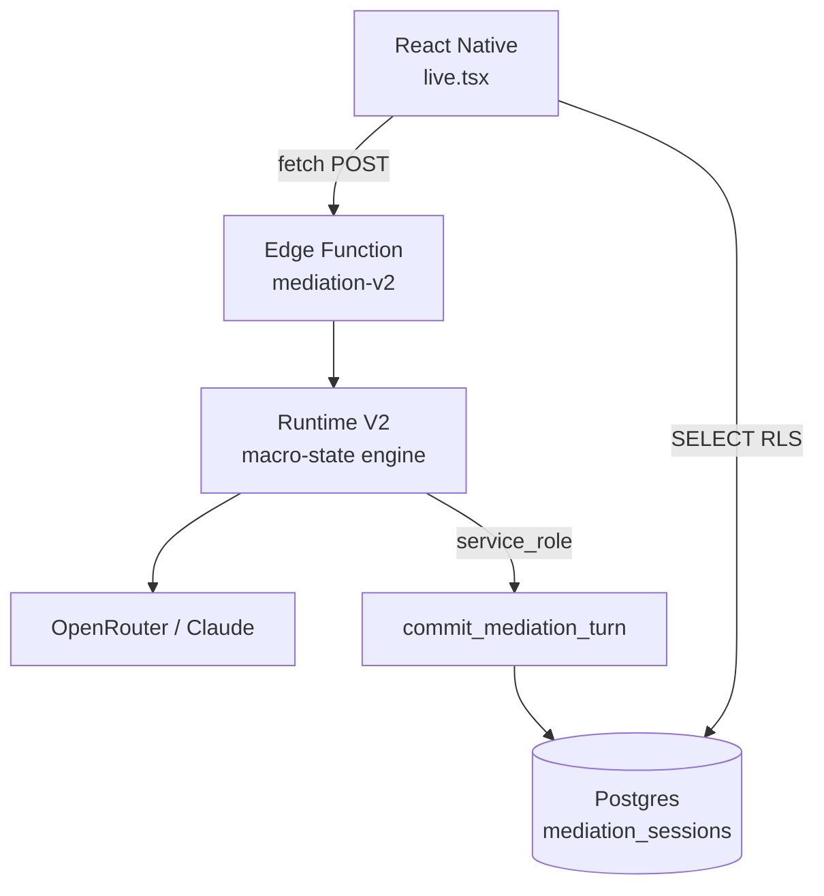
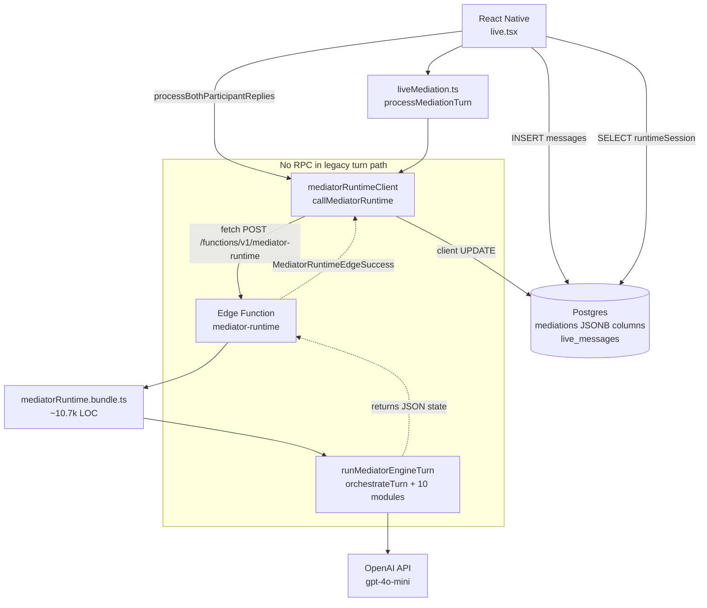

# Legacy Mediator Runtime — Entrypoint Audit

> **Type:** read-only audit  
> **Date:** 2026-07-15  
> **Scope:** All code paths that **start live mediation AI** or **execute a mediator turn** via legacy v2.3 runtime  
> **Note:** `supabase.functions.invoke(...)` — **0 occurrences** in repo. All edge calls use `fetch(POST)`.

---

## Summary

| Metric | Count |
|--------|------:|
| **Total distinct entrypoints** | **17** |
| Production-active | 12 |
| Test / dev-only | 5 |
| `supabase.functions.invoke` | 0 |
| Direct `fetch` to `/functions/v1/mediator-runtime` | 2 layers (client + smoke script) |
| Edge server handler chain | 1 deploy path (bundle) |
| PostgreSQL RPC from legacy edge | **0** (state returned in HTTP body; client UPDATEs `mediations`) |
| Files importing `@/services/liveMediation` | 7 (1 production UI + 3 services + 3 test tools) |

**Legacy LLM provider:** OpenAI (`OPENAI_API_KEY`, default `gpt-4o-mini`) — **not** OpenRouter/Claude.  
**Runtime V2 target (migrations 031–032):** `mediation_sessions` + `commit_mediation_turn` RPC — **not wired** to any entrypoint yet.

---

## Entrypoint Catalog

### Tier A — Production HTTP primitive (client → Edge)

#### EP-01 `callMediatorRuntime`

| Field | Value |
|-------|-------|
| **File** | `services/mediatorRuntimeClient/mediatorRuntimeClient.ts` |
| **Function** | `callMediatorRuntime(input, options?)` |
| **Called by** | `processMediationTurn` (via `routeLiveMediatorTurn`), `processBothParticipantReplies` (`defaultCallRuntime`), `live.tsx` (dynamic import, 2 retry injection sites) |
| **Arguments** | `MediatorRuntimeClientInput`: `mediationId`, `sessionId`, `turnNumber`, `trigger`, `mediationState`, `sessionMemory`, `transcriptDelta`, `language`, optional `clientEvents`, `transcriptWindow`, `participantNames`, `engineVersion: 'v2.3'` |
| **Expected response** | `MediatorRuntimeParsedSuccess`: `{ response: LiveMediatorResponse, runtime: { mediationState, sessionMemory, runtimeSession, finalMediatorMessage, ... } }` |
| **Active** | **Yes** — sole production HTTP client |
| **V2 without UI change** | **Partial** — swap HTTP target + adapter inside this function; UI unchanged if `LiveMediatorResponse` + persistence shape preserved |

#### EP-02 `fetchMediatorRuntimeRaw` (internal)

| Field | Value |
|-------|-------|
| **File** | `services/mediatorRuntimeClient/mediatorRuntimeClient.ts` |
| **Function** | `fetchMediatorRuntimeRaw` |
| **Called by** | `callMediatorRuntime` → `withMediatorRuntimeRetry` |
| **HTTP** | `POST ${SUPABASE_URL}/functions/v1/mediator-runtime`, body = `buildMediatorRuntimeRequest(input)` |
| **Headers** | Supabase anon key + user JWT via `getMediatorRuntimeRequestHeaders()` |
| **Expected response** | Raw JSON → `parseMediatorRuntimeResponse` |
| **Active** | **Yes** |
| **V2 without UI change** | Same as EP-01 |

#### EP-03 `buildMediatorRuntimeRequest`

| Field | Value |
|-------|-------|
| **File** | `services/mediatorRuntimeClient/buildMediatorRuntimeRequest.ts` |
| **Function** | `buildMediatorRuntimeRequest(input)` |
| **Called by** | `fetchMediatorRuntimeRaw` |
| **Arguments** | Maps `MediatorRuntimeClientInput` → `MediatorRuntimeEdgeRequest` |
| **Active** | **Yes** (request builder, not a turn initiator by itself) |
| **V2 without UI change** | Replace body schema; requires new Edge contract |

---

### Tier B — Production orchestrators (client)

#### EP-04 `processMediationTurn`

| Field | Value |
|-------|-------|
| **File** | `services/liveMediation.ts:2231` |
| **Function** | `processMediationTurn(triggerMessage, hostUserId, partnerUserIds, currentPhase, allMessages, currentQuestionIndex, language, mediationContext?, mode, participantNames?, clientEvents?)` |
| **Called by** | `live.tsx` → `applyAiTurn` only |
| **Arguments** | `LiveMessage` trigger + session context; `mode: MediatorMode` (`opening_summary`, `generate_question`, `mid_summary`, `final_summary`, `extension_check`, `proposed_solution`, `closure`, etc.); rejects `answer_ack` |
| **Flow** | `loadMediationRuntimeState` → `buildLiveRuntimeTurnInput` → `routeLiveMediatorTurn` → `callMediatorRuntime` → `persistMediationRuntimeState` (UPDATE `mediations` JSONB columns) |
| **Expected response** | `LiveMediatorResponse` (normalized: `publicMessage`, `aiQuestion`, `privateHint`, `summaryType`, …) |
| **Active** | **Yes** |
| **V2 without UI change** | **Partial** — replace internal call + persistence; keep function signature + `LiveMediatorResponse` |

#### EP-05 `routeLiveMediatorTurn`

| Field | Value |
|-------|-------|
| **File** | `services/mediatorRuntimeClient/liveMediationBridge.ts:128` |
| **Function** | `routeLiveMediatorTurn(runtimeInput, { callRuntime, onRuntimeFailure })` |
| **Called by** | `processMediationTurn` only |
| **Arguments** | `MediatorRuntimeClientInput` + injected `callRuntime` callback |
| **Expected response** | Generic `T` (production: `LiveMediatorResponse` from callback) |
| **Active** | **Yes** |
| **V2 without UI change** | **Yes** — thin wrapper; swap callback |

#### EP-06 `buildLiveRuntimeTurnInput` / `resolveRuntimeTrigger`

| Field | Value |
|-------|-------|
| **File** | `services/mediatorRuntimeClient/liveMediationBridge.ts` |
| **Functions** | `buildLiveRuntimeTurnInput`, `resolveRuntimeTrigger` |
| **Called by** | `processMediationTurn` |
| **Trigger mapping** | `opening_summary` → `session_start`; host AI modes → `host_generate`; partner reply → `partner_message` |
| **Active** | **Yes** |
| **V2 without UI change** | **Partial** — V2 may use simpler macro-state triggers |

#### EP-07 `processBothParticipantReplies`

| Field | Value |
|-------|-------|
| **File** | `services/mediatorRuntimeClient/processBothParticipantReplies.ts:114` |
| **Function** | `processBothParticipantReplies(input, deps?)` |
| **Called by** | `live.tsx` → `runGenerateNextQuestion` (+ retry path) |
| **Arguments** | `{ mediationId, messages, hostUserId, partnerUserIds, language?, participantNames? }`; builds `trigger: 'host_generate'`, both-replies `clientEvents`, `transcriptDelta` |
| **Flow** | `loadMediationRuntimeState` → `callMediatorRuntime` → `buildMediationRuntimePersistencePatch` → `supabase UPDATE mediations` |
| **Expected response** | `ProcessBothParticipantRepliesResult` with `response: LiveMediatorResponse`, `runtime`, `success`, `source: 'llm'|'fallback'` |
| **Active** | **Yes** — standard Q&A round after both partners reply |
| **V2 without UI change** | **Partial** — same as EP-04; core swap candidate |

#### EP-08 `parseMediatorRuntimeResponse` + `adaptRuntimeToLiveResponse`

| Field | Value |
|-------|-------|
| **Files** | `parseMediatorRuntimeResponse.ts`, `adaptRuntimeToLiveResponse.ts` |
| **Called by** | `callMediatorRuntime` |
| **Input** | HTTP JSON `MediatorRuntimeEdgeSuccess` (`ok: true`, `engineVersion: 'v2.3'`, `finalMediatorMessage`, `runtimeSession`, …) |
| **Output** | `LiveMediatorResponse` + sanitized runtime payload |
| **Active** | **Yes** |
| **V2 without UI change** | **Critical adapter point** — must map V2 edge response → `LiveMediatorResponse` |

---

### Tier C — React Native UI call sites (production)

#### EP-09 `applyAiTurn`

| Field | Value |
|-------|-------|
| **File** | `app/mediation/live.tsx:1448` |
| **Function** | `applyAiTurn(triggerMessage, currentMessages, mode, force?, clientEvents?)` |
| **Called by** | Opening bootstrap effect, `applyRuntimeClientActionTurn`, indirect via other handlers |
| **Calls** | `processMediationTurn(...)` |
| **Modes used** | `opening_summary`, `generate_question`, `extension_question`, `mid_summary`, `final_summary`, `extension_check`, `proposed_solution`, `closure` |
| **Guards** | `shouldHostLeadGeneration`, `shouldBlockRuntimeMediatorGeneration`, `canGenerateNextQuestion`, dedup fingerprint |
| **Expected response** | Updates local messages via `insertAiMessages` / `buildLocalAiMessages` |
| **Active** | **Yes** |
| **V2 without UI change** | **Yes** — if EP-04 output unchanged |

#### EP-10 `runGenerateNextQuestion`

| Field | Value |
|-------|-------|
| **File** | `app/mediation/live.tsx:1666` |
| **Function** | `runGenerateNextQuestion(currentMessages)` |
| **Called by** | `useEffect` when `bothAnswered` + host leads; `handleSend` after partner/host reply |
| **Calls** | `processBothParticipantReplies(..., { callRuntime: callMediatorRuntime })` |
| **Active** | **Yes** |
| **V2 without UI change** | **Yes** — if EP-07 output unchanged |

#### EP-11 `applyRuntimeClientActionTurn`

| Field | Value |
|-------|-------|
| **File** | `app/mediation/live.tsx:1620` |
| **Function** | `applyRuntimeClientActionTurn(events, mode?)` |
| **Called by** | `handleContinueDispute`, proposal accept/reject, `handleResolveSession` |
| **Calls** | `applyAiTurn(..., force=true, clientEvents)` → `processMediationTurn` |
| **Client events** | `continue_session`, `proposal_accepted`, `proposal_rejected`, `resolve_session` |
| **Active** | **Yes** |
| **V2 without UI change** | **Partial** — V2 must support equivalent client-event semantics or simplify decision flow |

#### EP-12 Opening bootstrap `useEffect`

| Field | Value |
|-------|-------|
| **File** | `app/mediation/live.tsx:~1995` |
| **Trigger** | Host loads live screen; no opening yet |
| **Calls** | `applyAiTurn(..., mode='opening_summary', force=true)` → first `session_start` runtime turn |
| **Active** | **Yes** — **first AI touch** of live session |
| **V2 without UI change** | **Partial** — V2 session row must be created server-side before/at first turn |

---

### Tier D — Edge Function server chain (production deploy)

#### EP-13 Edge deploy entry

| Field | Value |
|-------|-------|
| **File** | `supabase/functions/mediator-runtime/index.ts` |
| **Handler** | `serve((req) => handleMediatorRuntimeHttpRequest(req))` |
| **Bundle** | `./_generated/mediatorRuntime.bundle.ts` (esbuild of `handleMediatorRuntimeHttp.ts`) |
| **Build** | `npm run build:mediator:edge` |
| **Active** | **Yes** |
| **V2 without UI change** | N/A — server replacement |

#### EP-14 `handleMediatorRuntimeHttpRequest`

| Field | Value |
|-------|-------|
| **File** | `services/mediatorEngine/edge/handleMediatorRuntimeHttp.ts` |
| **Called by** | Edge `index.ts` / bundle |
| **Arguments** | HTTP `Request` → JSON body |
| **Calls** | `handleMediatorRuntimeTurn(body, { env: OPENAI_* })` |
| **Active** | **Yes** |

#### EP-15 `handleMediatorRuntimeTurn`

| Field | Value |
|-------|-------|
| **File** | `services/mediatorEngine/edge/handleMediatorRuntimeTurn.ts` |
| **Called by** | EP-14; tests (direct) |
| **Arguments** | Parsed `MediatorRuntimeEdgeRequest` body |
| **Calls** | `createEdgeLlmProvider` → `runMediatorEngineTurn` → `buildMediatorRuntimeEdgeSuccess` |
| **LLM** | OpenAI API (`gpt-4o-mini` default) |
| **RPC** | **None** — returns state in JSON; no `commit_mediation_turn` |
| **Expected response** | `MediatorRuntimeEdgeSuccess` or structured error (`503` validation/LLM fail) |
| **Active** | **Yes** |

#### EP-16 `runMediatorEngineTurn`

| Field | Value |
|-------|-------|
| **File** | `services/mediatorEngine/runtime/runMediatorEngineTurn.ts` |
| **Called by** | EP-15 only (production) |
| **Pipeline** | `applyRuntimeClientEvents` → `orchestrateTurn` (10 modules) → `composePrompt` → `generateMediatorReply` → `validateMediatorReply` → `composeRuntimeSession` |
| **Active** | **Yes** (bundled, not imported by RN client) |
| **V2 without UI change** | **No** — entire engine replaced by V2 runtime |

---

### Tier E — Test / dev / tooling (non-production UI)

#### EP-17 `scripts/smoke-mediator-runtime.mjs`

| Field | Value |
|-------|-------|
| **Invocation** | `npm run smoke:mediator-runtime` |
| **HTTP** | `fetch(${SUPABASE_URL}/functions/v1/mediator-runtime, { method:'POST', body: baseRequest(...) })` |
| **Auth** | `SUPABASE_ANON_KEY` |
| **Expected** | `ok: true`, `finalMediatorMessage.text`, `engineVersion: 'v2.3'` |
| **Active** | Dev/CI smoke only |
| **V2 without UI change** | N/A |

#### EP-18 `handleMediatorRuntimeTurn` (direct in tests)

| Files | `__tests__/edge/mediatorRuntimeEdge.test.ts`, `__tests__/client/liveFlowE2E.integration.test.ts`, `participantReplyAtomicTurn.test.ts`, `participantReplyFiveRound.test.ts`, `__tests__/production/fixtures.ts` |
| **Active** | Test-only |
| **V2** | Replace with V2 edge tests |

#### EP-19 `runMediatorEngineTurn` (direct in tests)

| File | `__tests__/integration/runtime.integration.test.ts`, `__tests__/runtime/runMediatorEngineTurn.test.ts` |
| **Active** | Test-only |

#### EP-20 `mediatorEngine/index.ts` exports

| Exports | `runMediatorEngineTurn`, `handleMediatorRuntimeTurn`, `orchestrateTurn`, … |
| **Importers** | Tests only (not RN app) |
| **Active** | Library surface for tests/bundle |

#### EP-21 `syncParticipantRepliesFromLiveMessages` (deprecated)

| File | `services/mediatorRuntimeClient/syncParticipantRepliesFromLiveMessages.ts` |
| **Runtime call** | **None** (deprecated; no prod importers) |
| **Active** | **No** |

---

## `supabase.functions.invoke` — Not Used

Searched entire repo: **0 matches**.

Edge invocation pattern:

```typescript
fetch(`${SUPABASE_URL}/functions/v1/mediator-runtime`, {
  method: 'POST',
  headers: { apikey, Authorization, 'Content-Type': 'application/json' },
  body: JSON.stringify(buildMediatorRuntimeRequest(input)),
});
```

Alternative: `callEdge()` in `services/supabase.ts` — used for `analyze-perspectives`, `check-limits`, etc. **Not** used for `mediator-runtime`.

---

## Imports Leading to `liveMediation.ts`

| File | Imports | Reaches runtime? |
|------|---------|------------------|
| `app/mediation/live.tsx` | 40+ symbols incl. `processMediationTurn`, `initLiveSession`, `sendUserMessage` | **Yes** — EP-09–12 |
| `services/disputeClosure.ts` | `endLiveMediation` | **No** — DB status only |
| `services/mediationDelete.ts` | `invalidateLiveMessagesCache` | **No** |
| `services/mediationSummary.ts` | `LiveMessage` type | **No** |
| `tests/runtimeComparison/*.ts` (3) | types only | **No** |

**Related (not `liveMediation.ts`):**

| File | Role |
|------|------|
| `mediatorRuntimeClient/*` | Direct runtime bridge |
| `liveMediation.types.ts` | Shared types (8 importers) |
| `hooks/useRuntimeSession.ts` | Read-only `mediator_runtime_session` — no turn execution |

---

## Functions That Start Mediation But Do NOT Call Runtime

| Function | File | What it does |
|----------|------|--------------|
| `initLiveSession` | `liveMediation.ts:1003` | UPDATE `mediations` status=`live`, insert static opening messages |
| `sendUserMessage` | `liveMediation.ts:1296` | INSERT `live_messages`; triggers `runGenerateNextQuestion` indirectly |
| `recoverMediationRuntimeSession` | `recoverMediationRuntimeSession.ts` | Recompose missing `mediator_runtime_session` from state/memory — **no Edge call** |
| `loadMediationRuntimeSession` | `loadMediationRuntimeSession.ts` | SELECT only |
| Pre-live flow | `mediationCreate`, `mediationAnalysisRun`, `invite` | `analyze-perspectives` edge — **different** from mediator-runtime |

**First runtime turn in production:** EP-12 opening bootstrap → `session_start`.

---

## PostgreSQL / RPC in Legacy Path

| Layer | Persistence |
|-------|-------------|
| Edge `handleMediatorRuntimeTurn` | In-memory; **no DB writes** |
| Client after success | `UPDATE mediations SET mediation_state, session_memory, mediator_runtime_session, mediator_engine_version, …` |
| Legacy RPC | **None** for turns |
| V2 (planned) | `commit_mediation_turn` → `mediation_sessions` (service_role only) |

---

## V2 Redirect Assessment (without UI changes)

| Entrypoint | Can swap to V2 without UI change? | Blocker |
|------------|-----------------------------------|---------|
| `callMediatorRuntime` | Partial | New Edge + response adapter |
| `processMediationTurn` / `processBothParticipantReplies` | Partial | Persistence must still fill `LiveMediatorResponse` + optionally legacy JSONB for `useRuntimeSession` |
| `applyAiTurn` / `runGenerateNextQuestion` | Yes | If above hold |
| `useRuntimeSession` / decision panels | **No** | Expect `RuntimeSession` v2.3 contract — needs projection from V2 macro-state or UI refactor |
| Edge bundle / `runMediatorEngineTurn` | No | Full replacement |

**Minimal V2 migration path without UI touch:** replace HTTP handler + swap internals of `callMediatorRuntime` + adapter to `LiveMediatorResponse`; add shim that writes compatible `mediator_runtime_session` JSON. **Cannot** fully drop legacy state columns without breaking `useRuntimeSession`.

---

## Diagram A — Target V2 Architecture



---

## Diagram B — Current Legacy Architecture



---

## Call Graph (production turn — simplified)

```
live.tsx
├── applyAiTurn ──────────────────► processMediationTurn ──► routeLiveMediatorTurn ──► callMediatorRuntime ──► fetch POST
│   ├── opening bootstrap (session_start)
│   ├── continue / proposal / resolve (clientEvents + modes)
│   └── summaries / closure / extension
│
└── runGenerateNextQuestion ─────► processBothParticipantReplies ──► callMediatorRuntime ──► fetch POST
    └── trigger: host_generate (both replies)

callMediatorRuntime
  → parseMediatorRuntimeResponse
  → adaptRuntimeToLiveResponse → LiveMediatorResponse
  → persistMediationRuntimeState / buildMediationRuntimePersistencePatch

Edge: index.ts → handleMediatorRuntimeHttpRequest → handleMediatorRuntimeTurn → runMediatorEngineTurn → OpenAI
```

---

*End of audit. No existing files modified.*
